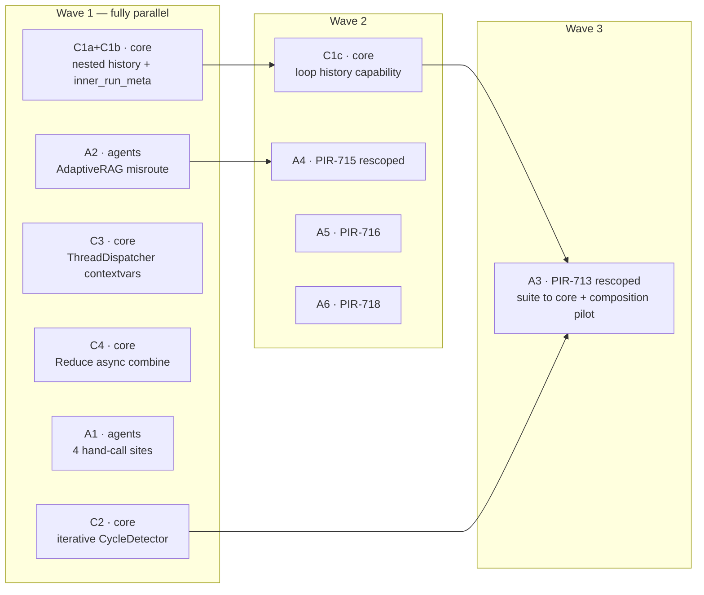
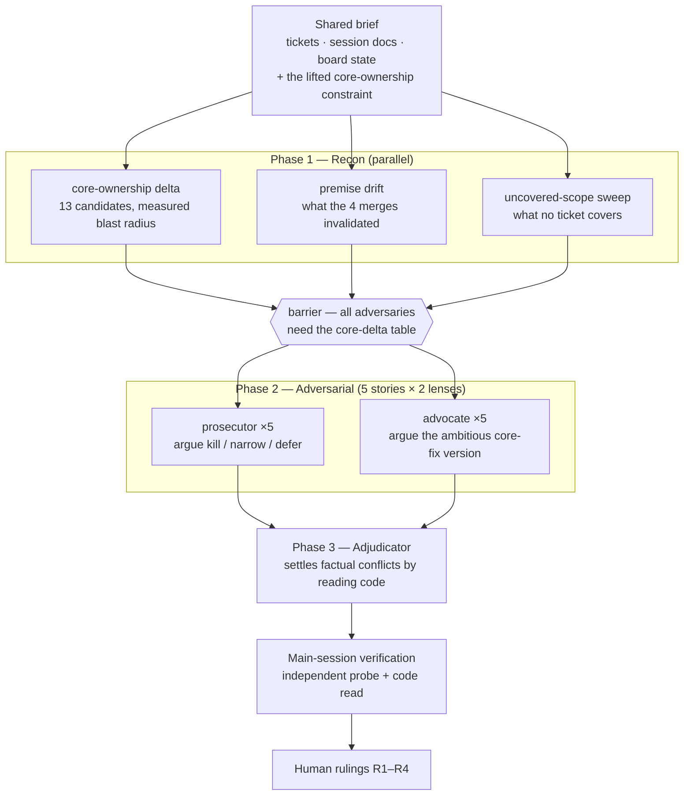

# ADR: WS7 Engine Parity — core observability repair, not a control-flow refactor

**Status:** **Implemented (2026-08-02).** Accepted 2026-07-29; built and merged in 14 PRs
(#214–#227). PIR-711 is closed. See §8 for what the build changed about this document.
**Supersedes:** PIR-711's issue description, its 2026-07-27 rescope comment, and the three
`.prompticorn/sessions/session_20260727_ws7_*.md` recon documents.
**Nature:** re-plan. Changes what WS7 *is*, kills one prior decision (D1), and opens a narrow
`pirn-core` track.

> **Read §8 first if you are picking this up after the fact.** The rulings R1–R4 all survived
> contact, but the build corrected two factual claims in this document and surfaced two core
> defects that were not predicted. Linear is the system of record for the work; this ADR is the
> record of the *decisions*.

> **Note on a WS5 premise.** `docs/adr/WS5-taxonomy.md` states "`pirn-core` is immutable —
> referenced, never edited." That constraint was lifted on 2026-07-29. Every WS7 story predating
> that date was scoped under it, which is the single largest reason this re-plan was needed.

---

## 0. Start here — resuming work from this document

> **This section described how to *start* WS7. WS7 is finished.** It is kept because §7's refusals
> and §3's measured blast radius are still the reasons behind the current code — but if you are
> here to do new work, read **§8** for outcomes and go to Linear for state. The instructions below
> are historical.

**This ADR was the entry point and was self-sufficient.** Read it in full, then:

1. **Read the Linear tickets it names** — PIR-711 (parent), 713, 714, 715, 716, 718. Their bodies
   carry the detailed acceptance criteria this ADR only summarises in §4.
   **Where they conflict with this ADR, this ADR wins** — PIR-711's description and its 2026-07-27
   comment are stale, and 713/714/715 have not yet been rescoped per §4.
   *(Done: all four were rescoped 2026-07-30 and PIR-711's description rewritten. Linear now leads;
   this document trails it.)*
2. **Re-run Appendix A's reproducer** before trusting any dependency claim in §6. It takes seconds
   and tells you whether C1a has already landed.
   *(C1a landed in #216. The reproducer now yields `children_of(l1) == 1` and `lineage[leaf] == 1`.)*
3. **Verify the baselines in §3** still hold before starting, so a pre-existing failure is not
   mistaken for your own.
   *(Those baselines are pre-WS7. Current: pirn-core 3619, pirn-agents 3754.)*
4. **Do not re-derive the plan.** §7 records what was considered and refused, with reasons. Six core
   changes and three story deliverables were rejected deliberately, several of them attractive.
   *(Still the most useful part of this document.)*

**Local-only artifacts.** `.prompticorn/sessions/` is gitignored (`.gitignore:53`). The raw
adjudicator output and the per-story prosecution/defence cases live there on the machine that
produced them and **will not exist in a fresh clone**. Nothing in this ADR depends on them; they are
provenance, not input.

---

## 1. Context — what WS7 turned out to be

PIR-711 was written as a control-flow refactor: pirn-agents hand-rolls loops, fan-out and dispatch
in Python inside knot bodies instead of expressing them as core nodes, so the engine's
`Result`/`Skipped`, run history, determinism and lineage do not cover agent internals.

The underlying finding is real. The prescription was wrong in three ways:

1. **Most stories named the wrong target primitive.** Established by the 2026-07-27 rescope and
   unchanged here.
2. **Every story was scoped around a core it could not edit.** Each carried at least one
   "requires a core change" exclusion that was auto-closed rather than decided.
3. **The engine cannot currently see what the stories would port.** Nested `SubTapestry` run
   history is silently lost below depth 2 (§Appendix A). Two of the five stories would have
   delivered nothing until that was fixed.

**WS7 is therefore a small core-engine repair plus a set of agents correctness fixes**, with roughly
half the original graph-rewrite ambition cut for want of a consumer.

The most valuable work found is not observability at all. It is three latent
**silent-wrong-answer** defects: four sites that hand-call `SubTapestry.process()` and bypass
`__call__` entirely, and an `if "SIMPLE" in complexity` ladder that misroutes. These are cheap,
independent of everything else, and go first.

---

## 2. The four rulings

| # | Question | Ruling |
|---|---|---|
| **R1** | Is the observability payoff worth anything yet? pirn-agents has zero `RunHistory` references. | **Observability is required.** Full scope proceeds. The "correctness fixes only" fallback is rejected. |
| **R2** | PIR-713 pilot shape: composition over `LoopSubTapestry`, or a static unroll? | **Composition.** The unroll cannot express an unbounded loop (see R3) and retains a `for i in range(n)` in its sink — it relocates the bypass rather than removing it. |
| **R3** | Does `loop_sub_tapestry.py:130`'s `InMemoryHistory` exclusion have a rationale? | **Yes.** `LoopSubTapestry` is for *dynamically extensible* pipelines — conversational flows that run until the session ends. The exclusion is an intentional unbounded-growth guard. **It must not be deleted.** |
| **R4** | PIR-718 / D2: the pin says the exclusion was intentional. | **Rewrite the prose with the pin, in the same PR.** The pin was a PIR-728 deferral, not a decision. |

**R3 is the consequential one.** The plan originally proposed deleting the exclusion on the evidence
"zero test delta across seven packages". That evidence structurally cannot detect an intentional
resource guard. See §3, C1c.

---

## 3. Core-fix decision

Thirteen core limitations were candidates. Blast radius was measured per candidate across all seven
packages, not estimated. **Six are refused.** Baselines that must hold for any core change:
pirn-core **3459 passed / 135 skipped**, pirn-agents **3728 / 8**, pirn-ml **597**.

| # | Limitation | Decision |
|---|---|---|
| 1 | Nested `SubTapestry` captures the throwaway inner tapestry's history — `nodes/sub_tapestry.py:126-139`, `:228-232` | **FIX** (C1a) |
| 2 | `_mutable_inner_run_meta` unreset, and assigned after the `except` — `:138`, `:197-204` | **FIX** (C1b) |
| 3 | `LoopSubTapestry` skips history when it is `InMemoryHistory` — `nodes/loop_sub_tapestry.py:130` | **REWORK, do not delete** (C1c) |
| 4 | `CycleDetector._visit_dfs` recursive — `engine/shed/shed.py:22-45` | **FIX** (C2) |
| 5 | `ThreadDispatcher` drops contextvars | **FIX** (C3) |
| 6 | `Reduce` invokes an async `combine` without awaiting — `reduce_.py:147,153` | **FIX** (C4) — correctness only, unlocks nothing in WS7 |
| 7 | `SubTapestry` raises unconditionally on inner failure — `:247-248` | **CONDITIONAL** — only behind a real fan-out consumer; **declined for PIR-715** |
| 8 | `Reduce.__init__` takes only `of: Knot` | **WON'T DO** — `Aggregator` already does N parents + async combine |
| 9 | `step`/`fold` are sync | **WON'T DO** — preserves the exact bypass PIR-711 exists to remove |
| 10 | `Branch.selector` is sync | **WON'T DO** — fails loudly today; unlocks nothing |
| 11 | `Map` markers are not `Knot`s | **KEEP WORKAROUND** — one `# pyright: ignore` per site, per house idiom |
| 12 | `RunResult.succeeded = not exceptions` | **DO NOT TOUCH** — 552 refs across 6 packages |
| 13 | `_run_inner` forwards no dispatcher/emitters/traceback_filter | **DEFER** — would change semantics for 87 subclasses; strictly after C3. PIR-719 stays canceled |

### C1 in detail

* **C1a — nested-history capture.** `__init__` captures `outer.history` from `_current_tapestry`,
  but inside a parent's `process()` that context *is* the throwaway `with Tapestry() as inner:` at
  `:182`. The fallback at `:228-232` only fires when the capture `is None` — here it is non-`None`
  but wrong. Prefer the live `_current_history` contextvar.
* **C1b — `_mutable_inner_run_meta`.** Reset it, and hoist the assignment out from after the
  `except` so a failed inner run stops reporting the *previous* run's `inner_run_id`.
* **C1c — the loop history guard.** Today: `not isinstance(outer_history, InMemoryHistory)`.
  Per R3 the *intent* is correct — an open-ended loop accumulates one child run per turn, and an
  ephemeral store cannot absorb that. But `tapestry.py:117` makes `InMemoryHistory` the **default**,
  so on the default backend a conversational loop is silently unobservable, which R1 forbids.
  **Keep the guard, drop the `isinstance`:** express it as a declared capability or retention policy
  on `RunHistory` (durable-vs-ephemeral, or a bounded buffer for the ephemeral case) so in-memory
  recording becomes *bounded* rather than *absent*, and the guard survives a new backend. A
  concrete-type check inside the engine is itself the OOP/SOLID violation this programme exists to
  remove.

  C1c is a design change, not a one-liner. **If it threatens C1a/C1b, split it** — those two ship
  alone and unblock the dependent stories.

---

## 4. Per-story disposition

### D1 (the `AgentLoop` adapter) does not survive — dropped

D1's sole justification was that a `final step()` makes the fold-state trap unreachable by
construction. **PIR-754 (`469985b9`) fixed the trap**, so an adapter-shaped `step()` is now a
measured no-op. Worse: the natural port shape — a `step` returning a *new* state object — is exactly
what a final `step()` would forbid, and PIR-754 rewrote `docs/guides/agentic-loops.md:50` to bless
it. The adapter would mandate the worse design. It also forces a multiple-inheritance diamond, since
`test_agent_pipeline_base.py:226-239` requires the pilot to remain an `AgentPipeline`.

Two independent adversarial agents reached this separately, one by executing pre- and post-fix core
side by side.

| Ticket | Disposition | Reason |
|---|---|---|
| **PIR-713** | **RESCOPE** M→S | Drop the adapter. Move the characterization suite into `packages/pirn-core/tests/unit/nodes/test_loop_sub_tapestry.py` — PIR-754 shipped with **zero** tests, and the existing `_CounterLoop.fold` never reads `state`, so reverting it reddens nothing. Pilot `evaluator_optimizer` by **composition** (R2). |
| **PIR-714** | **SPLIT** L → S + deferred | Take the correctness half only, widened from 2 sites to 4. **Defer** the `Aggregator` rewiring: measured identical output, identical lineage, identical `inner_knot_count`, identical wall time, and zero consumers. |
| **PIR-715** | **RESCOPE** L→S | Keep the arm-in-inner-tapestry refactor (deletes both `_ResultSource` closures, cuts `_run_inner` sites 9→3) and the misroute fix. **Drop** the `Branch`/`BranchOutput`/`Aggregator` graph — 19 knots, 12 of them `Skipped` on the SIMPLE path, for a module whose `__init__.py` is `__all__ = []`. Explicitly decline `_tolerate_inner_failures`: a `Branch` has one live arm, so tolerating it converts total failure into `succeeded=True`. |
| **PIR-716** | **TAKE AS SCOPED** | The retarget to a named `_SummaryReducer(Knot)` stands. Fixing `Reduce` (C4) does **not** reopen it — the binding constraint is the pin harness `_bare(cls)`, which `Reduce(combine=<fn>)` can never satisfy, not async-ness. |
| **PIR-718** | **TAKE AS SCOPED** | Plus R4: rewrite `pirn_agents/interfaces/router.py:20-24`, which currently documents the exclusion as intentional and would otherwise contradict the ticket. |

---

## 5. Tickets to file

| Title | Body | Size | Priority |
|---|---|---|---|
| core: nested `SubTapestry` captures the throwaway inner tapestry's history (C1a + C1b) | Prefer the live `_current_history` contextvar over the construction-time capture at `nodes/sub_tapestry.py:126-139` / `:228-232`; reset `_mutable_inner_run_meta` and hoist its assignment out from after the `except` (`:138`, `:197-204`). Reproducer + expected before/after in this ADR's Appendix A. | S | **Urgent** |
| core: express the `LoopSubTapestry` history guard as a capability, not `isinstance` (C1c) | `nodes/loop_sub_tapestry.py:130` discriminates on the concrete `InMemoryHistory` type. Keep the unbounded-growth intent (see §2 R3), replace the type check with a declared capability or retention policy on `RunHistory`, so ephemeral recording is bounded rather than absent. `tapestry.py:117` makes `InMemoryHistory` the default. | S–M | High |
| core: `CycleDetector` recursion caps graph depth at ~980 knots (C2) | Rewrite `_visit_dfs`/`detect` (`engine/shed/shed.py:22-45`) as an iterative three-colour DFS; public signature unchanged, bit-identical for non-crashing graphs. Add a regression test at a few thousand knots. **Closes PIR-763** — see §2 R3 for why its "wait for a real consumer" trigger is already met. | S | High |
| core: `ThreadDispatcher` drops contextvars, orphaning inner runs (C3) | Replace the `run_in_executor` call with `asyncio.to_thread` (or `copy_context().run`) so `_current_history`/`_current_run_id` survive the hop. Document that process-boundary dispatchers cannot propagate context. Zero refs outside core. | XS | High |
| core: `Reduce` invokes an async combine without awaiting (C4) | `reduce_.py:147,153` call `combine` synchronously in both forms, so an `async def combine` silently emits a coroutine object. Copy `Aggregator`'s `_mutable_combine_is_async` idiom; detect with `inspect`, not `asyncio`. Correctness only — unlocks nothing in WS7. | XS | Medium |
| agents: four sites hand-call `SubTapestry.process()`, shipping wrong answers (A1) | `parallel_specialist_fan_out.py:76`, `debate_framework.py:112`, `round_robin_review.py:80` (a `Knot` result fails the `isinstance` guard and the review is **discarded**), `orchestrator_agent.py:100`. Invoke via `__call__` and unwrap the `Result`; rewrite the four contract-violating test doubles to return Knots. Carved out of PIR-714. | S | High |
| agents: AdaptiveRAG substring ladder misroutes COMPLEX to the SIMPLE arm (A2) | `adaptive_rag_pipeline.py:121` tests `"SIMPLE" in complexity` before `:140`'s `"COMPLEX"`, so a reply like `"COMPLEX (not simple)"` routes to the SIMPLE arm and returns the sub-question list as the answer with `succeeded=True`. Extract a named module-level selector and order COMPLEX first. Preserves all 8 behavioural tuples. | XS | High |

Also: rescope PIR-713/714/715 per §4, rewrite PIR-711's stale description, and **close PIR-763 as
superseded by C2**.

---

## 6. Sequencing



**Critical path: C1a+C1b → C1c → A3.** Everything else is off it. A4/A5/A6 do **not** depend on C1
— their new nodes are plain `Knot`s, which are already recorded (Appendix A).

Every PR: repo-root `.venv` (`packages/pirn-agents/.venv` is stale and dies at collection),
package-scoped formatters — **never `ruff format .` at the monorepo root** — signed commits
(`git log -1 --format=%G?` must be `G`), and `ruff check tests` run from *inside* the package.
Any `packages/pirn-core/**` change fans to all seven packages automatically via
`.github/workflows/workspace.yml:63-95`.

---

## 7. Deliberately not doing

Recorded so the next sweep does not rediscover them.

* **The `AgentLoop` adapter.** Measured no-op post-PIR-754; would forbid the shape the guide now
  blesses; forces an MI diamond.
* **PIR-714's `Aggregator` fan-out rewiring.** Measured identical output, lineage, `children_of`,
  `inner_knot_count` and wall time. Revisit only behind a real consumer; there are currently zero.
* **PIR-715's `Branch` graph.** Its runtime-usage premise is already discharged elsewhere
  (`examples/financial/loan_underwriting.py:209-218`).
* **`_tolerate_inner_failures` for PIR-715.** One live arm ⇒ tolerating converts total failure into
  `succeeded=True`. A contract regression.
* **Async `step`/`fold`, async `Branch.selector`.** Both are cheap and near-zero radius, and both
  keep the terminating LLM call outside the engine — the exact bypass PIR-711 exists to remove. The
  five "permanently excluded" pipelines are un-ported, not un-portable.
* **`Reduce(**parents)`.** Duplicates `Aggregator`, which already ships N parents + async combine.
* **Touching `RunResult.succeeded`.** 552 refs across 6 packages. Write acceptance criteria against
  `outputs` shape and `len(run.exceptions)` instead.
* **Forwarding dispatcher/emitters from `_run_inner`.** PIR-719 stays canceled: its kill rested on
  three legs (no beneficiary, false motivation, contextvar safety) and core ownership touches only one.

**Standing caveat for every WS7 PR body:** work moved into a `SubTapestry` inner run becomes
observable **in run history and lineage only — it remains invisible to emitters**, because
`sub_tapestry.py:182` builds `with Tapestry() as inner:` with no arguments and `:241-246` forwards
only the parent ids.

---

## Appendix A — the nested-history defect (measured, with reproducer)

Run with the **repo-root** `.venv`. Outer `Tapestry(history=InMemoryHistory())` → `L1(SubTapestry)`
→ `L2(SubTapestry)` constructed inside `L1.process()` → `leaf` knot:

```python
import asyncio
from typing import Any

from pirn.backends.in_memory.in_memory_history import InMemoryHistory
from pirn.core.knot import Knot
from pirn.core.knot_config import KnotConfig
from pirn.core.knot_factory import knot
from pirn.core.parameter import Parameter
from pirn.core.run_request import RunRequest
from pirn.nodes.sub_tapestry import SubTapestry
from pirn.tapestry import Tapestry


@knot
async def double(x: int) -> int:
    return x * 2


class L2(SubTapestry):
    """Depth-2 pipeline: constructed INSIDE L1.process()."""

    async def process(self, value: int, **_: Any) -> Knot:
        p = Parameter("v", int, default=value)
        return double(x=p, _config=KnotConfig(id="leaf"))


class L1(SubTapestry):
    """Depth-1 pipeline: constructed inside the outer `with Tapestry()`."""

    async def process(self, value: int, **_: Any) -> Knot:
        p = Parameter("v", int, default=value)
        return L2(value=p, _config=KnotConfig(id="l2"))


async def main() -> None:
    history = InMemoryHistory()
    with Tapestry(history=history) as outer:
        src = Parameter("v", int, default=21)
        L1(value=src, _config=KnotConfig(id="l1"))

    result = await outer.run(RunRequest())
    print(f"succeeded          = {result.succeeded}")
    print(f"outputs            = {dict(result.outputs)}")

    depth1 = await history.children_of(result.run_id)
    print(f"children_of(outer) = {len(depth1)}  {[c.parent_knot_id for c in depth1]}")
    for child in depth1:
        depth2 = await history.children_of(child.run_id)
        print(f"children_of(l1)    = {len(depth2)}  {[c.parent_knot_id for c in depth2]}")
    for kid in ("l1", "l2", "leaf"):
        print(f"lineage[{kid:>4}]      = {len(await history.query_lineage_by_knot_id(kid))}")


asyncio.run(main())
```

Observed on `469985b9` (**pre-C1a**):

```
succeeded          = True        outputs = {'param:v': 21, 'l1': 42}
children_of(outer) = 1  ['l1']
children_of(l1)    = 0  []
lineage[l1] = 1     lineage[l2] = 1     lineage[leaf] = 0
```

**C1a is done when `children_of(l1) == 1` and `lineage[leaf] == 1`.** Everything else in this output
must be unchanged — in particular `succeeded` and `outputs`, which are already correct.

The depth-2 inner run is never recorded and the leaf has no lineage, while the run reports success
with the correct answer.

**The bound matters.** `lineage[l2] == 1` — a plain `Knot` constructed inside a *depth-1* pipeline's
`process()` **is** recorded. The defect bites only where a `SubTapestry` is nested inside another
`SubTapestry`'s `process()`. Consequences:

* **PIR-715, PIR-716 are unaffected** — their new nodes are plain `Knot`s. Not gated on C1.
* **PIR-713, PIR-714 are affected** — `AgentPipeline(SubTapestry)`
  (`specializations/base/agent_pipeline.py:42`) and `parallel_specialist_fan_out.py:74`, which types
  specialists `dict[str, SubTapestry]`, are genuine pipeline-in-pipeline nesting.
* Independently, `parallel_specialist_fan_out.py:76` calls `.process()` directly, bypassing
  `__call__`, so that site produces **no inner run at all** — defect or no defect. That is A1, and it
  stands alone.

---

## Appendix B — how this ADR was produced

A 14-agent adversarial planning run. 0 errors, ~1.69M agent tokens, 637 tool calls, ~9.5h agent time.
All agents read-only: no file edits, no commits, no `ruff format`.



**Design notes, for reuse.**

* Both lenses were required to cite `file:line` or measured output, and to state the strongest
  argument *against their own position*. That is what made the output adjudicable rather than two
  confident essays.
* The barrier after recon is deliberate: every adversary needed the same core-delta table as shared
  evidence. Elsewhere the run pipelines without barriers.
* The adjudicator was instructed to settle factual disputes **by reading the code itself**, not by
  weighing the two briefs. That is how the nested-history defect — which neither adversary had —
  surfaced.

**Two corrections were applied to the machine's output afterwards, both material:**

1. The run's headline claim, *"all five stories deliver zero observability"*, was **too broad**. The
   independent probe in Appendix A bounds it to pipeline-in-pipeline nesting, which is why PIR-715
   and PIR-716 are off C1's dependency list.
2. The run proposed **deleting** the `LoopSubTapestry` history exclusion on the evidence "zero test
   delta". R3 rejected this: that evidence cannot detect an intentional resource guard. Became C1c.

The lesson worth keeping: a multiagent run is strongest at generating and stress-testing candidate
findings, and weakest at knowing *why* code is the way it is. Both corrections were of the second
kind.

**Raw artifacts:** `.prompticorn/sessions/session_20260729_ws7_adversarial_plan.md` — full
adjudicator output, per-story prosecution/defence cases, and the verification appendix.
**Gitignored (`.gitignore:53`), so machine-local and absent from a fresh clone.** Every conclusion
that survived is reproduced in this ADR; the session doc adds only the losing arguments and the
per-story workings. Nothing here depends on it.

---

## 8. What the build changed about this document (2026-08-02)

WS7 was implemented in 14 PRs, #214–#227. **All four rulings survived** — R1 (observability
required), R2 (composition, not an adapter or unroll), R3 (the loop history guard has a rationale
and must not be deleted), R4 (PIR-718 rewrites the prose with the pin). What follows is what this
document got wrong or could not have known.

### 8.1 Tickets, against §5

§5 said "no tickets filed at time of writing". They were filed as PIR-764 (C1a+C1b), PIR-765 (C1c),
PIR-766 (C2), PIR-767 (C3), PIR-768 (C4), PIR-769 (A1), PIR-770 (A2), plus PIR-713/715/716/718
rescoped per §4. Three more were filed *during* the build and are described below.

### 8.2 R2 is proven — the composition pilot works

The open question behind R2 was whether the sanctioned answer to sync `step`/`fold` — move an
`await`-driven termination decision *into* the iteration tapestry as a knot — is actually workable.
It is. `EvaluatorOptimizerPipeline` now composes `_EvaluatorOptimizerLoop`, with **both** stop
conditions as knots: `AcceptGate`, and `ReflectionCheck` behind a core `Gate` that opens only on
"not accepted".

**All 11 existing tests passed with zero edits**, including the reflection test's exact
`len(llm.calls) == 3` — an accepted run still does not pay for the reflection call.

Measured on a 2-iteration run: child runs 0 → 2, and lineage 0 → 2 for each of `eo_gen`,
`eo_judge`, `eo_gate`.

The five pipelines §4 called "structurally excluded, permanently" are therefore **portable**, as
§7 hedged. The cost is real though: five new modules to replace one Python `for`. PIR-775 names the
seam once so the second port is roughly three.

### 8.3 Two core defects this document did not predict

Both surfaced only because the pilot was the first thing ever to nest a `LoopSubTapestry` inside
another `SubTapestry`.

* **PIR-773** — `loop_sub_tapestry.py`'s `process` read the *construction-time* history capture, so
  a loop nested in a pipeline recorded its iterations into the throwaway inner tapestry's store.
  Exactly the defect C1a fixed in `SubTapestry._run_inner`; that call site had no consumer to expose
  it. **Without this fix the pilot's observability was all zeros** — §8.2's numbers depend on it.
* **PIR-772** — any failed iteration raised `SubTapestryError` and killed the whole loop, so `fold`
  never saw the failure and retry-until-success was inexpressible over anything that can genuinely
  fail. Now opt-in via `_tolerate_iteration_failures`. This is **not** a reversal of §3 candidate
  #7: that declined tolerance for `SubTapestry`+`Branch`, where one live arm means tolerating
  converts total failure into `succeeded=True`. A loop iteration is not the only path, and a failed
  iteration is a legitimate retry trigger.

### 8.4 Corrections to claims in this document

* **§4 / PIR-713 on `retry_on_parse_failure.py`.** It is described as retrying "*through* inner-run
  failure via `outputs.get(...) → None`". It does not. Its LLM call succeeds and `_run_inner`
  returns normally; the retry is a Python `try/except` around `parser(text)` — a *parse* failure
  outside the run. That file was never blocked by the core limitation attributed to it.
* **§1 on the AdaptiveRAG misroute.** The mechanism is a reply naming *both* labels
  (`"COMPLEX (not simple)"`, upper-cased before matching), not `"SIMPLE"` being a substring of
  `"COMPLEX"` — it is not (`'SIMPLE' in 'COMPLEX'` is `False`). The defect and its consequence are
  as described; only the trigger was mis-stated.
* **§7 on the MI diamond.** This document killed D1 partly because an adapter "forces a
  multiple-inheritance diamond, since `test_agent_pipeline_base.py` requires the pilot to remain an
  `AgentPipeline`". **Composition does not avoid it.** That invariant catches *every* `SubTapestry`
  under `specializations/`, including a private helper, so the internal loop needs
  `(LoopSubTapestry[...], AgentPipeline)` too. It resolves cleanly — MRO puts `LoopSubTapestry`
  first — and on reflection the MI is *correct*: such a loop genuinely is both things. PIR-775 names
  the combination once rather than re-deriving it per pipeline.

### 8.5 Still deliberately not done

§7's refusals stand. `PIR-714`'s `Aggregator` fan-out rewiring remains deferred (measured no-op,
zero consumers), as do PIR-756/757/758/759. PIR-719 stays canceled.

The standing emitter caveat also stands and is **not** discharged: work inside a `SubTapestry` inner
run is observable in run history and lineage only — it remains invisible to emitters. Nothing in
WS7 changed that, and it is not ticketed.
