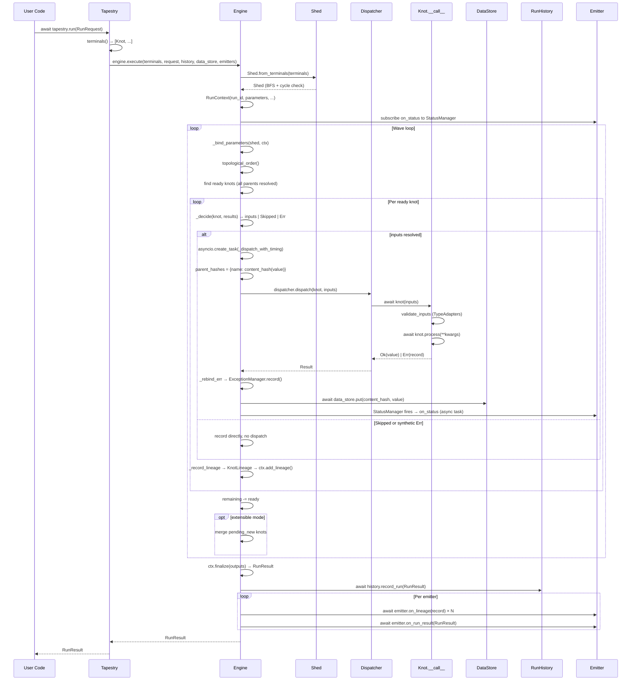
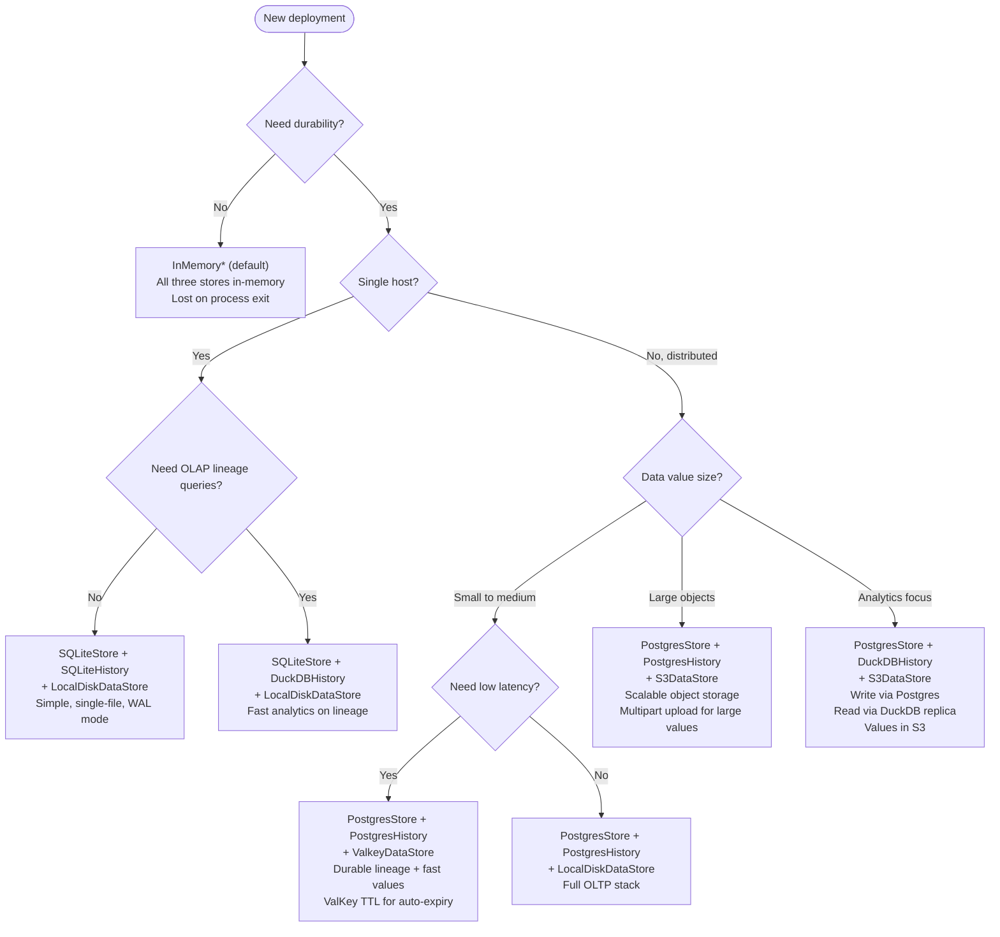

# pirn Architecture

**Version:** 0.3.0 (Phase 3)  
**Last Updated:** 2026-04-29  
**Audience:** engineers extending, deploying, or debugging the pirn framework

---

## Table of Contents

1. [System Overview](#1-system-overview)
2. [Core Concepts](#2-core-concepts)
3. [Architecture Layers](#3-architecture-layers)
4. [Execution Model](#4-execution-model)
5. [Storage Backend Matrix](#5-storage-backend-matrix)
6. [Distributed Execution](#6-distributed-execution)
7. [Streaming vs Trigger Architecture](#7-streaming-vs-trigger-architecture)
8. [YAML Pipeline Loader](#8-yaml-pipeline-loader)
9. [Extension Points](#9-extension-points)
10. [Mermaid Diagrams](#10-mermaid-diagrams)

---

## 1. System Overview

### What pirn Is

pirn is an async Python pipeline framework for defining, executing, and observing directed acyclic graphs (DAGs) of typed, async units of work. Pipelines are composed of **knots** — strongly-typed async functions with explicit dependency wiring — that the framework executes in topological order with concurrency between independent nodes.

**Problems pirn solves:**

- **Dependency tracking without ceremony.** Wiring a knot's output to another knot's input is a constructor argument. The framework derives execution order automatically.
- **Content-addressed lineage.** Every value that flows through a run is hashed and recorded in a lineage ledger. Two runs that produce identical values share the same hash, enabling cross-run comparisons without extra infrastructure.
- **Failure isolation.** Three error policies (SKIP_IF_PARENT_FAILED, RECEIVE_ERRORS, REQUIRE_ALL_PARENTS) control how failure propagates through the graph without manually writing try/except chains.
- **Swappable backends.** Storage (TapestryStore, RunHistory, DataStore), dispatch (LocalDispatcher, ThreadDispatcher, CeleryDispatcher, DaskDispatcher, RayDispatcher), and observability (Emitter) are all protocols. Production deployments swap to Postgres/S3/Kafka without touching pipeline code.
- **Run replay and diffing.** `replay_run` / `compare_runs` in `pirn/replay.py` let operators re-execute a past run with altered parameters and diff the results knot-by-knot by output hash.

### Version / Phase Status

| Phase | Status | Key additions |
|-------|--------|---------------|
| 1 | Complete | Knot/Tapestry/Engine core, InMemory backends, LocalDispatcher |
| 2 | Complete | Skipped result, ErrorPolicy, Optional mixin, ThreadDispatcher, StreamingSource, Trigger, Branch, Gate, Map, Reduce, Aggregator, YAML loader |
| 3 | Complete | Postgres/SQLite/DuckDB/ValKey/S3/Disk backends, CeleryDispatcher, DaskDispatcher, RayDispatcher, OpenTelemetry/Kafka/Valkey/Webhook emitters, Cron/HTTP/Kafka/Valkey triggers, mid-run extension, replay/diff utilities, tapestry-check CLI |

### High-Level Component Map

```
User Code
    │
    ├── @knot decorator / Knot subclasses   ← pirn/core/knot.py
    ├── KnotConfig / ErrorPolicy            ← pirn/core/config.py
    ├── Tapestry context manager            ← pirn/tapestry.py
    │       │
    │       └── tapestry.run(RunRequest)
    │               │
    │               ▼
    │           Engine                      ← pirn/engine/engine.py
    │               │
    │       ┌───────┼──────────────────┐
    │       ▼       ▼                  ▼
    │     Shed   Dispatcher        RunContext
    │  (graph)  (local/thread/     (lineage,
    │           celery/dask/ray)    status,
    │                               exceptions)
    │
    ├── Storage layer
    │       ├── TapestryStore  (InMemory / SQLite / Postgres / ValKey)
    │       ├── RunHistory     (InMemory / SQLite / DuckDB / Postgres)
    │       └── DataStore      (InMemory / Disk / S3 / ValKey)
    │
    ├── Observability layer
    │       └── Emitters       (Log / Kafka / OpenTelemetry / Valkey / Webhook)
    │
    ├── Trigger layer
    │       └── Triggers       (Cron / HTTP / Kafka / Valkey)
    │
    ├── Streaming layer
    │       └── StreamingSources (Iterable / FileTail / Kafka)
    │
    └── Tooling
            ├── YAML Loader    ← pirn/yaml_loader/
            ├── tapestry-check ← pirn/check.py
            └── replay / diff  ← pirn/replay.py
```

---

## 2. Core Concepts

### 2.1 Knot Lifecycle

**Construction → Validation → Registration → Execution**

**Construction** (`pirn/core/knot.py:Knot.__init__`)

A knot is constructed with keyword arguments matched against the signature of its `process()` method. The framework partitions kwargs at construction time:

- Arguments whose value is a `Knot` instance become **parents** — stored in `self._mutable_parents`.
- All other arguments become **config values** — stored in `self._mutable_config_values`.
- The reserved `_config=KnotConfig(id=...)` kwarg is required. The `id` field is mandatory; no auto-generation occurs.
- The reserved `tapestry=` kwarg selects explicit tapestry registration.

Two important type errors are caught eagerly:
- Unknown kwargs (not in `process()` signature) → `TypeError` immediately.
- Missing required inputs (declared in `process()` but not supplied) → `TypeError` immediately.

This means misconfigured pipelines fail at definition time, not at run time.

If `validate_io=True` (the default), Pydantic `TypeAdapter`s are built once per class at construction and applied at dispatch time.

**Validation** (`Knot._build_adapters`)

After the constructor runs, `TypeAdapter`s are built from `get_type_hints(type(self).process)`. These adapters are used in `__call__` to validate both inputs and the return value against the declared types.

**Registration** (`Tapestry.register`)

Registration happens at the end of `Knot.__init__`:

```python
target_tapestry = explicit_tapestry or _CURRENT_TAPESTRY.get(None)
if target_tapestry is not None:
    target_tapestry.register(self)
```

`_CURRENT_TAPESTRY` is a `contextvars.ContextVar` — async-safe, task-local. Inside a `with Tapestry() as t:` block the var is set; knots register themselves without any explicit call.

The tapestry delegates to its `TapestryStore.register(knot)`. `InMemoryStore` checks identity: the same instance registered twice is a no-op; two different instances with the same id raise `ValueError`.

**Execution** (`Knot.__call__`)

The engine calls `await knot(parent_results)`. The flow inside `__call__`:

1. Merge `_mutable_config_values` with `parent_results` (parent values override config for the same name).
2. If `validate_io`, call `_validate_inputs(kwargs)` via TypeAdapters → returns `Err` on failure.
3. `await self.process(**kwargs)` — user code.
4. If `validate_io`, validate the return value → returns `Err` on failure.
5. Return `Ok(value=result)`.

Any exception from `process()` is caught with `except BaseException` and becomes `Err(record=_pending_record(...))`. The engine re-registers these placeholder records with the live `ExceptionManager`.

After `_frozen = True` is set (last line of `__init__`), `__setattr__` rejects any attribute writes that do not start with `_mutable_`:

```python
def __setattr__(self, name: str, value: Any) -> None:
    if self._frozen and not name.startswith("_mutable_"):
        raise AttributeError(...)
```

This enforces the immutability-after-construction contract. The `_mutable_` prefix is the escape hatch used by the framework itself (e.g., `Parameter.bind_value`).

### 2.2 Result Type

**File:** `pirn/core/result.py`

```
Result[T] = Ok[T] | Err | Skipped
```

All three are frozen Pydantic models. The engine produces one per knot per run.

| Variant | Fields | Semantics |
|---------|--------|-----------|
| `Ok[T]` | `value: T` | Knot ran and returned successfully. |
| `Err` | `record: ExceptionRecord` | Knot raised an exception or a synthetic failure was injected by the engine. |
| `Skipped` | `reason: str`, `detail: dict` | Knot was deliberately not run: Optional opt-out, Branch non-selected path, Gate closed, or error policy propagation. |

**Propagation rules:**

- `Ok` propagates the raw `value` to children (unless the child uses `RECEIVE_ERRORS`).
- `Err` causes children with `SKIP_IF_PARENT_FAILED` to become `Skipped`, children with `REQUIRE_ALL_PARENTS` to produce a synthetic `Err`, and children with `RECEIVE_ERRORS` to receive the `Err` object directly.
- `Skipped` is treated identically to `Err` by `SKIP_IF_PARENT_FAILED` and `REQUIRE_ALL_PARENTS`. `RECEIVE_ERRORS` children also receive the `Skipped` object directly.

`unwrap()` exists on all three for convenience; it raises on non-`Ok`.

### 2.3 ErrorPolicy

**File:** `pirn/core/config.py:ErrorPolicy` (StrEnum)

Applied per knot in `Engine._decide()` (`pirn/engine/engine.py:384`):

```
SKIP_IF_PARENT_FAILED   (default)
RECEIVE_ERRORS
REQUIRE_ALL_PARENTS
```

**`SKIP_IF_PARENT_FAILED`** (default)

If any parent produced `Err` or `Skipped`, this knot returns `Skipped(reason="parent_failed_or_skipped", detail={...})` without calling `process()`. The Skipped propagates downstream. This is the right choice for most knots that cannot meaningfully proceed without upstream data.

Example: a chain `A → B → C` where B fails. Both C (child of B) and any knot downstream of C are Skipped, not Err.

**`RECEIVE_ERRORS`**

The engine calls `process()` unconditionally, passing `Result` objects directly as arguments instead of unwrapped values. The knot author handles `Err` and `Skipped` cases explicitly. Use for aggregation, fallback, or circuit-breaker knots.

Example:

```python
async def process(self, left: Result[int], right: Result[int]) -> int:
    lv = left.unwrap() if left.is_ok else 0
    rv = right.unwrap() if right.is_ok else 0
    return lv + rv
```

**`REQUIRE_ALL_PARENTS`**

If any parent produced `Err` or `Skipped`, the engine injects a synthetic `Err` (without calling `process()`) by creating an `ExceptionRecord` via `ctx.exceptions.record(knot_id, RuntimeError(...))`. Use when partial inputs are meaningless and a clear failure signal is preferable to silent skips.

### 2.4 Optional Mixin

**File:** `pirn/core/knot.py:Optional`

```python
class FetchPrefs(Optional, Knot):
    async def process(self, user_id: str) -> dict: ...
```

`Optional` is a plain Python mixin with no methods. Its presence is tested via `isinstance(self, Optional)` / `knot.is_optional`. The semantic difference from `ErrorPolicy` is about *the knot's own outcome*, not how it handles parent failures:

- A knot with `error_policy=SKIP_IF_PARENT_FAILED` skips if *its parents* failed.
- An `Optional` knot signals that *its own* failure or skip should be tolerable for the pipeline. Downstream visualizations and status reports can distinguish "this knot crashed" from "this knot opted out" using the `Skipped` vs `Err` distinction.
- `Optional` does **not** prevent error propagation on its own — children still apply their own `error_policy` when they see the Optional parent's `Err` or `Skipped` result. The distinction is visible and useful to `RECEIVE_ERRORS` children and to emitters.

### 2.5 Content-Addressed Lineage

**Files:** `pirn/core/hashing.py`, `pirn/core/lineage.py`

Every value that flows through the pipeline is identified by a stable content hash. `content_hash(value)` returns `sha256:<hex-digest>`.

**What gets hashed:**

- Knot output values (stored in `KnotLineage.output_hash` and as key in `DataStore`).
- Each parent's input value (stored per-name in `KnotLineage.parent_input_hashes`).
- The knot's config (`KnotLineage.knot_config_hash` via `knot.config.model_dump(mode="json")`).

**Why sha256:** collision resistance at acceptable cost. Hex-encoded because hashes appear in logs and JSON where hex is universally readable.

**Canonicalisation rules** (`hashing._canonicalise`):

| Type | Canonical form |
|------|---------------|
| Pydantic model | `{"__model__": ClassName, "data": <dict>}` |
| Mapping | `{"__map__": [[k, v], ...]}` with keys sorted by `str(key)` |
| Sequence (list, tuple) | `{"__seq__": [...]}` — order preserved |
| Set/frozenset | `{"__set__": [sorted element hashes]}` — order-independent |
| Primitives | JSON-native |
| bytes | `{"__bytes__": hex_string}` |
| Opaque | `sha256:unhashable:<TypeName>` sentinel |

Type tags (`__model__`, `__map__`, `__seq__`, `__set__`, `__bytes__`) prevent cross-type hash collisions.

**Stability guarantees:** stable within a Python deployment (same major version, same pirn version). Cross-deployment stability is guaranteed for Pydantic models, dicts, lists, primitives, and bytes. Opaque types fall back to `repr`, which is not cross-process stable; these produce the `unhashable` sentinel rather than a false equality.

**DataStore / Lineage split:** `KnotLineage` holds hashes only; the actual values live in the `DataStore` keyed by the same hash. This means:

- Lineage can be retained indefinitely for auditing.
- Data can be scrubbed (TTL, privacy) without breaking the lineage graph.
- Two runs that produce the same output value share one DataStore entry.

---

## 3. Architecture Layers

### 3.1 User API Layer

**Files:** `pirn/core/knot.py`, `pirn/core/config.py`, `pirn/tapestry.py`

**Knot subclassing:**

```python
from pirn.core.knot import Knot
from pirn.core.config import KnotConfig, ErrorPolicy

class EnrichUser(Knot):
    async def process(self, user_id: str, lookup_table: dict) -> dict:
        return lookup_table.get(user_id, {})
```

**`@knot` decorator:**

```python
from pirn.core.knot import knot

@knot
async def double(x: int) -> int:
    return x * 2
```

`@knot` creates a `KnotFactory` that returns a new `Knot` subclass on each call. The factory exposes `.fn` (the original function) and `.knot_class` (the generated subclass). Sync functions are wrapped via `asyncio.to_thread` automatically.

**KnotFactory:**

`KnotFactory.__call__(**kwargs)` delegates to `self.knot_class(**kwargs)`. This makes `@knot`-decorated functions call-compatible with Knot subclasses — both can be passed to Map's `each=` or the YAML loader's `known_callables`.

**Tapestry context manager:**

```python
with Tapestry(store=..., history=..., data_store=..., dispatcher=..., emitters=[...]) as t:
    p = Parameter(name="user_id", type_=str, _config=KnotConfig(id="user_id"))
    enriched = EnrichUser(user_id=p, lookup_table={...}, _config=KnotConfig(id="enrich"))
    # enriched is now registered with `t`
```

`Tapestry.__enter__` sets `_CURRENT_TAPESTRY` via `ContextVar.set`; `__exit__` resets via the saved token. The ContextVar is async-safe and task-local in asyncio.

**Connection to the next layer:**

`Tapestry.run(request)` builds an `Engine`, derives terminals, and calls `engine.execute(terminals, ...)`.

### 3.2 Pipeline Graph Layer

**Files:** `pirn/tapestry.py`, `pirn/engine/shed.py`, `pirn/core/parameter.py`

**Knot wiring:**

A knot's parents are any constructor kwargs whose value is a `Knot` instance. These are stored in `knot._mutable_parents: dict[str, Knot]`. The key is the `process()` parameter name; the value is the parent knot.

**Parent/config partitioning:**

At construction, `Knot.__init__` iterates all kwargs and sorts them:

```python
for name, value in kwargs.items():
    if isinstance(value, Knot):
        parents[name] = value
    else:
        config_values[name] = value
```

**Terminals:**

`Tapestry.terminals()` computes terminal knots on demand (O(n)):

```python
referenced: set[str] = set()
for k in all_knots:
    for parent in k.parents.values():
        referenced.add(parent.knot_id)
return [k for k in all_knots if k.knot_id not in referenced]
```

A terminal is any knot not referenced as a parent by any other knot in the tapestry. These are the "sinks" — the engine executes up to these.

**Shed construction (`Shed.from_terminals`):**

The `Shed` (`pirn/engine/shed.py`) is a per-run, ephemeral view of the subgraph reachable from the terminal set. It is built via BFS from terminals, walking `knot.parents` references:

- `knots: dict[str, Knot]` — all reachable knots by id.
- `edges_by_child: dict[str, list[Edge]]` — for each knot, the list of parent edges.
- `children_by_parent: dict[str, list[str]]` — inverse: for each parent id, the list of child ids.

`Edge` is a frozen Pydantic model: `(child_id, parent_id, name)`.

After BFS, a DFS cycle check runs (`_has_cycle`). If a cycle is found, `ShedError` is raised.

The shed also computes `topological_order()` via Kahn's algorithm with sorted-within-layer determinism.

The Shed is not part of the public API. It is an engine internal.

### 3.3 Execution Layer

**Files:** `pirn/engine/engine.py`, `pirn/engine/shed.py`, `pirn/engine/dispatcher.py`

**Engine:**

`Engine` (`pirn/engine/engine.py:Engine`) owns no state across runs. It is constructed with a `Dispatcher` and its `execute(terminals, request, history, data_store, emitters, extensible_store)` method runs one complete pipeline execution.

**Wave loop:**

```
remaining = all knots in topological order

while remaining:
    ready = [k for k in order if k in remaining
             and all parents in results]
    
    for each ready knot:
        decision = _decide(knot, results)    # error policy
        if decision is Skipped/Err:
            record directly, continue
        else:
            create asyncio.Task(_dispatch_with_timing(knot, inputs))
    
    for each task:
        await task → (result, parent_hashes, started_at)
        rebind Err records to live ExceptionManager
        persist Ok value to DataStore
        record lineage
    
    remaining -= ready
    merge any mid-run-registered knots
```

Knots within a wave run concurrently via `asyncio.create_task` + individual `await task`. This is wave-level concurrency, not full async fan-out — the engine awaits each task sequentially after the wave. This is correct and simple: knots within a wave have no dependencies on each other, so ordering within the await loop does not matter for correctness.

**`_decide()`:**

Returns one of:
- `dict[str, Any]` — resolved inputs (raw values for SKIP_IF_PARENT_FAILED and REQUIRE_ALL_PARENTS; `Result` objects for RECEIVE_ERRORS).
- `Skipped` — knot will be skipped.
- `Err` — synthetic failure (REQUIRE_ALL_PARENTS policy).

**Dispatcher protocol:**

```python
class Dispatcher(Protocol):
    @property
    def name(self) -> str: ...
    async def dispatch(self, knot: Knot, inputs: Mapping[str, Any]) -> Result[Any]: ...
```

`LocalDispatcher` calls `await knot(inputs)` directly in the event loop.  
`ThreadDispatcher` submits to a `ThreadPoolExecutor` via `loop.run_in_executor`, spinning a new event loop in each worker thread via `asyncio.run(knot(inputs))`.

**Mid-run extension (`extensible=True`):**

When `extensible_store` is passed to `engine.execute`, the engine subscribes to the store's `subscribe(callback)` method. New knots registered with the store during the run are queued in `pending_new`. Between each wave, the engine calls `_merge_new_knots()` which:

1. Validates that no new knot's parent has already completed (would break lineage).
2. Inserts new knots into the shed's dicts directly (bypassing `Shed.from_terminals`).
3. Re-runs `_bind_parameters` for any new Parameter knots.
4. Extends `remaining` with new knot ids.

Requires the store to implement `SubscribableStore` (`pirn/backends/subscribe.py`). `InMemoryStore`, `PostgresStore`, and `ValKeyStore` all implement this protocol (see `docs/subscribable-stores.md`).

### 3.4 Storage Layer

**Files:** `pirn/backends/__init__.py`, `pirn/backends/in_memory.py`, plus sqlite, postgres, duckdb, valkey, s3, disk backends.

Three protocols (all `@runtime_checkable`):

**`TapestryStore`** — knot registry
- `register(knot)` — idempotent by identity, raises on id collision.
- `get(knot_id)` — retrieve knot by id.
- `all()` — list all knots.
- `snapshot()` → `TapestrySnapshot` — immutable view of knot ids at a moment in time.

**`RunHistory`** — run result and lineage persistence
- `record_run(result)` — persist a `RunResult`.
- `get_run(run_id)` — retrieve by id.
- `query_lineage_by_output_hash(hash)` — all lineage records with this output.
- `query_lineage_by_input_hash(hash)` — all lineage records that consumed this hash.
- `query_lineage_by_knot_id(knot_id)` — all runs of a specific knot.

**`DataStore`** — content-addressed value store
- `put(content_hash, value)` — store a value.
- `get(content_hash)` — retrieve; raises `KeyError` if absent.
- `has(content_hash)` — check existence.
- `scrub(content_hash)` — remove value; lineage referencing it remains intact.

**`SubscribableStore`** (optional extension of `TapestryStore`, `pirn/backends/subscribe.py`)
- `subscribe(callback)` → token — fire callback on each new knot registration.
- `unsubscribe(token)` — remove subscription.

Adjacent layers interface: `Tapestry` holds references to all three stores. It passes them to `Engine.execute`. The engine writes to `DataStore` (via `data_store.put`) and reads via `_bind_parameters` only for Parameters. After a run, `history.record_run(run_result)` persists the full `RunResult` including all `KnotLineage` records.

### 3.5 Observability Layer

**Files:** `pirn/emitters/base.py`, `pirn/emitters/log.py`, `pirn/emitters/kafka.py`, `pirn/emitters/otel.py`, `pirn/emitters/valkey.py`, `pirn/emitters/webhook.py`

**Emitter protocol:**

```python
class Emitter(Protocol):
    async def on_status(self, event: StatusEvent) -> None: ...
    async def on_lineage(self, record: KnotLineage) -> None: ...
    async def on_run_result(self, result: RunResult) -> None: ...
```

**Subscription to StatusManager:**

The engine wires emitters to `RunContext.status` (a `StatusManager`) at the start of each run via `_subscribe_emitters_to_status`. Because `StatusManager` fires subscribers synchronously but emitters are async, each subscriber wraps the emitter call in a fire-and-forget `asyncio.create_task`. Exceptions in emitters are swallowed so a broken emitter cannot abort a run.

**Lifecycle hooks:**

- `on_status` — fires on each knot state transition (RUNNING → SUCCEEDED/FAILED/SKIPPED). Fired synchronously during the wave loop via the StatusManager subscriber.
- `on_lineage` — fired after `history.record_run()`, once per `KnotLineage` record in the `RunResult`.
- `on_run_result` — fired once per run, after `history.record_run()`.

**Built-in emitters:**

| Emitter | Transport | Phase |
|---------|-----------|-------|
| `LogEmitter` | Python `logging` | 2 |
| `KafkaEmitter` | `aiokafka` producer | 3 |
| `OpenTelemetryEmitter` | OTLP spans | 3 |
| `ValKeyEmitter` | ValKey pubsub | 3 |
| `WebhookEmitter` | HTTP POST | 3 |

### 3.6 Trigger Layer

**Files:** `pirn/triggers/base.py`, `pirn/triggers/cron.py`, `pirn/triggers/http.py`, `pirn/triggers/kafka.py`, `pirn/triggers/valkey.py`

**Trigger protocol:**

```python
class Trigger(Protocol):
    @property
    def name(self) -> str: ...
    def stream(self) -> AsyncIterator[RunRequest]: ...
    async def close(self) -> None: ...
```

**`run_forever(trigger, tapestry, *, on_result=None, on_error=None)`** (`pirn/triggers/base.py`):

Consumes `RunRequest`s from `trigger.stream()` and calls `tapestry.run(request)` for each. Calls `trigger.close()` on exit (normal, cancelled, or errored). Optional callbacks `on_result` and `on_error` are awaited if provided.

**Built-in triggers:**

| Trigger | Source |
|---------|--------|
| `CronTrigger` | Schedule-based; wraps `croniter` or similar |
| `HttpTrigger` | Embedded HTTP server (webhook receiver) |
| `KafkaTrigger` | Kafka consumer; one `RunRequest` per message |
| `ValkeyTrigger` | ValKey pubsub subscriber |

### 3.7 YAML Loader Layer

**Files:** `pirn/yaml_loader/loader.py`, `pirn/yaml_loader/spec.py`

The YAML loader translates a pipeline definition file into a live `Tapestry`. It is an optional convenience layer; all pipeline constructions can be done programmatically.

---

## 4. Execution Model

### Complete Run Cycle

**Step 1: `tapestry.run(request)` called**

`Tapestry.run` (`pirn/tapestry.py:131`) accepts an optional `RunRequest` (auto-constructed if omitted). Key parameters:

- `terminals` — explicit terminal knots; defaults to `tapestry.terminals()`.
- `dispatcher` — per-run dispatcher override.
- `emitters` — per-run emitter list override; `None` uses tapestry defaults; `[]` disables.
- `extensible=True` — enables mid-run knot registration.

**Step 2: `Tapestry.terminals()` computed**

If no explicit terminals are passed, `Tapestry.terminals()` performs an O(n) scan: knots not referenced as a parent by any other knot in the store.

**Step 3: `Engine.execute()` — shed built, parameters bound**

`Engine.execute` (`pirn/engine/engine.py:46`):

1. `Shed.from_terminals(terminals)` — BFS walk + cycle check + index build.
2. `RunContext(run_id, terminals_requested, dispatcher_name, parameters)` — run-scoped state container holding the `StatusManager`, `ExceptionManager`, and lineage accumulator.
3. If `emitters` non-empty, subscribe each emitter's `on_status` to `ctx.status` via `_subscribe_emitters_to_status`.
4. If `extensible_store`, subscribe `_on_new_knot` callback to the store.
5. Call `_execute_loop`.
6. In the `finally` block, unsubscribe from the store.

**Step 4: Wave loop — `_execute_loop`**

Inside `_execute_loop` (`pirn/engine/engine.py:105`):

1. `_bind_parameters(shed, ctx)` — for each `Parameter` knot in the shed, bind its value from `ctx.parameters` or its default. Raises `RuntimeError` for unbound parameters without defaults.
2. Compute `order = shed.topological_order()` (Kahn's algorithm, sorted within each wave for determinism).
3. `remaining = set(order)`.
4. **Wave iteration:**
   a. Drain `pending_new` (mid-run extension).
   b. Compute `ready` — knots in `remaining` whose all parents have entries in `results`.
   c. For each ready knot: call `_decide()`. If the decision is `Skipped` or synthetic `Err`, record immediately. Otherwise, create an `asyncio.Task` via `_dispatch_with_timing`.
   d. `await` each task in order, collect `(result, parent_hashes, started_at)`.
   e. Call `_rebind_err` to register the `ExceptionRecord` with the live `ExceptionManager`.
   f. If `Ok`: `content_hash(result.value)` + `await data_store.put(hash, value)`.
   g. Update `ctx.status` state machine.
   h. Call `_record_lineage` — builds a `KnotLineage` record and adds it to `ctx`.
   i. `remaining -= ready`.
   j. Drain `pending_new` again (knots registered during the wave).

**Step 5: Per-knot `_decide()` (error policy)**

`_decide` (`pirn/engine/engine.py:384`) reads the error policy from `knot.config.error_policy` and inspects `results[parent_id]` for each parent edge:

- `REQUIRE_ALL_PARENTS`: any Err or Skipped → synthetic `Err`.
- `SKIP_IF_PARENT_FAILED`: any Err or Skipped → `Skipped`.
- `RECEIVE_ERRORS`: pass `Result` objects directly as inputs.

On a clean path (all parents `Ok`), the input dict is `{name: result.value for name, result in parent_results.items()}`.

**Step 6: `_dispatch_with_timing(knot, inputs)`**

```python
parent_hashes = {name: content_hash(value) for name, value in inputs.items()}
started_at = datetime.now(UTC)
result = await self._dispatcher.dispatch(knot, inputs)
return result, parent_hashes, started_at
```

The dispatcher calls `knot(inputs)` (which calls `knot.__call__`, which calls `knot.process`). The result is wrapped in `Ok`/`Err`/`Skipped` by the knot itself.

**Step 7: Lineage capture per knot**

`_record_lineage` (`pirn/engine/engine.py:472`) builds a `KnotLineage`:

- `run_id`, `knot_id`, `knot_class` (fully-qualified class name).
- `knot_config_hash` = `content_hash(knot.config.model_dump(mode="json"))`.
- `parent_input_hashes` = per-input content hashes captured before dispatch.
- `output_hash` = content hash of `Ok.value`, or `None`.
- `outcome` = `"ok"` | `"err"` | `"skipped"`.
- `error_record_id` — id from the `ExceptionManager` if `Err`.
- `skip_reason` — reason string if `Skipped`.
- `dispatcher` name.
- `started_at`, `finished_at` timestamps.

Records are accumulated in `ctx` (via `ctx.add_lineage(record)`).

**Step 8: `history.record_run()` called**

After the wave loop, `ctx.finalize(outputs)` builds the `RunResult`:

- `outputs: dict[str, Any]` — raw values for `Ok` knots.
- `lineage: list[KnotLineage]` — all per-knot records.
- `exceptions` — all `ExceptionRecord`s registered during the run.
- `status_events` — full state machine history from `StatusManager`.

`await history.record_run(run_result)` persists the result.

**Step 9: Emitter hooks fired**

After `history.record_run()` (so emitters see persisted state):

```python
for emitter in emitters:
    for record in run_result.lineage:
        await emitter.on_lineage(record)  # exceptions swallowed
    await emitter.on_run_result(run_result)  # exceptions swallowed
```

**Step 10: `RunResult` returned**

`tapestry.run()` returns the `RunResult` to the caller.

### Mid-Run Extension

With `extensible=True`, the engine subscribes to the store before the wave loop. Any knot registered with the tapestry while a wave runs is appended to `pending_new`. Between waves, `_merge_new_knots` validates and merges them:

- A new knot whose parent already has a result → `ShedError` (cannot re-run completed knots).
- Newly arrived `Parameter` knots are bound immediately.
- The topological order is recomputed; `remaining` is extended.

This enables dynamic pipeline construction patterns such as generators that emit new knots based on the outputs of early knots.

### Distributed Dispatch

When a distributed dispatcher (Celery, Dask, Ray) is used, the engine's wave loop is unchanged. The difference is that `dispatcher.dispatch(knot, inputs)` submits the work to the remote scheduler and awaits the result. The engine still waits for each task in the wave before proceeding.

See [Section 6](#6-distributed-execution) for serialization details.

---

## 5. Storage Backend Matrix

| Backend | TapestryStore | RunHistory | DataStore | SubscribableStore | Notes |
|---------|:---:|:---:|:---:|:---:|-------|
| `InMemoryStore` / `InMemoryHistory` / `InMemoryDataStore` | Y | Y | Y | Y | Default. Single-process, lost on exit. Thread-safe via locks. |
| `SQLiteStore` / `SQLiteHistory` | Y | Y | — | N | Single-host durable. Single-writer model; WAL mode recommended. |
| `PostgresStore` / `PostgresHistory` | Y | Y | — | Y | OLTP. Async via `asyncpg`. Connection pool required. |
| `DuckDBHistory` | — | Y | — | N | OLAP queries on lineage. Best as a read-replica target. |
| `LocalDiskDataStore` | — | — | Y | N | Single-host file-per-value storage. |
| `S3DataStore` | — | — | Y | N | Distributed object storage. Requires `aioboto3`. |
| `ValKeyStore` / `ValKeyDataStore` | Y | — | Y | Y | Low-latency. Requires `valkey-glide`. TTL support on DataStore. |

### Deployment Guidance

**Local development:**

Use all `InMemory*` defaults. No configuration required; data is lost when the process exits. Suitable for testing, notebooks, and CI pipelines where history persistence is not needed.

```python
t = Tapestry()  # all defaults: InMemoryStore, InMemoryHistory, InMemoryDataStore
```

**Single-host durable:**

```python
from pirn.backends.sqlite import SQLiteStore, SQLiteHistory
from pirn.backends.disk import LocalDiskDataStore

t = Tapestry(
    store=SQLiteStore("pirn.db"),
    history=SQLiteHistory("pirn.db"),
    data_store=LocalDiskDataStore("/var/pirn/data"),
)
```

Suitable for scheduled batch jobs on a single machine. SQLite is the write path; `LocalDiskDataStore` handles arbitrary value sizes.

**Distributed OLTP:**

```python
from pirn.backends.postgres import PostgresStore, PostgresHistory
from pirn.backends.s3 import S3DataStore

t = Tapestry(
    store=PostgresStore(dsn="postgresql://..."),
    history=PostgresHistory(dsn="postgresql://..."),
    data_store=S3DataStore(bucket="pirn-data", region="us-east-1"),
)
```

Multiple workers can share the same Postgres cluster and S3 bucket. Suitable for high-volume distributed runs (>1000/day) with durable lineage.

**Mixed OLTP/OLAP:**

```python
from pirn.backends.postgres import PostgresStore, PostgresHistory
from pirn.backends.duckdb import DuckDBHistory

# OLTP writes go to Postgres; OLAP reads hit DuckDB (e.g. against a read replica)
t = Tapestry(
    store=PostgresStore(dsn="..."),
    history=PostgresHistory(dsn="..."),  # write path
    ...
)
# Separate read path for analytics:
analytics_history = DuckDBHistory("analytics.duckdb")
```

**Low-latency streaming:**

```python
from pirn.backends.valkey import ValKeyStore, ValKeyDataStore

t = Tapestry(
    store=ValKeyStore(host="localhost", port=6379),
    data_store=ValKeyDataStore(host="localhost", port=6379, ttl_seconds=3600),
)
```

ValKey (Redis-compatible) provides sub-millisecond get/put with optional TTL on data values. Suitable for streaming pipelines where data has a natural expiry.

---

## 6. Distributed Execution

### CeleryDispatcher

**File:** `pirn/engine/celery_dispatcher.py`

```python
from pirn.engine.celery_dispatcher import CeleryDispatcher, register_celery_worker_task

# Driver side
dispatcher = CeleryDispatcher(broker_url="redis://localhost:6379/0",
                               backend_url="redis://localhost:6379/1")

# Worker side (in worker init module)
from celery import Celery
app = Celery("pirn", broker="redis://localhost:6379/0")
app.conf.update(task_serializer="pickle", accept_content=["pickle"], result_serializer="pickle")
register_celery_worker_task(app)
```

**How it works:**

`CeleryDispatcher.dispatch(knot, inputs)` calls `app.send_task(PIRN_CELERY_TASK_NAME, args=(knot, dict(inputs)))` and bridges the blocking `async_result.get()` to async via `asyncio.to_thread`. The worker runs `asyncio.run(knot(inputs))` in a fresh event loop per task.

**Serialization:** Celery's default JSON serializer cannot handle arbitrary Knot objects. The dispatcher configures `task_serializer="pickle"` and `accept_content=["pickle"]`. Knots must be pickle-serializable. This requires the knot class to be importable on the worker process — dynamic classes created by `@knot` may need explicit `__module__` and `__qualname__` if they are not defined at module scope.

**What changes vs local:**

- Knots run in a separate OS process (the Celery worker).
- Worker processes must have `pirn` installed and the user's pipeline package importable.
- The wave-loop structure is unchanged; the engine still awaits each distributed task.
- Latency per knot increases by the round-trip to the broker + worker + result backend.

### DaskDispatcher

**File:** `pirn/engine/dask_dispatcher.py`

Submits knots via `client.submit(asyncio.run, knot, dict(inputs))` against a Dask `Client`. Serialization is via `cloudpickle` (Dask's default), which handles most Python objects including lambdas and locally-defined functions. Workers must have `pirn` importable.

Construction: `DaskDispatcher(client=<dask.distributed.Client>)` or `DaskDispatcher(scheduler_address="tcp://...")`.

### RayDispatcher

**File:** `pirn/engine/ray_dispatcher.py`

Submits knots as Ray remote tasks. Ray uses `cloudpickle` for serialization. Construction: `RayDispatcher()` (expects `ray.init()` to have been called by the application).

### Serialization Considerations

For all distributed dispatchers:

- **Knot classes defined at module scope** serialize reliably across processes.
- **`@knot`-decorated functions at module scope** serialize reliably; `@knot` preserves `__module__` and `__qualname__` from the wrapped function.
- **Lambdas and nested functions** in `selector`, `predicate`, or `combine` arguments (Branch, Gate, Aggregator) require cloudpickle (Dask/Ray) or explicit module-scope definitions (Celery).
- **Config values** must be serializable. Pydantic models, dicts, lists, and primitives work. Custom classes need `__reduce__` or cloudpickle.
- **Inputs at dispatch time** are already-resolved Python values (not Knot references). They are passed directly as `dict(inputs)` to the worker.

---

## 7. Streaming vs Trigger Architecture

### Conceptual Distinction

| Concept | Model | Driver | Lifecycle |
|---------|-------|--------|-----------|
| **Trigger** | Event → one full `RunRequest` | `run_forever` | Async generator; external events create full parameter sets |
| **StreamingSource** | Source → one parameter value per tick | `run_stream` | Async generator; source is the primary input |

A `Trigger` yields fully-formed `RunRequest` objects — the trigger author decides all parameter values for each run. A `StreamingSource` yields raw values that are bound to a single parameter name; the rest of the parameters come from `extra_parameters`.

### `run_forever()` Loop

**File:** `pirn/triggers/base.py:run_forever`

```python
async for request in trigger.stream():
    result = await tapestry.run(request)
    if on_result:
        await on_result(request, result)
```

- `trigger.close()` is called in the `finally` block on any exit (including `asyncio.CancelledError`).
- `on_error` callback receives the original `RunRequest` and the exception.
- Cancellation: wrap in `asyncio.create_task()` and `task.cancel()`.

### `run_stream()` Loop

**File:** `pirn/streaming/base.py:run_stream`

```python
async for value in source.stream():
    params = dict(base_params)
    params[source.parameter_name] = value
    request = RunRequest(parameters=params)
    result = await tapestry.run(request)
    if on_result:
        await on_result(value, result)
```

The source provides `parameter_name` (the knot id or parameter name to bind to). `extra_parameters` provides constants that appear in every tick's run.

- `source.close()` is called in `finally`.
- `on_error` receives the raw value and the exception.

### StreamingSource Protocol

```python
class StreamingSource(Protocol):
    @property
    def name(self) -> str: ...
    @property
    def parameter_name(self) -> str: ...
    def stream(self) -> AsyncIterator[Any]: ...
    async def close(self) -> None: ...
```

Built-in sources: `IterableStreamingSource` (wraps a Python iterable), `FileTailSource` (tails a file), `KafkaStreamingSource` (consumes a Kafka topic).

### StreamingSourceTrigger Adapter

**File:** `pirn/streaming/trigger_adapter.py`

`StreamingSourceTrigger` wraps a `StreamingSource` to implement the `Trigger` protocol. Each value from the source is converted to a `RunRequest` by binding `source.parameter_name = value`. This allows streaming sources to be driven by `run_forever` without a custom driver.

---

## 8. YAML Pipeline Loader

**Files:** `pirn/yaml_loader/loader.py`, `pirn/yaml_loader/spec.py`

### Entry Point

```python
from pirn.yaml_loader.loader import load_pipeline

tapestry = load_pipeline(
    yaml_text,
    tapestry=existing_tapestry,         # optional; new Tapestry() if omitted
    known_callables={"my_fn": my_fn},   # strict mode: map names to callables
)
```

### Node Types and YAML Shape

| Node Type | Spec Class | Key Fields |
|-----------|-----------|------------|
| `parameter` | `ParameterSpec` | `id`, `type_` (str builtin or dotted path), `default` (optional) |
| `source` | `SourceSpec` | `id`, `callable` (name or dotted path) |
| `knot` | `KnotSpec` | `id`, `callable`, `parents: {input_name: node_id}`, `config: {input_name: value}` |
| `sink` | `SinkSpec` | same as `KnotSpec` |
| `branch` | `BranchSpec` | `id`, `input` (node_id), `selector` (callable ref), `branches: [name, ...]` |
| `gate` | `GateSpec` | `id`, `input` (node_id), `predicate` (callable ref) |
| `map` | `MapSpec` | `id`, `over` (node_id), `each` (callable ref), `bind` (param name), `shared: {}` |
| `reduce` | `ReduceSpec` | `id`, `of` (node_id), `combine` (callable ref), `initial` (optional) |
| `aggregator` | `AggregatorSpec` | `id`, `parents: {}`, `combine` (callable ref) |

All node specs share common fields: `id`, `validate_io` (bool, default `true`), `error_policy` (string, default `"skip_if_parent_failed"`), `description`, `tags`.

Example YAML:

```yaml
allow_callable_refs: false
nodes:
  - id: user_id
    type: parameter
    type_: str

  - id: fetch_user
    type: knot
    callable: fetch_user
    parents:
      user_id: user_id

  - id: enrich
    type: knot
    callable: enrich_user
    parents:
      user: fetch_user
    config:
      timeout: 30
    error_policy: require_all_parents
```

### Strict vs Loose Mode

**`allow_callable_refs: false`** (strict, default):

All callable references (`callable`, `selector`, `predicate`, `combine`, `each`) must be keys in `known_callables`. The loader resolves them by lookup; no imports are performed. This is safe for user-provided YAML (e.g., from a database or API) because no arbitrary code can be imported.

**`allow_callable_refs: true`** (loose):

If a callable reference is not in `known_callables`, the loader treats it as a dotted import path and calls `importlib.import_module`. Example: `"myapp.transforms.enrich_user"` → imports `myapp.transforms` and gets attribute `enrich_user`.

**Security implication:** loose mode allows arbitrary code execution if the YAML is user-controlled. Only enable it for YAML authored by the same trust boundary as the runtime (e.g., checked-in pipeline files, not user-supplied API payloads).

### `known_callables`

A `Mapping[str, Any]` passed to `load_pipeline`. Values can be:

- Plain callables (sync or async).
- `KnotFactory` instances (from `@knot`).
- `Knot` subclasses.

The loader's `_resolve_callable` checks `known_callables` first, then falls back to dotted import if `allow_callable_refs=True`.

### Topological Ordering Algorithm

`_topo_order_specs` (`pirn/yaml_loader/loader.py:89`) implements Kahn's algorithm on the YAML specs before any Python objects are constructed. This ensures each spec is built only after all its referenced parent specs. The algorithm uses sorted ready-queues for determinism, identical to `Shed.topological_order()`.

---

## 9. Extension Points

### 9.1 Custom Knot Subclasses

Subclass `Knot` and implement `async def process(self, ...) -> Any`:

```python
from pirn.core.knot import Knot, Optional
from pirn.core.config import KnotConfig

class MyKnot(Optional, Knot):
    async def process(self, data: list[dict], threshold: float) -> list[dict]:
        return [r for r in data if r["score"] >= threshold]
```

Key rules:
- `process()` parameters must not use reserved names `_config` or `tapestry`.
- `VAR_POSITIONAL` (`*args`) and `VAR_KEYWORD` (`**kwargs`) parameters are ignored by the wiring system.
- Raising any exception from `process()` produces `Err`; the framework catches `BaseException`.
- Override `__call__` only for `BranchOutput`-style sentinel conversion (converting specific exceptions to `Skipped`).

### 9.2 Custom Backends

Implement the protocol(s) from `pirn/backends/__init__.py`. All three protocols are `@runtime_checkable`, so `isinstance(obj, TapestryStore)` works without subclassing.

**Custom TapestryStore:**

```python
class RedisStore:
    def register(self, knot: Knot) -> None: ...
    def get(self, knot_id: str) -> Knot | None: ...
    def all(self) -> list[Knot]: ...
    def snapshot(self) -> TapestrySnapshot: ...
```

Optionally implement `subscribe`/`unsubscribe` to support `extensible=True` mid-run extension.

**Custom DataStore:**

```python
class GCSDataStore:
    async def put(self, content_hash: str, value: Any) -> None: ...
    async def get(self, content_hash: str) -> Any: ...
    async def has(self, content_hash: str) -> bool: ...
    async def scrub(self, content_hash: str) -> None: ...
```

Note: values are arbitrary Python objects. The store is responsible for serialization. All built-in stores use `pickle` or JSON depending on the backend.

### 9.3 Custom Dispatchers

Implement `pirn/engine/dispatcher.py:Dispatcher`:

```python
class MyDispatcher:
    @property
    def name(self) -> str:
        return "MyDispatcher"

    async def dispatch(self, knot: Knot, inputs: Mapping[str, Any]) -> Result[Any]:
        # Submit knot to remote system, await result.
        ...
```

The dispatcher is passed to `Tapestry(dispatcher=...)` or `tapestry.run(dispatcher=...)` for per-run override.

### 9.4 Custom Emitters

Implement the Emitter protocol from `pirn/emitters/base.py`:

```python
class MetricsEmitter:
    async def on_status(self, event: StatusEvent) -> None:
        metrics.increment(f"pirn.knot.{event.knot_id}.{event.state}")

    async def on_lineage(self, record: KnotLineage) -> None:
        metrics.histogram("pirn.knot.duration_ms", record.duration_ms,
                          tags={"knot_id": record.knot_id})

    async def on_run_result(self, result: RunResult) -> None:
        metrics.gauge("pirn.run.knot_count", len(result.lineage))
```

Register via `tapestry.add_emitter(MetricsEmitter())` or pass to `Tapestry(emitters=[...])`.

Emitters must be safe to `await` concurrently and must not raise (exceptions are swallowed by the engine). Long-running emitter work should be scheduled as background tasks.

### 9.5 Custom Triggers

Implement `pirn/triggers/base.py:Trigger`:

```python
class SQSTrigger:
    @property
    def name(self) -> str:
        return "SQSTrigger"

    async def stream(self) -> AsyncIterator[RunRequest]:
        async for message in self._poll():
            yield RunRequest(parameters=json.loads(message.body))

    async def close(self) -> None:
        await self._client.close()
```

Drive with `run_forever(trigger, tapestry)`.

### 9.6 Custom StreamingSources

Implement `pirn/streaming/base.py:StreamingSource`:

```python
class WebSocketSource:
    @property
    def name(self) -> str: return "WebSocketSource"

    @property
    def parameter_name(self) -> str: return "event"

    async def stream(self) -> AsyncIterator[Any]:
        async for msg in self._ws:
            yield json.loads(msg)

    async def close(self) -> None:
        await self._ws.close()
```

Drive with `run_stream(source, tapestry, extra_parameters={...})`.

---

## 10. Mermaid Diagrams

### Component Dependency Diagram

```mermaid
graph TD
    subgraph User["User API"]
        KnotCls["Knot (ABC)\npirn/core/knot.py"]
        KnotDec["@knot decorator\nKnotFactory"]
        Tap["Tapestry\npirn/tapestry.py"]
        KnotCfg["KnotConfig / ErrorPolicy\npirn/core/config.py"]
    end

    subgraph Graph["Pipeline Graph"]
        Shed["Shed\npirn/engine/shed.py"]
        Edge["Edge (Pydantic)"]
        Param["Parameter\npirn/core/parameter.py"]
    end

    subgraph Exec["Execution"]
        Engine["Engine\npirn/engine/engine.py"]
        LocalDisp["LocalDispatcher"]
        ThreadDisp["ThreadDispatcher"]
        CeleryDisp["CeleryDispatcher\npirn/engine/celery_dispatcher.py"]
        DaskDisp["DaskDispatcher\npirn/engine/dask_dispatcher.py"]
        RayDisp["RayDispatcher\npirn/engine/ray_dispatcher.py"]
    end

    subgraph Core["Core Primitives"]
        Result["Result (Ok/Err/Skipped)\npirn/core/result.py"]
        Lineage["KnotLineage\npirn/core/lineage.py"]
        Hashing["content_hash\npirn/core/hashing.py"]
        Ctx["RunContext / RunRequest / RunResult\npirn/core/context.py"]
    end

    subgraph Storage["Storage Backends"]
        TapStore["TapestryStore protocol\npirn/backends/__init__.py"]
        RunHist["RunHistory protocol"]
        DataSt["DataStore protocol"]
        InMem["InMemory*\npirn/backends/in_memory.py"]
        SQLite["SQLite*\npirn/backends/sqlite.py"]
        PG["Postgres*\npirn/backends/postgres.py"]
        DDB["DuckDBHistory\npirn/backends/duckdb.py"]
        Valkey["Valkey*\npirn/backends/valkey.py"]
        S3["S3DataStore\npirn/backends/s3.py"]
        Disk["LocalDiskDataStore\npirn/backends/disk.py"]
    end

    subgraph Obs["Observability"]
        Emitter["Emitter protocol\npirn/emitters/base.py"]
        LogE["LogEmitter"]
        KafkaE["KafkaEmitter"]
        OtelE["OpenTelemetryEmitter"]
        WbhkE["WebhookEmitter"]
    end

    subgraph Trig["Triggers"]
        TrigProto["Trigger protocol\npirn/triggers/base.py"]
        RunForever["run_forever()"]
        CronT["CronTrigger"]
        HttpT["HttpTrigger"]
        KafkaT["KafkaTrigger"]
    end

    subgraph Stream["Streaming"]
        SrcProto["StreamingSource protocol\npirn/streaming/base.py"]
        RunStream["run_stream()"]
        IterSrc["IterableSource"]
        FileSrc["FileTailSource"]
        KafkaSrc["KafkaStreamingSource"]
        TrigAdapt["StreamingSourceTrigger\npirn/streaming/trigger_adapter.py"]
    end

    subgraph YAML["YAML Loader"]
        Loader["load_pipeline()\npirn/yaml_loader/loader.py"]
        Spec["PipelineSpec\npirn/yaml_loader/spec.py"]
    end

    Tap --> TapStore
    Tap --> RunHist
    Tap --> DataSt
    Tap --> Engine
    Tap --> Emitter

    Engine --> Shed
    Engine --> Ctx
    Engine --> Lineage
    Engine --> Hashing
    Engine --> DataSt
    Engine --> RunHist
    Engine --> LocalDisp
    Engine --> ThreadDisp
    Engine --> CeleryDisp
    Engine --> DaskDisp
    Engine --> RayDisp

    Shed --> Edge
    Shed --> KnotCls

    KnotCls --> KnotCfg
    KnotCls --> Result
    KnotCls --> Param

    InMem --> TapStore
    InMem --> RunHist
    InMem --> DataSt
    SQLite --> TapStore
    SQLite --> RunHist
    PG --> TapStore
    PG --> RunHist
    DDB --> RunHist
    Valkey --> TapStore
    Valkey --> DataSt
    S3 --> DataSt
    Disk --> DataSt

    LogE --> Emitter
    KafkaE --> Emitter
    OtelE --> Emitter
    WbhkE --> Emitter

    RunForever --> TrigProto
    CronT --> TrigProto
    HttpT --> TrigProto
    KafkaT --> TrigProto

    RunStream --> SrcProto
    IterSrc --> SrcProto
    FileSrc --> SrcProto
    KafkaSrc --> SrcProto
    TrigAdapt --> TrigProto
    TrigAdapt --> SrcProto

    Loader --> Spec
    Loader --> Tap
    Loader --> KnotCls
```



### Execution Flow Sequence Diagram



### Backend Selection Decision Tree



---

## Appendix: Key File Reference

| File | Role |
|------|------|
| `pirn/core/knot.py` | `Knot` ABC, `Optional` mixin, `@knot` decorator, `KnotFactory`, `_pending_record` |
| `pirn/core/config.py` | `KnotConfig`, `ErrorPolicy` enum |
| `pirn/core/context.py` | `RunRequest`, `RunResult`, `RunContext` |
| `pirn/core/hashing.py` | `content_hash()`, `_canonicalise()` |
| `pirn/core/lineage.py` | `KnotLineage` Pydantic model |
| `pirn/core/parameter.py` | `Parameter` knot (external input binding) |
| `pirn/core/result.py` | `Ok`, `Err`, `Skipped` |
| `pirn/tapestry.py` | `Tapestry`, `_CURRENT_TAPESTRY` ContextVar, `current_tapestry()` |
| `pirn/engine/engine.py` | `Engine`, wave loop, `_decide`, `_dispatch_with_timing`, `_record_lineage` |
| `pirn/engine/shed.py` | `Shed`, `Edge`, `ShedError`, BFS construction, `merge_knot` |
| `pirn/engine/dispatcher.py` | `Dispatcher` protocol, `LocalDispatcher`, `ThreadDispatcher` |
| `pirn/engine/celery_dispatcher.py` | `CeleryDispatcher`, `register_celery_worker_task` |
| `pirn/engine/dask_dispatcher.py` | `DaskDispatcher` |
| `pirn/engine/ray_dispatcher.py` | `RayDispatcher` |
| `pirn/backends/__init__.py` | `TapestryStore`, `RunHistory`, `DataStore` protocols, `TapestrySnapshot` |
| `pirn/backends/in_memory.py` | `InMemoryStore`, `InMemoryHistory`, `InMemoryDataStore` |
| `pirn/backends/sqlite.py` | `SQLiteStore`, `SQLiteHistory` |
| `pirn/backends/postgres.py` | `PostgresStore`, `PostgresHistory` |
| `pirn/backends/duckdb.py` | `DuckDBHistory` |
| `pirn/backends/valkey.py` | `ValKeyStore`, `ValKeyDataStore` |
| `pirn/backends/s3.py` | `S3DataStore` |
| `pirn/backends/disk.py` | `LocalDiskDataStore` |
| `pirn/backends/subscribe.py` | `SubscribableStore` protocol |
| `pirn/emitters/base.py` | `Emitter` protocol |
| `pirn/triggers/base.py` | `Trigger` protocol, `run_forever()` |
| `pirn/streaming/base.py` | `StreamingSource` protocol, `run_stream()` |
| `pirn/streaming/trigger_adapter.py` | `StreamingSourceTrigger` |
| `pirn/nodes/map_.py` | `Map` knot — per-element fan-out |
| `pirn/nodes/branch.py` | `Branch`, `BranchOutput` — selector routing |
| `pirn/nodes/gate.py` | `Gate` — predicate-based pass/skip |
| `pirn/nodes/reduce_.py` | `Reduce` — sequential fold over a collection |
| `pirn/nodes/aggregator.py` | `Aggregator` — multi-parent combine |
| `pirn/nodes/source.py` | `Source` — no-parent producer |
| `pirn/nodes/sink.py` | `Sink` — return-none consumer |
| `pirn/yaml_loader/loader.py` | `load_pipeline()`, `_topo_order_specs`, `_resolve_callable` |
| `pirn/yaml_loader/spec.py` | `PipelineSpec`, all `*Spec` models |
| `pirn/replay.py` | `replay_run()`, `compare_runs()`, `KnotDiff` |
| `pirn/check.py` | `validate_tapestry()`, `tapestry-check` CLI |
| `pirn/managers/exceptions.py` | `ExceptionRecord`, `ExceptionManager`, `RebindableException` |
| `pirn/managers/status.py` | `StatusManager`, `KnotState`, `StatusEvent` |
