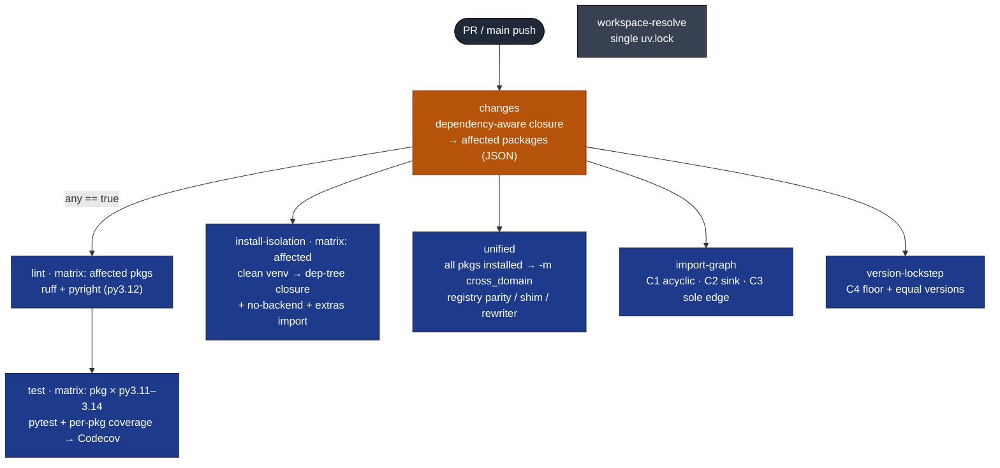
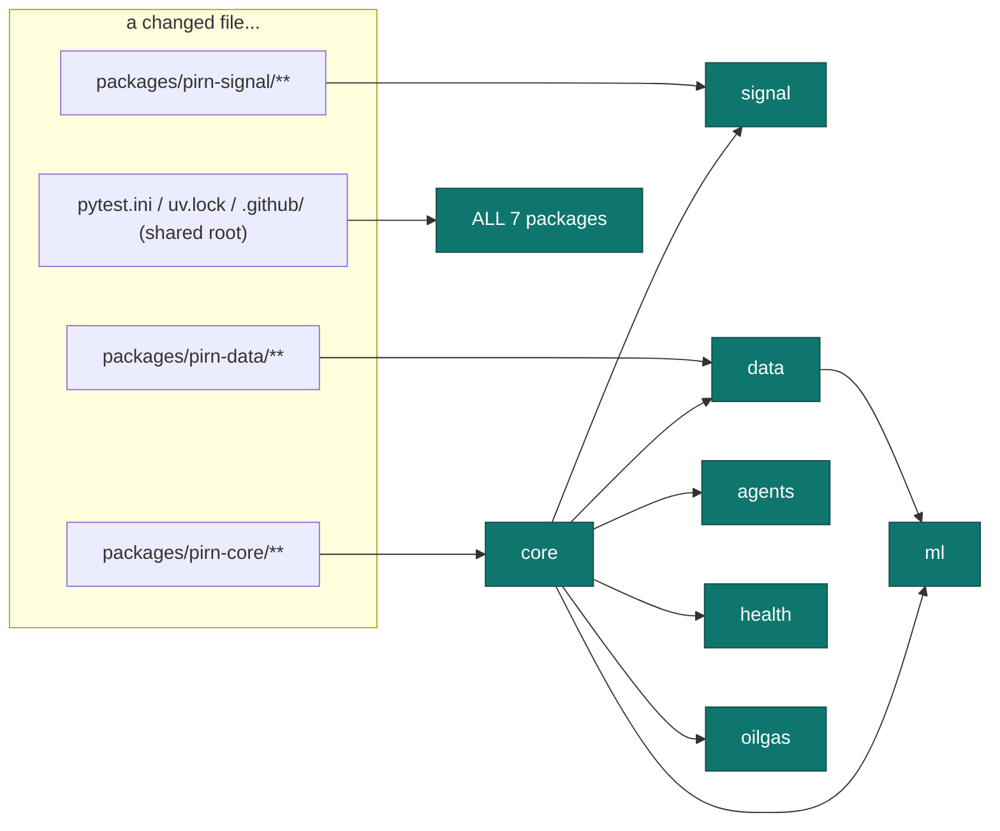
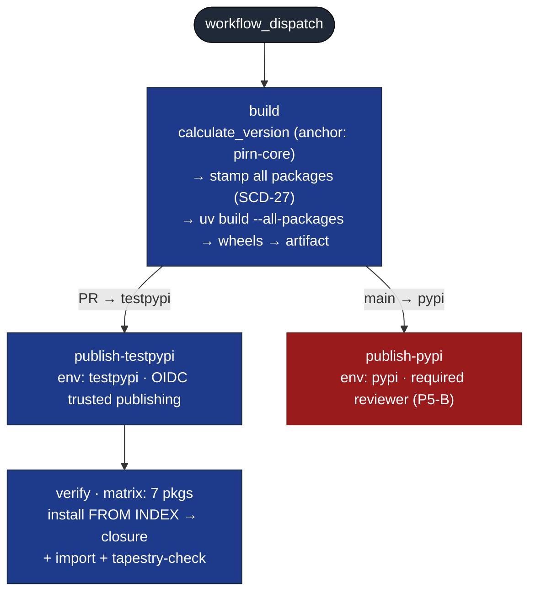
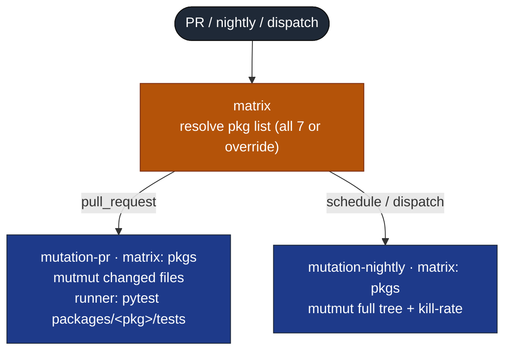

# CI pipelines

The split workspace is driven by three GitHub Actions workflows. All three are
currently `workflow_dispatch`-only (frozen during the migration); PR / main /
nightly triggers re-enable together at the end of the split.

- [`workspace.yml`](../../.github/workflows/workspace.yml) — per-package lint / type / test / isolation / gates (SCD-24, 25, 26, 27)
- [`mutation.yml`](../../.github/workflows/mutation.yml) — per-package mutation testing (SCD-26)
- [`publish.yml`](../../.github/workflows/publish.yml) — lockstep build + publish + verify (SCD-28)

## `workspace.yml` — per-package matrix

Every job hangs off `changes` with `if: any == 'true'`, so an untouched package
spawns zero jobs.

### Dependency-aware change detection

A package runs if its own files, an **upstream `pirn` dependency**, or a
shared-root file changed.

Worked examples: `signal/**` → `[signal]` · `data/**` → `[data, ml]` ·
`core/**` or any shared root → `[all 7]`.

## `publish.yml` — N-wheel build + publish (frozen, human-gated)

## `mutation.yml` — per-package mutation

