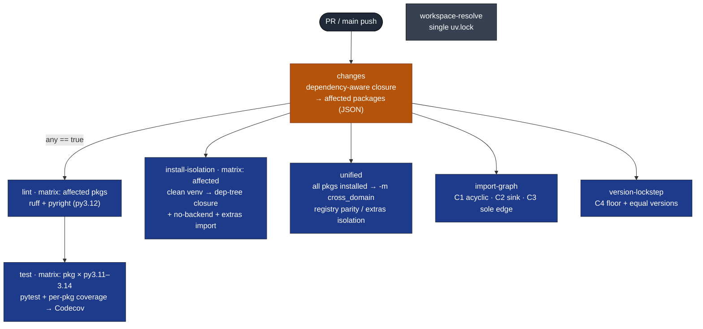
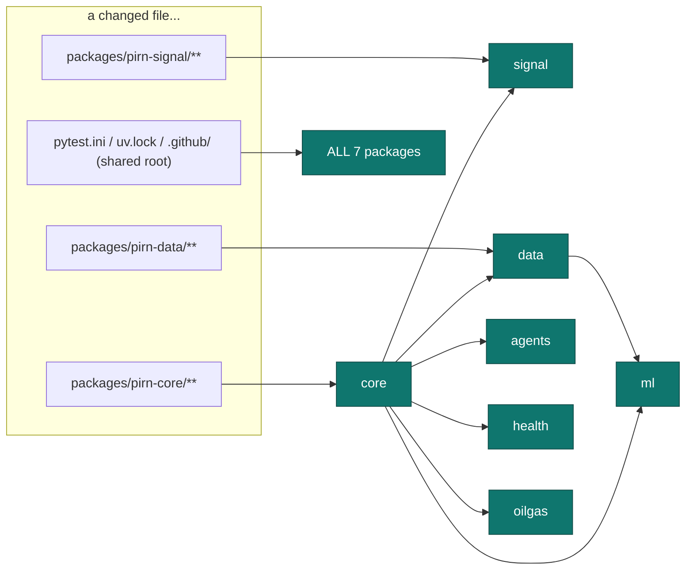
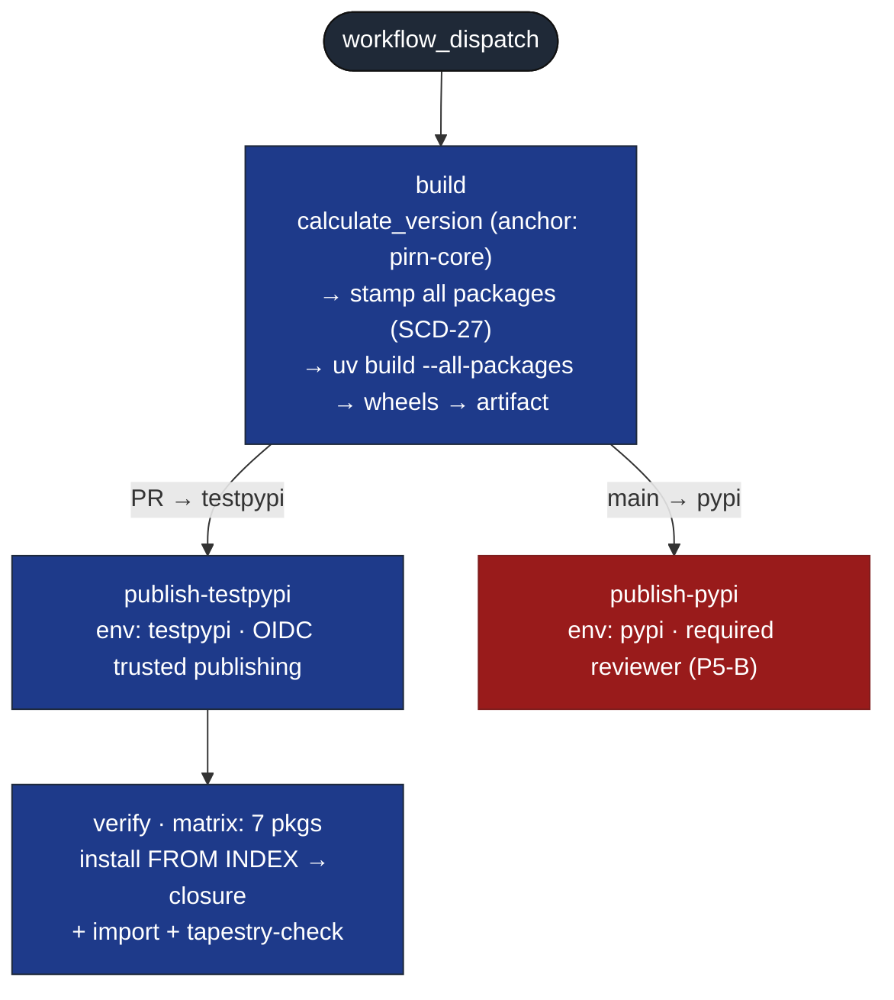
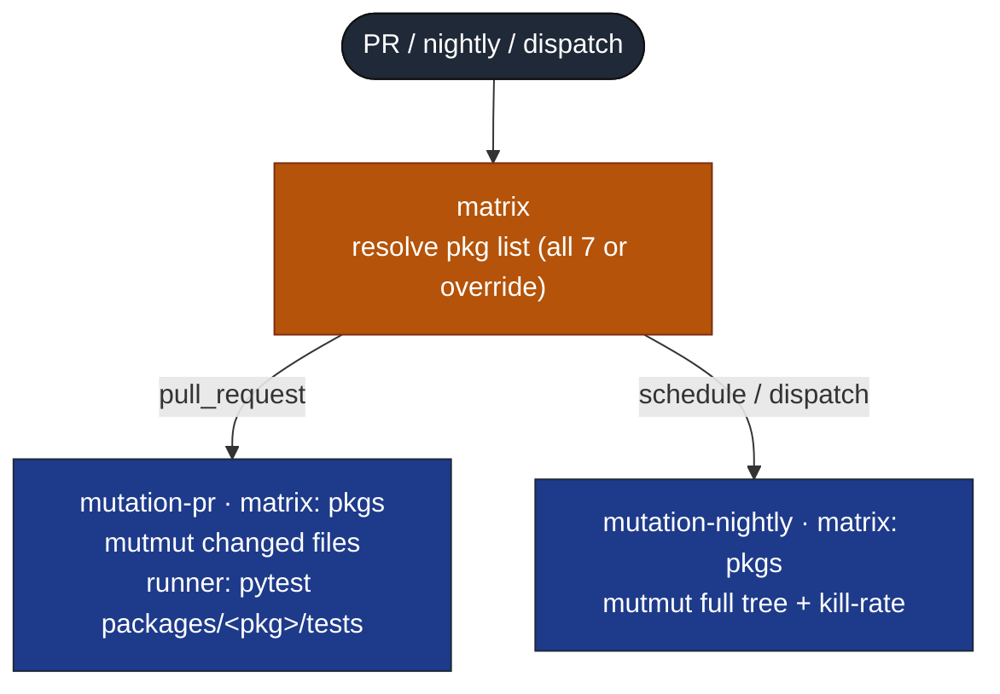

# CI pipelines

The split workspace is driven by three GitHub Actions workflows. All three are
currently `workflow_dispatch`-only (frozen during the migration); PR / main /
nightly triggers re-enable together at the end of the split.

- [`workspace.yml`](../../.github/workflows/workspace.yml) — per-package lint / type / test / isolation / gates (SCD-24, 25, 26, 27)
- [`mutation.yml`](../../.github/workflows/mutation.yml) — per-package mutation testing (SCD-26)
- [`publish.yml`](../../.github/workflows/publish.yml) — lockstep build + publish + verify (SCD-28)

## `workspace.yml` — per-package matrix

Every job hangs off `changes` with `if: any == 'true'`, so an untouched package
spawns zero jobs.

```mermaid
flowchart TD
    PR([PR / main push]):::trig --> CH

    CH["changes<br/>dependency-aware closure<br/>→ affected packages (JSON)"]:::gate
    WR["workspace-resolve<br/>single uv.lock"]:::ind

    CH -->|"any == true"| LINT["lint · matrix: affected pkgs<br/>ruff + pyright (py3.12)"]:::job
    LINT --> TEST["test · matrix: pkg × py3.11–3.14<br/>pytest + per-pkg coverage → Codecov"]:::job
    CH --> ISO["install-isolation · matrix: affected<br/>clean venv → dep-tree closure<br/>+ no-backend + extras import"]:::job
    CH --> UNI["unified<br/>all pkgs installed → -m cross_domain<br/>registry parity / extras isolation"]:::job
    CH --> IG["import-graph<br/>C1 acyclic · C2 sink · C3 sole edge"]:::job
    CH --> VL["version-lockstep<br/>C4 floor + equal versions"]:::job

    classDef trig fill:#1f2937,color:#fff,stroke:#111;
    classDef gate fill:#b45309,color:#fff,stroke:#7c2d12;
    classDef job fill:#1e3a8a,color:#fff,stroke:#1e293b;
    classDef ind fill:#374151,color:#fff,stroke:#111;
```

### Dependency-aware change detection

A package runs if its own files, an **upstream `pirn` dependency**, or a
shared-root file changed.

```mermaid
flowchart LR
    subgraph diff["a changed file..."]
        F1["packages/pirn-signal/**"]
        F2["packages/pirn-data/**"]
        F3["packages/pirn-core/**"]
        F4["pytest.ini / uv.lock / .github/ (shared root)"]
    end

    F1 --> Rsig[signal]
    F2 --> Rdata[data] --> Rml[ml]
    F3 --> CORE[core]
    CORE --> Rsig & Rdata & Rml & Ra[agents] & Rh[health] & Ro[oilgas]
    F4 --> ALL["ALL 7 packages"]

    classDef d fill:#0f766e,color:#fff,stroke:#134e4a;
    class Rsig,Rdata,Rml,Ra,Rh,Ro,CORE,ALL d;
```

Worked examples: `signal/**` → `[signal]` · `data/**` → `[data, ml]` ·
`core/**` or any shared root → `[all 7]`.

## `publish.yml` — N-wheel build + publish (frozen, human-gated)

```mermaid
flowchart TD
    D([workflow_dispatch]):::trig --> B

    B["build<br/>calculate_version (anchor: pirn-core)<br/>→ stamp all packages (SCD-27)<br/>→ uv build --all-packages → wheels → artifact"]:::job

    B -->|"PR → testpypi"| TP["publish-testpypi<br/>env: testpypi · OIDC trusted publishing"]:::job
    B -->|"main → pypi"| PP["publish-pypi<br/>env: pypi · required reviewer (P5-B)"]:::stop
    TP --> V["verify · matrix: 7 pkgs<br/>install FROM INDEX → closure<br/>+ import + tapestry-check"]:::job

    classDef trig fill:#1f2937,color:#fff,stroke:#111;
    classDef job fill:#1e3a8a,color:#fff,stroke:#1e293b;
    classDef stop fill:#991b1b,color:#fff,stroke:#7f1d1d;
```

## `mutation.yml` — per-package mutation

```mermaid
flowchart TD
    T([PR / nightly / dispatch]):::trig --> M["matrix<br/>resolve pkg list (all 7 or override)"]:::gate
    M -->|pull_request| MPR["mutation-pr · matrix: pkgs<br/>mutmut changed files<br/>runner: pytest packages/&lt;pkg&gt;/tests"]:::job
    M -->|schedule / dispatch| MN["mutation-nightly · matrix: pkgs<br/>mutmut full tree + kill-rate"]:::job

    classDef trig fill:#1f2937,color:#fff,stroke:#111;
    classDef job fill:#1e3a8a,color:#fff,stroke:#1e293b;
    classDef gate fill:#b45309,color:#fff,stroke:#7c2d12;
```

## pyright strict — per-subpackage ratchet and burn-down (PIR-869)

Strict mode is adopted **per top-level subpackage**, not per package. Each
package's `[tool.pyright]` carries a `strict = [...]` list; every listed path
passes strict with 0 errors, everything else runs in basic mode until its
strict count reaches 0. The policy (also in
`.claude/conventions/languages/python.md`, "Type Checking Enforcement"):

- **new subpackages start strict** — add the path to the list in the change
  that creates the directory;
- **a subpackage joins the strict list when its count hits 0**;
- **a listed subpackage never regresses**.

`scripts/check_pyright_strict_list.py` enforces all three in the `lint` job
right after the package's own `pyright` run: it measures every subpackage in
strict mode (a throwaway config that `extends` the `pyproject.toml` and sets
`strict` to the whole import package) and fails on a regression, on a
0-error subpackage missing from the list, or on a listed path that is not a
subpackage. `<pkg>/*.py` is the entry for the modules directly under the
import root. Regenerate the table below with
`python scripts/check_pyright_strict_list.py packages/<dist> --table`
(from a worktree that changes core, add `--extra-path <worktree>/packages/pirn-core`).

Two things the adoption settled: a config-level rule override does **not**
apply inside `strict` paths (pyright applies the strict rule set to those
files and honours only in-file `# pyright:` comments), and the one strict rule
the house style contradicts is `reportUnnecessaryIsInstance` — explicit
type-then-value validation of runtime-bound knot inputs is required by
`docs/contributing/domain-knots.md`, so a strict-listed file keeps its guards
and carries the two-line header `# pyright: reportUnnecessaryIsInstance=false`
+ a reason line above its docstring. Every other suppression is a per-line
`# pyright: ignore[<rule>]` with its reason on the same line.

### Burn-down table (measured 2026-09-14, pyright 1.1.411)

Counts are strict errors per subpackage; `yes` marks the paths in the
package's `strict` list (all at 0). The 25-error threshold used for the
initial cut is not policy — the list is exactly the set of subpackages at 0.

| package | subpackage | strict errors | strict |
|---|---|---:|:---:|
| pirn-core | `pirn/*.py` | 0 | yes |
| pirn-core | `pirn/check` | 0 | yes |
| pirn-core | `pirn/connectors` | 0 | yes |
| pirn-core | `pirn/emitters` | 0 | yes |
| pirn-core | `pirn/exceptions` | 0 | yes |
| pirn-core | `pirn/managers` | 0 | yes |
| pirn-core | `pirn/recording` | 0 | yes |
| pirn-core | `pirn/security` | 0 | yes |
| pirn-core | `pirn/streaming` | 0 | yes |
| pirn-core | `pirn/viz` | 0 | yes |
| pirn-core | `pirn/yaml_loader` | 0 | yes |
| pirn-core | `pirn/triggers` | 19 |  |
| pirn-core | `pirn/engine` | 20 |  |
| pirn-core | `pirn/backends` | 35 |  |
| pirn-core | `pirn/nodes` | 54 |  |
| pirn-core | `pirn/core` | 150 |  |
| pirn-agents | `pirn_agents/*.py` | 0 | yes |
| pirn-agents | `pirn_agents/_internal` | 0 | yes |
| pirn-agents | `pirn_agents/agent` | 0 | yes |
| pirn-agents | `pirn_agents/benchmarks` | 0 | yes |
| pirn-agents | `pirn_agents/caching` | 0 | yes |
| pirn-agents | `pirn_agents/connectors` | 0 | yes |
| pirn-agents | `pirn_agents/control` | 0 | yes |
| pirn-agents | `pirn_agents/exceptions` | 0 | yes |
| pirn-agents | `pirn_agents/generation` | 0 | yes |
| pirn-agents | `pirn_agents/interfaces` | 0 | yes |
| pirn-agents | `pirn_agents/observability` | 0 | yes |
| pirn-agents | `pirn_agents/performance` | 0 | yes |
| pirn-agents | `pirn_agents/planning` | 0 | yes |
| pirn-agents | `pirn_agents/testing` | 0 | yes |
| pirn-agents | `pirn_agents/input` | 27 |  |
| pirn-agents | `pirn_agents/context` | 33 |  |
| pirn-agents | `pirn_agents/types` | 33 |  |
| pirn-agents | `pirn_agents/prompt` | 37 |  |
| pirn-agents | `pirn_agents/resilience` | 39 |  |
| pirn-agents | `pirn_agents/builder` | 42 |  |
| pirn-agents | `pirn_agents/security` | 54 |  |
| pirn-agents | `pirn_agents/batch` | 58 |  |
| pirn-agents | `pirn_agents/mcp` | 64 |  |
| pirn-agents | `pirn_agents/determinism` | 73 |  |
| pirn-agents | `pirn_agents/evaluation` | 75 |  |
| pirn-agents | `pirn_agents/retrieval` | 82 |  |
| pirn-agents | `pirn_agents/sessions` | 83 |  |
| pirn-agents | `pirn_agents/tools` | 88 |  |
| pirn-agents | `pirn_agents/memory` | 122 |  |
| pirn-agents | `pirn_agents/llm` | 128 |  |
| pirn-agents | `pirn_agents/specializations` | 671 |  |
| pirn-data | `pirn_data/*.py` | 0 | yes |
| pirn-data | `pirn_data/frames` | 0 | yes |
| pirn-data | `pirn_data/lakehouse` | 0 | yes |
| pirn-data | `pirn_data/lazy` | 0 | yes |
| pirn-data | `pirn_data/quality` | 0 | yes |
| pirn-data | `pirn_data/sinks` | 0 | yes |
| pirn-data | `pirn_data/sources` | 0 | yes |
| pirn-data | `pirn_data/specializations` | 0 | yes |
| pirn-data | `pirn_data/specialized` | 0 | yes |
| pirn-data | `pirn_data/transforms` | 0 | yes |
| pirn-data | `pirn_data/validation` | 0 | yes |
| pirn-health | `pirn_health/*.py` | 0 | yes |
| pirn-health | `pirn_health/assemblers` | 0 | yes |
| pirn-health | `pirn_health/clinical` | 0 | yes |
| pirn-health | `pirn_health/disassemblers` | 0 | yes |
| pirn-health | `pirn_health/eeg_meg` | 0 | yes |
| pirn-health | `pirn_health/genomics` | 0 | yes |
| pirn-health | `pirn_health/mri` | 0 | yes |
| pirn-health | `pirn_health/pathology` | 0 | yes |
| pirn-health | `pirn_health/protocols` | 0 | yes |
| pirn-health | `pirn_health/trials` | 0 | yes |
| pirn-health | `pirn_health/types` | 0 | yes |
| pirn-health | `pirn_health/wearables` | 0 | yes |
| pirn-ml | `pirn_ml/*.py` | 0 | yes |
| pirn-ml | `pirn_ml/assemblers` | 0 | yes |
| pirn-ml | `pirn_ml/data_prep` | 0 | yes |
| pirn-ml | `pirn_ml/deployment` | 0 | yes |
| pirn-ml | `pirn_ml/disassemblers` | 0 | yes |
| pirn-ml | `pirn_ml/evaluation` | 0 | yes |
| pirn-ml | `pirn_ml/features` | 0 | yes |
| pirn-ml | `pirn_ml/specializations` | 0 | yes |
| pirn-ml | `pirn_ml/training` | 0 | yes |
| pirn-ml | `pirn_ml/types` | 0 | yes |
| pirn-oilgas | `pirn_oilgas/*.py` | 0 | yes |
| pirn-oilgas | `pirn_oilgas/assemblers` | 0 | yes |
| pirn-oilgas | `pirn_oilgas/disassemblers` | 0 | yes |
| pirn-oilgas | `pirn_oilgas/geospatial` | 0 | yes |
| pirn-oilgas | `pirn_oilgas/integrity` | 0 | yes |
| pirn-oilgas | `pirn_oilgas/production` | 0 | yes |
| pirn-oilgas | `pirn_oilgas/protocols` | 0 | yes |
| pirn-oilgas | `pirn_oilgas/reservoir` | 0 | yes |
| pirn-oilgas | `pirn_oilgas/seismic` | 0 | yes |
| pirn-oilgas | `pirn_oilgas/types` | 0 | yes |
| pirn-oilgas | `pirn_oilgas/well` | 0 | yes |
| pirn-oilgas | `pirn_oilgas/workflows` | 0 | yes |
| pirn-signal | `pirn_signal/*.py` | 0 | yes |
| pirn-signal | `pirn_signal/adaptive` | 0 | yes |
| pirn-signal | `pirn_signal/assemblers` | 0 | yes |
| pirn-signal | `pirn_signal/audio` | 0 | yes |
| pirn-signal | `pirn_signal/beamforming` | 0 | yes |
| pirn-signal | `pirn_signal/bindings` | 0 | yes |
| pirn-signal | `pirn_signal/disassemblers` | 0 | yes |
| pirn-signal | `pirn_signal/filters` | 0 | yes |
| pirn-signal | `pirn_signal/nonlinear` | 0 | yes |
| pirn-signal | `pirn_signal/resampling` | 0 | yes |
| pirn-signal | `pirn_signal/separation` | 0 | yes |
| pirn-signal | `pirn_signal/spectral` | 0 | yes |
| pirn-signal | `pirn_signal/statistical` | 0 | yes |
| pirn-signal | `pirn_signal/types` | 0 | yes |
| pirn-signal | `pirn_signal/wavelets` | 0 | yes |

Totals outside the lists: pirn-core 278, pirn-agents 1709, pirn-data 0 (fully strict;
pyarrow, pandas, ibis, dask.dataframe and ray.data are typed through the local stubs in
`packages/pirn-data/typings/`),
pirn-health 0, pirn-ml 0, pirn-oilgas 0, pirn-signal 0. The dominant
remaining categories are `reportUnknownMemberType` / `reportUnknownVariableType`
on untyped third-party returns (cloud SDKs, `cloudpickle`, DB drivers,
numpy-heavy domain code), `reportMissingTypeStubs`, `reportPrivateUsage` on
package-internal `_Foo` helpers and, in the domain packages, the deliberate
`reportUnnecessaryIsInstance` guards described above.
