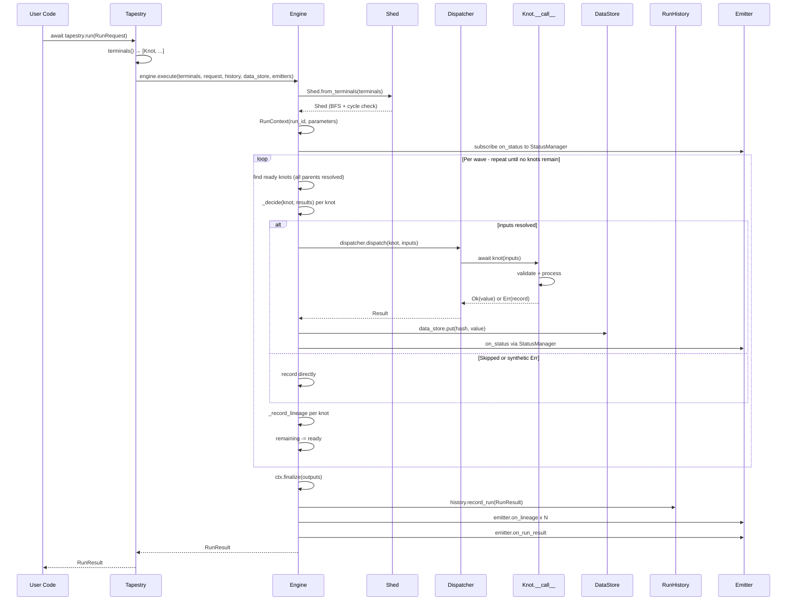
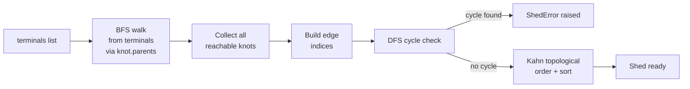

# Execution Model

A deep dive into what happens between `tapestry.run(request)` and the returned `RunResult`.

---

## Complete run cycle

### Step 1: `tapestry.run(request)` called

`Tapestry.run()` accepts an optional `RunRequest` (auto-constructed if omitted). Key parameters:

- `terminals` — explicit terminal knots; defaults to `tapestry.terminals()`.
- `dispatcher` — per-run dispatcher override.
- `emitters` — per-run emitter list; `None` uses tapestry defaults; `[]` disables all.
- `extensible=True` — enables mid-run knot registration.

### Step 2: Terminals computed

`Tapestry.terminals()` performs an O(n) scan — knots not referenced as a parent by any other knot in the store:

```python
referenced: set[str] = set()
for k in all_knots:
    for parent in k.parents.values():
        referenced.add(parent.knot_id)
return [k for k in all_knots if k.knot_id not in referenced]
```

A terminal is a "sink" — the engine executes backward from these to pull in all reachable knots.

### Step 3: Shed built

`Shed.from_terminals(terminals)` performs BFS from terminals, walking `knot.parents` references:

1. Collect all reachable knots by id.
2. Build `edges_by_child` (parent edges per knot) and `children_by_parent` (inverse index).
3. Run DFS cycle check — raises `ShedError` if a cycle is found.
4. Compute `topological_order()` via Kahn's algorithm with sorted-within-wave determinism.

The Shed is ephemeral — built fresh for each run, discarded when the run completes.

### Step 4: RunContext created

`RunContext(run_id, terminals_requested, dispatcher_name, parameters)` holds run-scoped state:

- `StatusManager` — state machine tracking each knot through PENDING → RUNNING → SUCCEEDED/FAILED/SKIPPED.
- `ExceptionManager` — registry of `ExceptionRecord`s captured during the run.
- Lineage accumulator — list of `KnotLineage` records built during execution.

### Step 5: Emitters subscribed

Each emitter's `on_status` is wired to the `StatusManager` via a fire-and-forget `asyncio.create_task` wrapper. Exceptions in emitters are swallowed; a broken emitter cannot abort a run.

### Step 6: Wave loop (`_execute_loop`)

```
1. Bind parameters (match Parameter knots to RunRequest.parameters or defaults)
2. topological_order = shed.topological_order()
3. remaining = set(topological_order)

while remaining:
    a. Drain pending_new (mid-run extension)
    b. ready = knots in remaining whose all parents have results
    c. For each ready knot:
         decision = _decide(knot, results)
         if Skipped or synthetic Err → record directly
         else → asyncio.create_task(_dispatch_with_timing(knot, inputs))
    d. Await each task → (result, parent_hashes, started_at)
    e. _rebind_err → register ExceptionRecord with ExceptionManager
    f. If Ok → content_hash(value) + data_store.put(hash, value)
    g. Update StatusManager state machine
    h. _record_lineage → KnotLineage → ctx.add_lineage()
    i. remaining -= ready
    j. Drain pending_new again
```

Knots within a wave are independent (no parent–child relationships within the wave). They are dispatched as `asyncio.Task`s and awaited in order. This provides wave-level concurrency: all ready knots in a wave run simultaneously, but the engine awaits each sequentially before proceeding to the next wave. The order of awaiting within a wave does not affect correctness — results are collected into a dict by knot id.

### Step 7: `_decide(knot, results)` — error policy

```python
match knot.config.error_policy:
    case REQUIRE_ALL_PARENTS:
        if any parent is Err or Skipped → synthetic Err
    case SKIP_IF_PARENT_FAILED:
        if any parent is Err or Skipped → Skipped
    case RECEIVE_ERRORS:
        pass Result objects directly as inputs (no unwrapping)
```

On a clean path (all parents `Ok`), the input dict is `{name: result.value for name, result in parent_results.items()}`.

### Step 8: `_dispatch_with_timing(knot, inputs)`

```python
parent_hashes = {name: content_hash(value) for name, value in inputs.items()}
started_at = datetime.now(UTC)
result = await self._dispatcher.dispatch(knot, inputs)
return result, parent_hashes, started_at
```

The dispatcher calls `knot(inputs)` → `knot.__call__` → `knot.process(**kwargs)`. The result is `Ok`, `Err`, or `Skipped` from the knot itself.

### Step 9: Lineage capture per knot

`_record_lineage` builds a `KnotLineage`:

```python
KnotLineage(
    run_id=ctx.run_id,
    knot_id=knot.knot_id,
    knot_class=f"{type(knot).__module__}.{type(knot).__qualname__}",
    knot_config_hash=content_hash(knot.config.model_dump(mode="json")),
    parent_input_hashes=parent_hashes,   # captured before dispatch
    output_hash=content_hash(result.value) if result.is_ok else None,
    outcome="ok" | "err" | "skipped",
    error_record_id=...,                 # if Err
    skip_reason=...,                     # if Skipped
    dispatcher=dispatcher.name,
    started_at=started_at,
    finished_at=datetime.now(UTC),
)
```

### Step 10: `history.record_run()` called

After the wave loop completes, `ctx.finalize(outputs)` builds the `RunResult`:

- `outputs` — raw values for `Ok` knots.
- `lineage` — all `KnotLineage` records.
- `exceptions` — all `ExceptionRecord`s.
- `status_events` — full StatusManager history.

`await history.record_run(run_result)` persists the result.

### Step 11: Emitter hooks fired

After persistence (so emitters see stable state):

```python
for emitter in emitters:
    for record in run_result.lineage:
        await emitter.on_lineage(record)
    await emitter.on_run_result(run_result)
```

### Step 12: `RunResult` returned

`tapestry.run()` returns the `RunResult` to the caller.

---

## Execution sequence diagram



---

## Shed construction



**Kahn's algorithm with sort:** pirn uses sorted ready-queues within each wave to ensure deterministic execution order across runs. Two runs with the same pipeline and parameters always produce knots in the same order.

---

## Mid-run extension

With `extensible=True`, the engine subscribes to the store before the wave loop. Any knot registered with the tapestry while a wave runs is appended to `pending_new`. Between waves, `_merge_new_knots` validates and merges them:

1. Validate: a new knot whose parent already has a result → `ShedError`.
2. Insert new knots into the shed's dicts (bypassing `Shed.from_terminals`).
3. Bind any new `Parameter` knots immediately.
4. Extend `remaining` with new knot ids.

This enables dynamic pipeline patterns such as a knot that decides to spawn N more knots based on its output. Requires a `SubscribableStore` (`InMemoryStore` in Phase 3).

---

## Topological sort (Kahn's algorithm)

```python
in_degree = {k: len(edges_by_child[k]) for k in knots}
queue = sorted([k for k in knots if in_degree[k] == 0])  # sorted for determinism
order = []

while queue:
    batch = list(queue)  # current wave
    queue.clear()
    order.extend(batch)
    for knot_id in batch:
        for child_id in children_by_parent.get(knot_id, []):
            in_degree[child_id] -= 1
            if in_degree[child_id] == 0:
                queue.append(child_id)
    queue.sort()  # sort next wave too

return order
```

---

## Content addressing

```python
def content_hash(value: Any) -> str:
    canonical = _canonicalise(value)
    raw = json.dumps(canonical, ensure_ascii=False, separators=(",", ":"))
    return "sha256:" + hashlib.sha256(raw.encode()).hexdigest()
```

The `_canonicalise` function handles Pydantic models, dicts (sorted keys), lists (ordered), sets (sorted by element hash), bytes, and primitives. Opaque types fall back to `repr` with an `unhashable` sentinel prefix — these are not cross-process stable.

---

**See also:** [Architecture Overview](overview.md), [Extension Points](extension-points.md)
