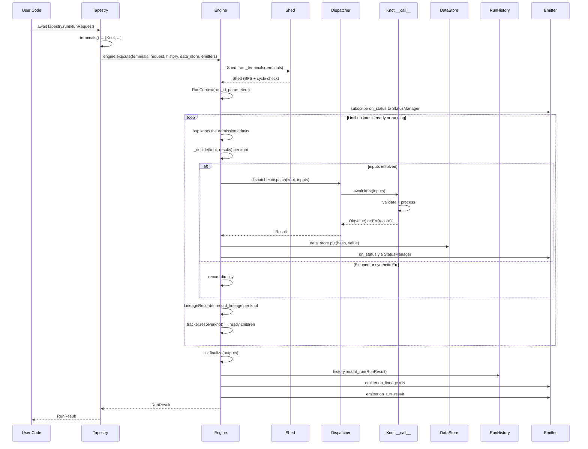
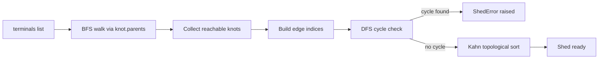

# Execution Model

A deep dive into what happens between `tapestry.run(request)` and the returned `RunResult`.

---

## Complete run cycle

### Step 1: `tapestry.run(request)` called

`Tapestry.run()` accepts an optional `RunRequest` (auto-constructed if omitted). Key parameters:

- `terminals` — explicit terminal knots; defaults to `tapestry.terminals()`.
- `dispatcher` — per-run dispatcher override.
- `emitters` — per-run emitter list; `None` uses tapestry defaults; `[]` disables all.
- `extensible=True` — enables mid-run knot registration.

### Step 2: Terminals computed

`Tapestry.terminals()` performs an O(n) scan — knots not referenced as a parent by any other knot in the store:

```python
referenced: set[str] = set()
for k in all_knots:
    for parent in k.parents.values():
        referenced.add(parent.knot_id)
return [k for k in all_knots if k.knot_id not in referenced]
```

A terminal is a "sink" — the engine executes backward from these to pull in all reachable knots.

### Step 3: Shed built

`Shed.from_terminals(terminals)` performs BFS from terminals, walking `knot.parents` references:

1. Collect all reachable knots by id.
2. Build `edges_by_child` (parent edges per knot) and `children_by_parent` (inverse index).
3. Run DFS cycle check — raises `ShedError` if a cycle is found.
4. Compute `topological_order()` via Kahn's algorithm, breaking ties by knot id for determinism.

The Shed is ephemeral — built fresh for each run, discarded when the run completes.

### Step 4: RunContext created

`RunContext(run_id, terminals_requested, dispatcher_name, parameters)` holds run-scoped state:

- `StatusManager` — state machine tracking each knot through PENDING → RUNNING → SUCCEEDED/FAILED/SKIPPED.
- `ExceptionManager` — registry of `ExceptionRecord`s captured during the run.
- Lineage accumulator — list of `KnotLineage` records built during execution.

### Step 5: Emitters subscribed

Each emitter's `on_status` is wired to the `StatusManager` via a fire-and-forget `asyncio.create_task` wrapper. Exceptions in emitters are swallowed; a broken emitter cannot abort a run.

### Step 6: Admission loop (`_execute_loop`)

Parameters are bound first (each `Parameter` knot matched to `RunRequest.parameters` or its default).

```
tracker = DependencyTracker(shed)          # unresolved-parent counts, levels
ready   = ReadyQueue(tracker.initially_ready())
gate    = UnboundedAdmission()         # no limits: admits everything
          | LimitedAdmission(limits)   # RunRequest.concurrency / Tapestry(concurrency=)

loop:
    merge any mid-run-registered knots     # newcomers may be ready at once

    while ready.pop_admissible(gate) -> knot:
        decision = _decide(knot, results)  # error policy
        if decision is Skipped/Err:
            record directly; release children into `ready`
        else:
            materialize inputs; create asyncio.Task(dispatch)

    if nothing is running: stop
    wait for the next completion (done-callback queue), then for each completed task:
        rebind Err records to live ExceptionManager
        persist Ok value to DataStore / transport
        record lineage (finished_at stamped when the knot finished)
        tracker.resolve(knot) -> children whose parents are all resolved -> `ready`

sort lineage, exceptions, skipped and outputs by (level, dispatched, topo index)
```

A knot is scheduled the moment its own parents have resolved, not when a whole "wave" of unrelated knots has finished: completions are processed one at a time as they happen, so a fast knot's children start while its slow siblings are still running (PIR-841). Each dispatched task reports itself on a completion queue through a done-callback, so the engine wakes once per completion at O(1) cost, and it finds newly ready knots by decrementing their unresolved-parent counts, so a chain of *n* knots costs O(n) scheduling work rather than a rescan of the topological order per step. A knot is decided, materialized and turned into a task only once the run's `Admission` admits it; the default `UnboundedAdmission` admits every ready knot immediately.

#### Concurrency limits

A run can cap how many knots are in flight at once, overall and per named group:

```python
from pirn.core.concurrency.concurrency_limits import ConcurrencyLimits

with Tapestry() as t:
    p = Parameter("doc", str)
    for i in range(200):
        Summarise(text=p, _config=KnotConfig(id=f"sum{i}"))                               # unbounded
    for i in range(12):
        CallLLM(text=p, _config=KnotConfig(id=f"llm{i}", concurrency_group="openai"))    # 4 at a time

await t.run(RunRequest(parameters={"doc": "..."}, concurrency=ConcurrencyLimits(groups={"openai": 4})))
```

- `RunRequest.concurrency` applies to one run; `Tapestry(concurrency=...)` is the default for runs whose request carries none. An explicit `ConcurrencyLimits()` runs unbounded even over a tapestry default.
- A knot is admitted only while both its global slot (`max_in_flight`, if set) and its group slot (`groups[name]`) are free; it takes both or neither.
- **Undefined groups fail fast.** When the limits define any group, a knot whose `concurrency_group` is not one of them raises `UndefinedConcurrencyGroupError` (naming the knot, its group and the defined groups): at run start for the static graph, at admission for a knot registered mid-run. A typo such as `"open_ai"` for `"openai"` would otherwise silently run every call at once. When the limits define no groups, tags are ignored, so the same tapestry runs unbounded or under `max_in_flight` alone. A defined group that no knot of the static graph uses emits `UnusedConcurrencyGroupWarning`.
- The ready queue keeps one FIFO per group and a heap of group heads, offering heads in readiness order and skipping a head whose group is full. Saturated API calls never hold up the local knots behind them, and within a group a knot is never overtaken by one that became ready after it. A full group is parked until one of its slots is released, and no leaf is offered while the run-wide cap is full, so admission cost does not grow with the number of groups.
- **Containers hold no slot (WS0b).** A `SubTapestry`, a `LoopSubTapestry` and each loop iteration (`Knot._holds_admission_slot` is `False`) are admitted without consulting the gate, even when it is full, and their ticket (`AdmissionTicket.held == False`) is never released to it. Their inner runs share the enclosing run's gate (below), so every slot holder is a leaf that is actually running and a container can never deadlock on a slot its own leaves need. A container therefore may not declare a `concurrency_group` (`ValueError` at construction); tag the knots inside it instead. A group used only by inner-run knots is not reported as unused when the static graph contains a container.
- A slot is released when the knot's task finishes, whatever the outcome (result, `Err`, exception or cancellation), when the engine resolves a knot without running it (skipped, missing parent), and for every in-flight knot when a run aborts.
- Limits govern scheduling only: outputs, lineage hashes and the order of lineage, exceptions, skipped and outputs are the same under any limits. `KnotConfig.concurrency_group` is excluded from `model_dump`, so it never reaches `knot_config_hash`, and recordings made before a knot joined a group still replay.
- A queued knot stays `PENDING`; `RUNNING` means admitted.
- **Runtime feedback (WS0).** `Tapestry(admission_observers=[...])` / `run(admission_observers=...)` attach `AdmissionObserver`s that hear every admission and release as an `AdmissionEvent` — queue depth per group, wait, hold time, outcome — and can move a cap mid-run with `event.gate.set_limit(group, n)` (issued tickets untouched; `AdmissionLimitError` for an unknown group, a cap below one, or the unbounded gate). See [Extension Points](extension-points.md#runtime-feedback-admissionobserver-and-set_limit).
- The effective ceiling is also bounded by the dispatcher (`ThreadDispatcher(max_workers=...)`; a sync `@KnotFactory.knot` runs on the default executor, `min(32, cpu + 4)` threads).
- **Inner runs share the gate (WS0b).** A `SubTapestry` inner run or `LoopSubTapestry` iteration that names no limits of its own — neither `Tapestry(concurrency=)` nor `RunRequest(concurrency=)` — is metered by the enclosing run's gate, the very same instance, so `max_in_flight` and every group cap are one budget across the whole run tree; a shared `LimitedAdmission` is thread-safe (lock-guarded counters, waiters woken on their own loop via `call_soon_threadsafe`) because an inner run under `ThreadDispatcher` admits from a worker thread's loop, and tickets are tracked by identity so inner and outer knots may share an id. An inner run that names limits gets a gate of its own (there is no chaining: its knots then count against its budget, not the outer one), and `RunRequest(concurrency=ConcurrencyLimits())` opts an inner run out of the shared budget explicitly. An engine whose refused knots wait on a shared gate wakes on a release made by any run sharing it, not only on its own completions. Still intra-knot: `Map` / `ZipMap` / `DictMap` fan out their elements inside one admitted knot (PIR-841 slice 4).

#### Loop iterations that await

`LoopSubTapestry` plans and folds through `astep(state)` / `afold(state, result)`, which the framework awaits. The defaults delegate to the sync `step` / `fold` and await the result if it is awaitable, so a loop declares whichever pair it needs — sync, `async def step`/`fold`, or an `astep`/`afold` override — and an iteration can sleep for a backoff, check a remote budget, or ask a model whether to continue without dropping into a Python loop inside `process()`. (A batch of *independent* calls needs no loop at all: `ParallelToolExecutor` is one tool knot per call under an `Aggregator`, with per-call retry backoff and timeout owned by `GovernedDispatch`.)

#### Gate decisions: predicate or Check

A `Gate` passes its one `input` through unchanged or produces `Skipped(reason="gate_closed")`. Its decision is either `predicate=`, a callable over the input, or `check=`, a `Check` knot (`pirn/nodes/check.py`) — the predicate half of a gate: a knot with any number of parents whose `process()` answers `bool`, enforced by `Check.__call__` (a non-`bool` verdict is `Err(TypeError)` whatever the return hint). The gate stays single-input on purpose: its output carries the input's identity through lineage, and joining is `Aggregator`'s job. With `check=` the common multi-value case — gate `A` on a verdict computed from `A` and `B` — needs no join: the `Check` reads both, the gate passes `A`. A `Check` that fails or is skipped skips the gate under the default error policy, like any missing parent.

#### Nested runs and the nesting guard

Every `SubTapestry` inner run, `LoopSubTapestry` loop run and loop iteration is a real run with its own id, recorded with `parent_run_id` / `parent_knot_id`, and now with a `run_path` that lists the enclosing runs (`/{outer}/{inner}`). Each run executes under an immutable `RunNesting` frame (`pirn/core/run_nesting.py`) carried on a context variable: its `depth` (0 for a root run), the enclosing `run_ids`, the `path` of container classes between the root and it, and the tightest `max_depth` set on that path. A knot reads its own frame with `RunNesting.current()`; the engine keeps it on `RunContext.nesting`.

The frame is also the guard. `Tapestry(max_nesting_depth=n)` caps how many runs may nest below a run of that tapestry; inner tapestries inherit the cap through the context and may only tighten it. When a cap is active on the path, `Tapestry.run` derives the inner frame *before* anything starts (`RunNesting.child`) and refuses:

- a run that would exceed the cap → `NestingDepthExceededError`;
- a container class re-entering itself — its nesting key (qualified class name, `SubTapestry._nesting_key`) already on the path → `NestedRunCycleError`, raised at the first re-entry rather than after burning the whole budget.

Both are `PirnError`s raised inside the container knot that tried to start the run, so the enclosing engine records them as that knot's `Err` and the refused run never touches history. Loop iterations count one level of depth but add no key: the loop's own class is already on the path, and a loop nested inside another loop's iteration is not a cycle. With no cap anywhere on the path the guard is off and nesting is unbounded — exactly the behaviour before the frame existed. The frame survives a `ThreadDispatcher` hop (context copy) and is empty on a process-boundary dispatcher, where nothing ambient survives.

#### Inner runs inherit the execution plane

An inner run already inherited the enclosing run's *observability and value plane* — history, data store, transport, emitters, traceback filter (PIR-764/834/837/725) — through `SubTapestry._run_inner` and `IterationChainKnot`. Since ADR agents-speaks-core WS0b it also inherits the *execution plane* (`pirn/core/execution_plane.py`, `ExecutionPlane`): the `Dispatcher` its knots run on, the `Admission` and `ConcurrencyLimits` metering them, the `AdmissionObserver`s hearing every admission, the `ReplaySession` it is served from, and the `IdentityResolver` naming its actor. `Tapestry.run` publishes the plane it runs under on a context variable and derives an inner run's plane from it; a knot reads the plane in force with `ExecutionPlane.current()`. Resolution is the same for every half — an explicit `run(...)` argument wins, then the inner tapestry's own explicit constructor setting, then the enclosing plane, then the tapestry default — with three consequences worth knowing:

- **The gate is shared by identity.** An inner run that names no limits is metered by the enclosing run's gate instance (see *Concurrency limits* above), and its inner tapestry may not name a `concurrency_group` on the container itself. Because observers belong to the gate they steer, an inner run sharing the gate also hears the outer observers (appended after its own, de-duplicated by identity); one with its own gate hears only its own. `AdmissionEvent.in_flight` counts the reporting run's tickets; `event.gate.in_flight` is the shared total.
- **Overrides are per container.** `SubTapestry._run_inner(dispatcher=, concurrency=, admission_observers=)` or the overridable `_inner_dispatcher()` / `_inner_concurrency()` / `_inner_admission_observers()` hooks (default `None` = inherit) give one container its own backend or budget; a `LoopSubTapestry` iteration tapestry built as `Tapestry(dispatcher=..., concurrency=...)` inside `step()` keeps what it named, exactly as it keeps a transport. Nothing needs to assign a tapestry's private fields, and `pirn-agents` carries a ratchet (`tests/core_seams/test_execution_plane_reach_through.py`) that refuses code which does.
- **Replay posture derives, never copies.** The outer session indexes the outer run's knots, so an inner run started under replay is served from the recording of the inner run the container's own row names (`KnotLineage.extra["inner_run_id"]`), loaded from the run's history; a container with no recorded row runs its inner pipeline live, and a row naming an evicted inner run raises `ReplayMismatchError` rather than executing. In the ordinary case the container itself is served from the outer recording and the inner run never starts, so this matters only for a session that lets a new container execute.

Known limitation: a container dispatched by `ThreadDispatcher` still occupies a pool worker while it waits on its inner run, whose leaves need workers of their own — deep nesting under a small `max_workers` can exhaust the pool even though no admission slot is held. A process-boundary dispatcher (Ray, Dask, Celery) starts from an empty context, so an inner run on a remote worker inherits no plane and behaves as a root run — the same honest answer as for emitters.

Per-knot records do not depend on completion order. `RunResult.lineage`, `exceptions`, `skipped` and `outputs` are sorted by `(level, dispatched, topological index)`, where `level` is the knot's depth from the roots; for a graph without mid-run registrations that is exactly the order the earlier wave loop produced. `status_events` and live `on_status` delivery are the exception: they follow real state transitions, so sibling knots' events interleave in the order the knots actually start and finish.

### Step 7: `_decide(knot, results)` — error policy

```python
match knot.config.error_policy:
    case REQUIRE_ALL_PARENTS:
        if any parent is Err or Skipped → synthetic Err
    case SKIP_IF_PARENT_FAILED:
        if any parent is Err or Skipped → Skipped
    case RECEIVE_ERRORS:
        pass Result objects directly as inputs (no unwrapping)
```

On a clean path (all parents `Ok`), the input dict is `{name: result.value for name, result in parent_results.items()}`.

### Step 8: `_dispatch_with_timing(knot, inputs)`

```python
parent_hashes = {name: ContentHasher.hash(value) for name, value in inputs.items()}
started_at = datetime.now(UTC)
result = await self._dispatcher.dispatch(knot, inputs)
return result, parent_hashes, started_at
```

The dispatcher calls `knot(inputs)` → `knot.__call__` → `knot.process(**kwargs)`. The result is `Ok`, `Err`, or `Skipped` from the knot itself.

**Declaring a skip.** A `process()` that returns a `Skipped` is declaring that it deliberately produced no value — a closed `Gate`, a non-selected `Branch` arm, a denied approval. `Knot.__call__` passes it through bare: never wrapped in `Ok`, never checked against the return hint, so the engine records the knot as skipped (`outcome == "skipped"`, `skip_reason`) and its children skip in turn. `Gate` and `BranchOutput` are written this way; a knot of your own can be too. `Optional` is the one exception and keeps its `Ok(Skipped)` contract — a skip of an optional knot is a *value* its consumers receive, and lineage marks it `extra["optional_skip"]` (PIR-856 deferral resolved in WS0).

**Timeout and retry.** The engine dispatches through `GovernedDispatch` (`pirn/engine/governed_dispatch.py`), which applies two per-knot policies from `KnotConfig` around the dispatcher call — never inside `Knot.__call__`, so dispatchers stay a single `dispatch()` and a retried knot is simply called again:

- `KnotConfig(timeout=seconds)` runs each attempt under `asyncio.wait_for`; on expiry the attempt is cancelled and the knot's result is `Err(KnotTimeoutError)`. The timeout bounds one attempt, not the retry budget, and a knot on a worker thread or remote worker is not stopped — the engine records the timeout and moves on.
- `KnotConfig(retry=KnotRetryPolicy(...))` re-dispatches an attempt that ended in `Err` (a raised exception, a failed output validation, a timeout) with the same inputs, sleeping on the event loop between attempts: capped exponential backoff with full jitter, or a `retry_after` hint from the `ExceptionRecord` capped by `max_retry_after`. `is_retryable` decides on the record — the only thing every dispatcher hands back — and `max_attempts` counts the first attempt. `Skipped` is never retried; a real cancellation is never retried. The attempt count is recorded as `KnotLineage.extra["attempts"]`. The admission slot is held across backoff.

Both fields are excluded from `model_dump`, like `concurrency_group`: they describe resilience, not computation, so no `knot_config_hash` changes and every existing recording still replays.

**Cancellation.** `Knot.__call__` turns every exception `process()` raises into `Err`, with one exception: a cancellation of the *task* running the knot propagates (PIR-849). `Knot._is_task_cancellation` tells the two apart with `Task.cancelling()` — positive only while a cancel request is pending on the task. So a run that is cancelled raises `CancelledError` out of `tapestry.run()` (the engine cancels and awaits its in-flight tasks first, and every admission slot comes back), a `KnotConfig.timeout` can expire as `TimeoutError` inside `asyncio.wait_for`, and a knot that raises `CancelledError` *itself*, with no cancellation pending, is still recorded as an ordinary `Err`. `SubTapestry.__call__` and the `Map`/`ZipMap`/`DictMap` fan-out path apply the same rule.

### Step 9: Lineage capture per knot

`LineageRecorder.record_lineage` (`pirn/engine/lineage_recorder.py`) builds a `KnotLineage`:

```python
KnotLineage(
    run_id=ctx.run_id,
    knot_id=knot.knot_id,
    knot_class=f"{type(knot).__module__}.{type(knot).__qualname__}",
    knot_config_hash=ContentHasher.hash(knot.config.model_dump(mode="json")),
    parent_input_hashes=parent_hashes,   # captured before dispatch
    output_hash=ContentHasher.hash(result.value) if result.is_ok else None,
    outcome="ok" | "err" | "skipped",
    error_record_id=...,                 # if Err
    skip_reason=...,                     # if Skipped
    dispatcher=dispatcher.name,
    started_at=started_at,
    finished_at=finished_at,            # stamped the instant the knot finished
)
```

### Step 10: `history.record_run()` called

After the admission loop completes and per-knot records are sorted, `ctx.finalize(outputs)` builds the `RunResult`:

- `outputs` — raw values for `Ok` knots.
- `lineage` — all `KnotLineage` records.
- `exceptions` — all `ExceptionRecord`s.
- `status_events` — full StatusManager history.

`await history.record_run(run_result)` persists the result.

Every row is indexed by `knot_id` across runs, and two queries read that index: `query_lineage_by_knot_id(knot_id)` returns every row the store holds for the id, and `query_latest_lineage_by_knot_id(knot_id)` (ADR agents-speaks-core WS0b) returns just the most recently finished one — by `finished_at`, or `None` for an id never recorded. The latter is the keyed-identity lookup: a knot given a stable id (`item:<batch>:<key>`, a memory writer's key) is asked "what did you last produce?" without paging its whole history, and the answer's `output_hash` resolves in the `DataStore`. All four shipped stores implement it and the backend conformance suite pins the semantics; ties on `finished_at` are broken by the backend (in-memory prefers the row recorded last).

### Step 11: Emitter hooks fired

After persistence (so emitters see stable state):

```python
for emitter in emitters:
    for record in run_result.lineage:
        await emitter.on_lineage(record)
    await emitter.on_run_result(run_result)
```

One hook fires earlier. **`Emitter.on_knot_result(knot_id, result, lineage)`** (ADR agents-speaks-core WS0b) is awaited by the engine inside the admission loop the moment a knot settles — right after its `KnotLineage` row is built and before its children are released — with the knot's full `Result`: the `Ok` value, the `Err`'s `ExceptionRecord` (already re-registered against this run), or the `Skipped` reason. Knots the engine resolves without dispatching (skipped, missing parent) stream through it too. It is the live per-knot stream `on_lineage` is not: a consumer of a fan-out (an `Aggregator` over per-item knots, a `Map` over `SubTapestry` bodies) sees each item as it finishes, in completion order, while the join is still waiting for the rest. The hook is awaited in place rather than scheduled as a task so the run's `EmitterErrorPolicy` applies exactly as it does to `on_lineage` — `IGNORE`, `WARN`, or `RAISE`, which aborts the run — so a hook should hand the outcome to a queue and return. The default is a no-op, and an emitter written before the hook existed (no `on_knot_result` at all) is skipped.

### Step 12: `RunResult` returned

`tapestry.run()` returns the `RunResult` to the caller.

---

## Execution sequence diagram


```mermaid
sequenceDiagram
    participant U as User Code
    participant T as Tapestry
    participant E as Engine
    participant S as Shed
    participant D as Dispatcher
    participant K as Knot.__call__
    participant DS as DataStore
    participant H as RunHistory
    participant EM as Emitter

    U->>T: await tapestry.run(RunRequest)
    T->>T: terminals() → [Knot, ...]
    T->>E: engine.execute(terminals, request, history, data_store, emitters)
    E->>S: Shed.from_terminals(terminals)
    S-->>E: Shed (BFS + cycle check)
    E->>E: RunContext(run_id, parameters)
    E->>EM: subscribe on_status to StatusManager

    loop Until no knot is ready or running
        E->>E: pop knots the Admission admits
        E->>E: _decide(knot, results) per knot
        alt inputs resolved
            E->>D: dispatcher.dispatch(knot, inputs)
            D->>K: await knot(inputs)
            K->>K: validate + process
            K-->>D: Ok(value) or Err(record)
            D-->>E: Result
            E->>DS: data_store.put(hash, value)
            E->>EM: on_status via StatusManager
        else Skipped or synthetic Err
            E->>E: record directly
        end
        E->>E: LineageRecorder.record_lineage per knot
        E->>E: tracker.resolve(knot) → ready children
    end

    E->>E: ctx.finalize(outputs)
    E->>H: history.record_run(RunResult)
    E->>EM: emitter.on_lineage x N
    E->>EM: emitter.on_run_result
    E-->>T: RunResult
    T-->>U: RunResult
```

---

## Shed construction


```mermaid
flowchart LR
    A[terminals list] --> B["BFS walk via knot.parents"]
    B --> C["Collect reachable knots"]
    C --> D["Build edge indices"]
    D --> E[DFS cycle check]
    E -->|cycle found| F[ShedError raised]
    E -->|no cycle| G["Kahn topological sort"]
    G --> H[Shed ready]
```

**Kahn's algorithm with sort:** ties are broken by knot id, so the topological order is deterministic across runs. The engine uses it, together with each knot's depth, to report lineage, exceptions, skips and outputs in the same order every run, whatever order the knots finished in.

---

## Mid-run extension

With `extensible=True`, the engine subscribes to the store before the loop starts. Any knot registered with the tapestry while the run is in flight is appended to `pending_new`. Each time a knot completes, `_merge_new_knots` validates and merges them:

1. Validate: a new knot whose parent is neither resolved nor in the shed → `ShedError`. A parent that already has a result is served from it.
2. Insert new knots into the shed's dicts (bypassing `Shed.from_terminals`).
3. Bind any new `Parameter` knots immediately.
4. Track the new knots; any whose parents have all resolved are ready at once.

**Where a merged knot appears in the reported order.** Scheduling is the same for every newcomer: it starts as soon as its parents have resolved. Only the order of `lineage`, `exceptions`, `skipped` and `outputs` depends on how the knot was registered:

- **Registered from inside a dispatched knot** (the usual case, e.g. `LoopSubTapestry` iterations). The engine reads the registering knot from the task's context and places the newcomer one level past that registrar and past its deepest parent. This matches the order the earlier wave loop produced, and it does not depend on timing.
- **Registered with no known registrar**, i.e. from a plain thread, `run_in_executor`, an external orchestrator, or a `PostgresStore` / `ValKeyStore` delivery (their notices carry no registering knot). There is no timing-independent level for such a knot. It goes into a final bucket after every knot with a known level, ordered by registration sequence and then by knot id. A knot that a bucket knot registers in turn sits one level past its registrar inside the bucket. The wave loop placed these knots by whichever wave happened to be running when they arrived, so this order intentionally differs from it.

This enables dynamic pipeline patterns such as a knot that decides to spawn N more knots based on its output. Requires a `SubscribableStore` (`InMemoryStore`, `PostgresStore`, and `ValKeyStore` all extend this base class).

---

## Topological sort (Kahn's algorithm)

```python
in_degree = {k: len(edges_by_child[k]) for k in knots}
queue = sorted([k for k in knots if in_degree[k] == 0])  # sorted for determinism
order = []

while queue:
    knot_id = queue.pop(0)  # smallest ready id
    order.append(knot_id)
    for child_id in children_by_parent.get(knot_id, []):
        in_degree[child_id] -= 1
        if in_degree[child_id] == 0:
            queue.append(child_id)
    queue.sort()

return order
```

---

## Content addressing

```python
@staticmethod
def hash(value: Any) -> str:  # ContentHasher.hash
    canonical = ContentHasher._canonicalise(value)
    raw = json.dumps(canonical, ensure_ascii=False, separators=(",", ":"))
    return "sha256:" + hashlib.sha256(raw.encode()).hexdigest()
```

The `_canonicalise` function handles Pydantic models, dicts (sorted keys), lists (ordered), sets (sorted by element hash), bytes, and primitives. Opaque types fall back to `repr` with an `unhashable` sentinel prefix — these are not cross-process stable.

---

**See also:** [Architecture Overview](overview.md), [Extension Points](extension-points.md)
