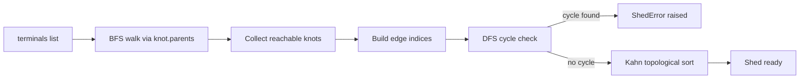

# Execution Model

A deep dive into what happens between `tapestry.run(request)` and the returned `RunResult`.

---

## Complete run cycle

### Step 1: `tapestry.run(request)` called

`Tapestry.run()` accepts an optional `RunRequest` (auto-constructed if omitted). Key parameters:

- `terminals` — explicit terminal knots; defaults to `tapestry.terminals()`.
- `dispatcher` — per-run dispatcher override.
- `emitters` — per-run emitter list; `None` uses tapestry defaults; `[]` disables all.
- `extensible=True` — enables mid-run knot registration.

### Step 2: Terminals computed

`Tapestry.terminals()` performs an O(n) scan — knots not referenced as a parent by any other knot in the store:

```python
referenced: set[str] = set()
for k in all_knots:
    for parent in k.parents.values():
        referenced.add(parent.knot_id)
return [k for k in all_knots if k.knot_id not in referenced]
```

A terminal is a "sink" — the engine executes backward from these to pull in all reachable knots.

### Step 3: Shed built

`Shed.from_terminals(terminals)` performs BFS from terminals, walking `knot.parents` references:

1. Collect all reachable knots by id.
2. Build `edges_by_child` (parent edges per knot) and `children_by_parent` (inverse index).
3. Run DFS cycle check — raises `ShedError` if a cycle is found.
4. Compute `topological_order()` via Kahn's algorithm, breaking ties by knot id for determinism.

The Shed is ephemeral — built fresh for each run, discarded when the run completes.

### Step 4: RunContext created

`RunContext(run_id, terminals_requested, dispatcher_name, parameters)` holds run-scoped state:

- `StatusManager` — state machine tracking each knot through PENDING → RUNNING → SUCCEEDED/FAILED/SKIPPED.
- `ExceptionManager` — registry of `ExceptionRecord`s captured during the run.
- Lineage accumulator — list of `KnotLineage` records built during execution.

### Step 5: Emitters subscribed

Each emitter's `on_status` is wired to the `StatusManager` via a fire-and-forget `asyncio.create_task` wrapper. Exceptions in emitters are swallowed; a broken emitter cannot abort a run.

### Step 6: Admission loop (`_execute_loop`)

Parameters are bound first (each `Parameter` knot matched to `RunRequest.parameters` or its default).

```
tracker = DependencyTracker(shed)          # unresolved-parent counts, levels
ready   = ReadyQueue(tracker.initially_ready())
gate    = UnboundedAdmissionGate()         # no limits: admits everything
          | LimitedAdmissionGate(limits)   # RunRequest.concurrency / Tapestry(concurrency=)

loop:
    merge any mid-run-registered knots     # newcomers may be ready at once

    while ready.pop_admissible(gate) -> knot:
        decision = _decide(knot, results)  # error policy
        if decision is Skipped/Err:
            record directly; release children into `ready`
        else:
            materialize inputs; create asyncio.Task(dispatch)

    if nothing is running: stop
    wait for the next completion (done-callback queue), then for each completed task:
        rebind Err records to live ExceptionManager
        persist Ok value to DataStore / transport
        record lineage (finished_at stamped when the knot finished)
        tracker.resolve(knot) -> children whose parents are all resolved -> `ready`

sort lineage, exceptions, skipped and outputs by (level, dispatched, topo index)
```

A knot is scheduled the moment its own parents have resolved, not when a whole "wave" of unrelated knots has finished: completions are processed one at a time as they happen, so a fast knot's children start while its slow siblings are still running (PIR-841). Each dispatched task reports itself on a completion queue through a done-callback, so the engine wakes once per completion at O(1) cost, and it finds newly ready knots by decrementing their unresolved-parent counts, so a chain of *n* knots costs O(n) scheduling work rather than a rescan of the topological order per step. A knot is decided, materialized and turned into a task only once the run's `AdmissionGate` admits it; the default `UnboundedAdmissionGate` admits every ready knot immediately.

#### Concurrency limits

A run can cap how many knots are in flight at once, overall and per named group:

```python
from pirn.core.concurrency.concurrency_limits import ConcurrencyLimits

with Tapestry() as t:
    p = Parameter("doc", str)
    for i in range(200):
        Summarise(text=p, _config=KnotConfig(id=f"sum{i}"))                               # unbounded
    for i in range(12):
        CallLLM(text=p, _config=KnotConfig(id=f"llm{i}", concurrency_group="openai"))    # 4 at a time

await t.run(RunRequest(parameters={"doc": "..."}, concurrency=ConcurrencyLimits(groups={"openai": 4})))
```

- `RunRequest.concurrency` applies to one run; `Tapestry(concurrency=...)` is the default for runs whose request carries none. An explicit `ConcurrencyLimits()` runs unbounded even over a tapestry default.
- A knot is admitted only while both its global slot (`max_in_flight`, if set) and its group slot (`groups[name]`) are free; it takes both or neither.
- **Undefined groups fail fast.** When the limits define any group, a knot whose `concurrency_group` is not one of them raises `UndefinedConcurrencyGroupError` (naming the knot, its group and the defined groups): at run start for the static graph, at admission for a knot registered mid-run. A typo such as `"open_ai"` for `"openai"` would otherwise silently run every call at once. When the limits define no groups, tags are ignored, so the same tapestry runs unbounded or under `max_in_flight` alone. A defined group that no knot of the static graph uses emits `UnusedConcurrencyGroupWarning`.
- The ready queue keeps one FIFO per group and a heap of group heads, offering heads in readiness order and skipping a head whose group is full. Saturated API calls never hold up the local knots behind them, and within a group a knot is never overtaken by one that became ready after it. A full group is parked until one of its slots is released, and nothing is offered while the run-wide cap is full, so admission cost does not grow with the number of groups.
- **Known limitation (until slice 3):** a `SubTapestry` / `LoopSubTapestry` holds one slot for its inner run's whole life. An open-ended `LoopSubTapestry` under a small `max_in_flight` can starve its siblings.
- A slot is released when the knot's task finishes, whatever the outcome (result, `Err`, exception or cancellation), when the engine resolves a knot without running it (skipped, missing parent), and for every in-flight knot when a run aborts.
- Limits govern scheduling only: outputs, lineage hashes and the order of lineage, exceptions, skipped and outputs are the same under any limits. `KnotConfig.concurrency_group` is excluded from `model_dump`, so it never reaches `knot_config_hash`, and recordings made before a knot joined a group still replay.
- A queued knot stays `PENDING`; `RUNNING` means admitted.
- The effective ceiling is also bounded by the dispatcher (`ThreadDispatcher(max_workers=...)`; a sync `@knot` runs on the default executor, `min(32, cpu + 4)` threads).
- Not yet: limits are not forwarded into `SubTapestry` / `LoopSubTapestry` inner runs, and `Map` / `ZipMap` / `DictMap` fan out their elements inside one admitted knot (PIR-841 slices 3 and 4).

Per-knot records do not depend on completion order. `RunResult.lineage`, `exceptions`, `skipped` and `outputs` are sorted by `(level, dispatched, topological index)`, where `level` is the knot's depth from the roots; for a graph without mid-run registrations that is exactly the order the earlier wave loop produced. `status_events` and live `on_status` delivery are the exception: they follow real state transitions, so sibling knots' events interleave in the order the knots actually start and finish.

### Step 7: `_decide(knot, results)` — error policy

```python
match knot.config.error_policy:
    case REQUIRE_ALL_PARENTS:
        if any parent is Err or Skipped → synthetic Err
    case SKIP_IF_PARENT_FAILED:
        if any parent is Err or Skipped → Skipped
    case RECEIVE_ERRORS:
        pass Result objects directly as inputs (no unwrapping)
```

On a clean path (all parents `Ok`), the input dict is `{name: result.value for name, result in parent_results.items()}`.

### Step 8: `_dispatch_with_timing(knot, inputs)`

```python
parent_hashes = {name: content_hash(value) for name, value in inputs.items()}
started_at = datetime.now(UTC)
result = await self._dispatcher.dispatch(knot, inputs)
return result, parent_hashes, started_at
```

The dispatcher calls `knot(inputs)` → `knot.__call__` → `knot.process(**kwargs)`. The result is `Ok`, `Err`, or `Skipped` from the knot itself.

**Timeout and retry.** The engine dispatches through `GovernedDispatch` (`pirn/engine/governed_dispatch.py`), which applies two per-knot policies from `KnotConfig` around the dispatcher call — never inside `Knot.__call__`, so dispatchers stay a single `dispatch()` and a retried knot is simply called again:

- `KnotConfig(timeout=seconds)` runs each attempt under `asyncio.wait_for`; on expiry the attempt is cancelled and the knot's result is `Err(KnotTimeoutError)`. The timeout bounds one attempt, not the retry budget, and a knot on a worker thread or remote worker is not stopped — the engine records the timeout and moves on.
- `KnotConfig(retry=KnotRetryPolicy(...))` re-dispatches an attempt that ended in `Err` (a raised exception, a failed output validation, a timeout) with the same inputs, sleeping on the event loop between attempts: capped exponential backoff with full jitter, or a `retry_after` hint from the `ExceptionRecord` capped by `max_retry_after`. `is_retryable` decides on the record — the only thing every dispatcher hands back — and `max_attempts` counts the first attempt. `Skipped` is never retried; a real cancellation is never retried. The attempt count is recorded as `KnotLineage.extra["attempts"]`. The admission slot is held across backoff.

Both fields are excluded from `model_dump`, like `concurrency_group`: they describe resilience, not computation, so no `knot_config_hash` changes and every existing recording still replays.

**Cancellation.** `Knot.__call__` turns every exception `process()` raises into `Err`, with one exception: a cancellation of the *task* running the knot propagates (PIR-849). `Knot._is_task_cancellation` tells the two apart with `Task.cancelling()` — positive only while a cancel request is pending on the task. So a run that is cancelled raises `CancelledError` out of `tapestry.run()` (the engine cancels and awaits its in-flight tasks first, and every admission slot comes back), a `KnotConfig.timeout` can expire as `TimeoutError` inside `asyncio.wait_for`, and a knot that raises `CancelledError` *itself*, with no cancellation pending, is still recorded as an ordinary `Err`. `SubTapestry.__call__` and the `Map`/`ZipMap`/`DictMap` fan-out path apply the same rule.

### Step 9: Lineage capture per knot

`LineageRecorder.record_lineage` (`pirn/engine/lineage_recorder.py`) builds a `KnotLineage`:

```python
KnotLineage(
    run_id=ctx.run_id,
    knot_id=knot.knot_id,
    knot_class=f"{type(knot).__module__}.{type(knot).__qualname__}",
    knot_config_hash=content_hash(knot.config.model_dump(mode="json")),
    parent_input_hashes=parent_hashes,   # captured before dispatch
    output_hash=content_hash(result.value) if result.is_ok else None,
    outcome="ok" | "err" | "skipped",
    error_record_id=...,                 # if Err
    skip_reason=...,                     # if Skipped
    dispatcher=dispatcher.name,
    started_at=started_at,
    finished_at=finished_at,            # stamped the instant the knot finished
)
```

### Step 10: `history.record_run()` called

After the admission loop completes and per-knot records are sorted, `ctx.finalize(outputs)` builds the `RunResult`:

- `outputs` — raw values for `Ok` knots.
- `lineage` — all `KnotLineage` records.
- `exceptions` — all `ExceptionRecord`s.
- `status_events` — full StatusManager history.

`await history.record_run(run_result)` persists the result.

### Step 11: Emitter hooks fired

After persistence (so emitters see stable state):

```python
for emitter in emitters:
    for record in run_result.lineage:
        await emitter.on_lineage(record)
    await emitter.on_run_result(run_result)
```

### Step 12: `RunResult` returned

`tapestry.run()` returns the `RunResult` to the caller.

---

## Execution sequence diagram


```mermaid
sequenceDiagram
    participant U as User Code
    participant T as Tapestry
    participant E as Engine
    participant S as Shed
    participant D as Dispatcher
    participant K as Knot.__call__
    participant DS as DataStore
    participant H as RunHistory
    participant EM as Emitter

    U->>T: await tapestry.run(RunRequest)
    T->>T: terminals() → [Knot, ...]
    T->>E: engine.execute(terminals, request, history, data_store, emitters)
    E->>S: Shed.from_terminals(terminals)
    S-->>E: Shed (BFS + cycle check)
    E->>E: RunContext(run_id, parameters)
    E->>EM: subscribe on_status to StatusManager

    loop Until no knot is ready or running
        E->>E: pop knots the AdmissionGate admits
        E->>E: _decide(knot, results) per knot
        alt inputs resolved
            E->>D: dispatcher.dispatch(knot, inputs)
            D->>K: await knot(inputs)
            K->>K: validate + process
            K-->>D: Ok(value) or Err(record)
            D-->>E: Result
            E->>DS: data_store.put(hash, value)
            E->>EM: on_status via StatusManager
        else Skipped or synthetic Err
            E->>E: record directly
        end
        E->>E: LineageRecorder.record_lineage per knot
        E->>E: tracker.resolve(knot) → ready children
    end

    E->>E: ctx.finalize(outputs)
    E->>H: history.record_run(RunResult)
    E->>EM: emitter.on_lineage x N
    E->>EM: emitter.on_run_result
    E-->>T: RunResult
    T-->>U: RunResult
```

---

## Shed construction


```mermaid
flowchart LR
    A[terminals list] --> B["BFS walk via knot.parents"]
    B --> C["Collect reachable knots"]
    C --> D["Build edge indices"]
    D --> E[DFS cycle check]
    E -->|cycle found| F[ShedError raised]
    E -->|no cycle| G["Kahn topological sort"]
    G --> H[Shed ready]
```

**Kahn's algorithm with sort:** ties are broken by knot id, so the topological order is deterministic across runs. The engine uses it, together with each knot's depth, to report lineage, exceptions, skips and outputs in the same order every run, whatever order the knots finished in.

---

## Mid-run extension

With `extensible=True`, the engine subscribes to the store before the loop starts. Any knot registered with the tapestry while the run is in flight is appended to `pending_new`. Each time a knot completes, `_merge_new_knots` validates and merges them:

1. Validate: a new knot whose parent is neither resolved nor in the shed → `ShedError`. A parent that already has a result is served from it.
2. Insert new knots into the shed's dicts (bypassing `Shed.from_terminals`).
3. Bind any new `Parameter` knots immediately.
4. Track the new knots; any whose parents have all resolved are ready at once.

**Where a merged knot appears in the reported order.** Scheduling is the same for every newcomer: it starts as soon as its parents have resolved. Only the order of `lineage`, `exceptions`, `skipped` and `outputs` depends on how the knot was registered:

- **Registered from inside a dispatched knot** (the usual case, e.g. `LoopSubTapestry` iterations). The engine reads the registering knot from the task's context and places the newcomer one level past that registrar and past its deepest parent. This matches the order the earlier wave loop produced, and it does not depend on timing.
- **Registered with no known registrar**, i.e. from a plain thread, `run_in_executor`, an external orchestrator, or a `PostgresStore` / `ValKeyStore` delivery (their notices carry no registering knot). There is no timing-independent level for such a knot. It goes into a final bucket after every knot with a known level, ordered by registration sequence and then by knot id. A knot that a bucket knot registers in turn sits one level past its registrar inside the bucket. The wave loop placed these knots by whichever wave happened to be running when they arrived, so this order intentionally differs from it.

This enables dynamic pipeline patterns such as a knot that decides to spawn N more knots based on its output. Requires a `SubscribableStore` (`InMemoryStore`, `PostgresStore`, and `ValKeyStore` all extend this base class).

---

## Topological sort (Kahn's algorithm)

```python
in_degree = {k: len(edges_by_child[k]) for k in knots}
queue = sorted([k for k in knots if in_degree[k] == 0])  # sorted for determinism
order = []

while queue:
    knot_id = queue.pop(0)  # smallest ready id
    order.append(knot_id)
    for child_id in children_by_parent.get(knot_id, []):
        in_degree[child_id] -= 1
        if in_degree[child_id] == 0:
            queue.append(child_id)
    queue.sort()

return order
```

---

## Content addressing

```python
def content_hash(value: Any) -> str:
    canonical = _canonicalise(value)
    raw = json.dumps(canonical, ensure_ascii=False, separators=(",", ":"))
    return "sha256:" + hashlib.sha256(raw.encode()).hexdigest()
```

The `_canonicalise` function handles Pydantic models, dicts (sorted keys), lists (ordered), sets (sorted by element hash), bytes, and primitives. Opaque types fall back to `repr` with an `unhashable` sentinel prefix — these are not cross-process stable.

---

**See also:** [Architecture Overview](overview.md), [Extension Points](extension-points.md)
