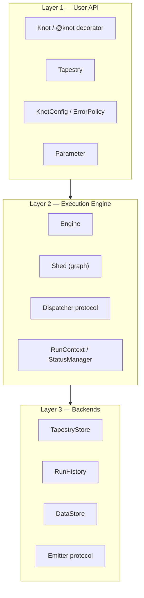
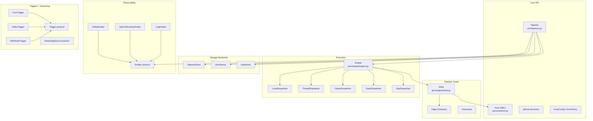

# Architecture Overview

**Version:** 0.3.0 (Phase 3)
**Audience:** engineers extending, deploying, or debugging the pirn framework

pirn is an async Python pipeline framework built around a weaving metaphor: pipelines are *tapestries* of *knots* connected by *threads* (dependency edges) on a *loom* (the execution graph). This isn't decoration — the metaphor shapes the API, the execution model, and the naming of every internal component.

---

## The three-layer model

pirn is structured in three layers, each with a clean boundary:



**Layer 1** is where you write pipeline code. Knots, tapestries, parameters, and config are the only objects you need.

**Layer 2** runs when you call `tapestry.run()`. The engine builds an ephemeral execution graph (the Shed), runs knots in topological waves with concurrency within each wave, and produces a `RunResult`.

**Layer 3** is where data lives. All three backends are protocols — swap implementations without touching pipeline code.

---

## Weaving metaphor — why it matters

| Weaving term | pirn concept | Technical meaning |
|-------------|--------------|-------------------|
| Thread | Dependency edge | `Edge(child_id, parent_id, name)` |
| Knot | Processing node | `Knot` subclass or `@knot` function |
| Tapestry | Pipeline workspace | `Tapestry` context manager + store |
| Loom | Execution graph | `Shed` — ephemeral per-run DAG |
| Shed | Per-run execution context | `Shed.from_terminals(terminals)` |
| Lineage | Run audit trail | `list[KnotLineage]` in `RunResult` |

The `Shed` (in weaving: the triangular opening between threads where the shuttle passes) is the opening through which execution passes — it is built fresh for each run and discarded afterward.

---

## Knot lifecycle

**Construction → Validation → Registration → Execution**

### Construction

A knot is constructed with keyword arguments matched against its `process()` signature. The framework partitions kwargs:

- Arguments whose value is a `Knot` instance → **parents** (`_mutable_parents`).
- All other arguments → **config values** (`_mutable_config_values`).
- `_config=KnotConfig(id=...)` → required framework metadata.

Unknown kwargs or missing required inputs raise `TypeError` immediately at construction time — misconfigured pipelines fail at definition time, not at run time.

### Validation

After construction, Pydantic `TypeAdapter`s are built from `get_type_hints(type(self).process)`. These adapters validate inputs and outputs at dispatch time (when `validate_io=True`, the default).

### Registration

Knots self-register at the end of `__init__`:

```python
target_tapestry = explicit_tapestry or _CURRENT_TAPESTRY.get(None)
if target_tapestry is not None:
    target_tapestry.register(self)
```

`_CURRENT_TAPESTRY` is a `contextvars.ContextVar` — async-safe and task-local. Inside a `with Tapestry()` block the var is set; knots register without any explicit call.

### Execution

The engine calls `await knot(parent_results)`. Inside `__call__`:

1. Merge config values with parent results.
2. Validate inputs via TypeAdapters (if `validate_io`).
3. `await self.process(**kwargs)` — user code.
4. Validate the return value.
5. Return `Ok(value)`. Any exception becomes `Err(record)`.

After construction, knots are immutable — `__setattr__` rejects writes to non-`_mutable_` attributes.

---

## Content-addressed lineage

Every value that flows through a pipeline is identified by `sha256:<hex-digest>` computed from a canonical JSON serialisation. The same Python value always produces the same hash (for standard types), regardless of which run or machine produced it.

**Canonicalisation rules:**

| Type | Canonical form |
|------|---------------|
| Pydantic model | `{"__model__": ClassName, "data": <dict>}` |
| Mapping | `{"__map__": [[k, v], …]}` keys sorted by `str(key)` |
| Sequence | `{"__seq__": […]}` order preserved |
| Set / frozenset | `{"__set__": [sorted element hashes]}` order-independent |
| Primitives | JSON-native |
| bytes | `{"__bytes__": hex_string}` |
| Opaque | `sha256:unhashable:<TypeName>` sentinel |

**DataStore / Lineage split:** `KnotLineage` holds hashes only; the actual values live in the `DataStore` keyed by the same hash. This means:

- Lineage can be retained indefinitely for auditing.
- Data can be scrubbed (TTL, GDPR) without breaking the lineage graph.
- Two runs that produce the same output value share one DataStore entry.

---

## Component map



---

## YAML Pipeline Loader

The YAML loader translates a pipeline definition file into a live `Tapestry`:

1. Parse YAML → `PipelineSpec` (Pydantic models, no Python objects yet).
2. Run Kahn's topological sort on the specs to determine build order.
3. For each spec in order: resolve callable references (from `known_callables` or via dotted import in loose mode), construct the Python knot object, wire parents.
4. Return the populated `Tapestry`.

The separation between steps 2 and 3 means cycles are detected before any user code runs, and each callable is imported exactly once.

---

## Phase history

| Phase | Status | Key additions |
|-------|--------|---------------|
| 1 | Complete | Knot / Tapestry / Engine core, InMemory backends, LocalDispatcher |
| 2 | Complete | Skipped, ErrorPolicy, Optional, ThreadDispatcher, StreamingSource, Trigger, Branch, Gate, Map, Reduce, Aggregator, YAML loader |
| 3 | Complete | Postgres / SQLite / DuckDB / ValKey / S3 / Disk backends; Celery / Dask / Ray dispatchers; OTel / Kafka / ValKey / Webhook emitters; Cron / HTTP / Kafka / ValKey triggers; mid-run extension; replay / diff; visualization |

---

**See also:** [Execution Model](execution-model.md), [Extension Points](extension-points.md)
