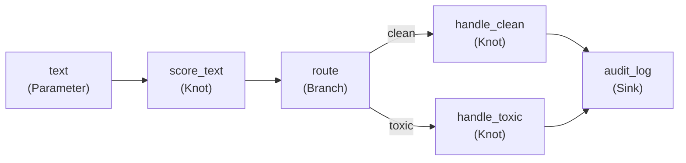

# Your First Pipeline

This walkthrough builds a realistic content moderation pipeline step by step. By the end you will have a multi-stage YAML-defined pipeline that classifies text and routes it through different handling paths.

---

## What we are building

A text moderation pipeline that:

1. Accepts raw text as input.
2. Scores the text for toxicity.
3. Routes clean text down one path and toxic text down another.
4. Logs the moderation decision.

The pipeline graph looks like this:



---

## Step 1: define the knots

Create `knots.py` with the processing functions:

```python
# knots.py
from pirn import knot, Sink, KnotConfig


@knot
async def score_text(text: str) -> float:
    """Return a toxicity score between 0.0 (clean) and 1.0 (toxic)."""
    # In a real pipeline this would call a model API.
    toxic_words = {"spam", "hate", "abuse"}
    words = set(text.lower().split())
    hits = toxic_words & words
    return len(hits) / max(len(words), 1)


def route_selector(score: float) -> str:
    """Choose which branch to activate based on the score."""
    return "toxic" if score > 0.3 else "clean"


@knot
async def handle_clean(text: str) -> dict:
    """Process clean content — approve and enrich."""
    return {"status": "approved", "text": text, "action": "publish"}


@knot
async def handle_toxic(text: str, score: float) -> dict:
    """Handle toxic content — quarantine and annotate."""
    return {"status": "quarantined", "text": text, "score": score}


class AuditLog(Sink):
    async def process(self, decision: dict) -> None:
        print(f"[AUDIT] {decision['status']}: {decision.get('text', '')[:40]}")
```

---

## Step 2: declare the pipeline in YAML

Create `content_moderation.yaml`:

```yaml
name: content_moderation

nodes:
  - id: text
    type: parameter
    type_: str

  - id: score_text
    type: knot
    callable: score_text        # resolved from known_callables
    parents:
      text: text

  - id: route
    type: branch
    input: score_text
    selector: route_selector    # resolved from known_callables
    branches:
      - clean
      - toxic

  - id: handle_clean
    type: knot
    callable: handle_clean
    parents:
      text: text                # passes the original text through

  - id: handle_toxic
    type: knot
    callable: handle_toxic
    parents:
      text: text
      score: score_text

  - id: audit
    type: sink
    callable: AuditLog
    parents:
      decision: handle_clean    # connected to handle_clean by default;
                                # handle_toxic is wired via the branch mechanism
```

!!! note "Branch wiring"
    In a `Branch` node, non-selected paths become `Skipped`. Downstream knots connected to a `Skipped` branch output are themselves skipped under the default error policy, so only the activated path runs.

---

## Step 3: load and run the pipeline

```python
# run_moderation.py
import asyncio
from pirn import load_pipeline, RunRequest
from knots import score_text, route_selector, handle_clean, handle_toxic, AuditLog

YAML = open("content_moderation.yaml").read()


async def main():
    tapestry = load_pipeline(
        YAML,
        known_callables={
            "score_text": score_text,
            "route_selector": route_selector,
            "handle_clean": handle_clean,
            "handle_toxic": handle_toxic,
            "AuditLog": AuditLog,
        },
    )

    # Test with clean text
    result = await tapestry.run(RunRequest(parameters={
        "text": "Hello, this is a friendly message."
    }))
    print("Clean run:", result.outputs)

    # Test with toxic text
    result = await tapestry.run(RunRequest(parameters={
        "text": "This is spam and abuse."
    }))
    print("Toxic run:", result.outputs)


asyncio.run(main())
```

Expected output:

```
[AUDIT] approved: Hello, this is a friendly message.
Clean run: {'param:text': 'Hello...', 'score_text': 0.0, 'handle_clean': {...}}
[AUDIT] quarantined: This is spam and abuse.
Toxic run: {'param:text': 'This is spam...', 'score_text': 0.666..., 'handle_toxic': {...}}
```

---

## Step 4: inspect the lineage

After each run, pirn records a full lineage trace:

```python
for record in result.lineage:
    status = "✓" if record.outcome == "ok" else ("✗" if record.outcome == "err" else "–")
    print(f"{status} {record.knot_id:20s}  {record.outcome:8s}  {record.output_hash or 'n/a'}")
```

For the toxic run you will see something like:

```
✓ param:text           ok        sha256:1a2b...
✓ score_text           ok        sha256:3c4d...
✓ route                ok        sha256:5e6f...
– handle_clean         skipped   n/a
✓ handle_toxic         ok        sha256:7a8b...
✓ audit                ok        sha256:9c0d...
```

`handle_clean` is `skipped` because the `route` branch selected `"toxic"`, making the `"clean"` branch output a `Skipped`. Under the default `SKIP_IF_PARENT_FAILED` policy, `handle_clean` is skipped in turn.

---

## Step 5: add observability

Attach a `LogEmitter` to see structured events during the run:

```python
from pirn import LogEmitter
import logging

logging.basicConfig(level=logging.INFO)

tapestry = load_pipeline(YAML, known_callables={...})
tapestry.add_emitter(LogEmitter())

result = await tapestry.run(RunRequest(parameters={"text": "..."}))
```

Each knot transition produces a JSON log line:

```json
{"event": "lineage", "run_id": "abc…", "knot_id": "score_text", "outcome": "ok", "duration_ms": 0.4}
```

---

## Step 6: visualise the pipeline

Generate a Mermaid diagram or a self-contained HTML explorer:

```python
from pirn import mermaid_for_tapestry, html_for_run
from pathlib import Path

# Embed in docs
print(mermaid_for_tapestry(tapestry))

# Standalone HTML file — open in a browser
result = await tapestry.run(RunRequest(parameters={"text": "hello"}))
Path("run.html").write_text(html_for_run(result))
```

Or explore all pipelines in a directory with the CLI:

```bash
pirn-explore .
```

This generates `pirn_explorer.html` and opens it in your browser. The explorer shows the loom view, run history, and per-knot provenance details.

**See also:** [Visualization Guide](../guides/visualization.md)

---

## What next?

- [YAML Pipelines](../guides/yaml-pipelines.md) — full YAML schema reference
- [Error Handling](../guides/error-handling.md) — error policies, `Optional` mixin, traceback filtering
- [Testing](../guides/testing.md) — test knots and tapestries with in-memory backends
- [Cookbook — Branching](../cookbook/branching.md) — more branch and gate patterns
