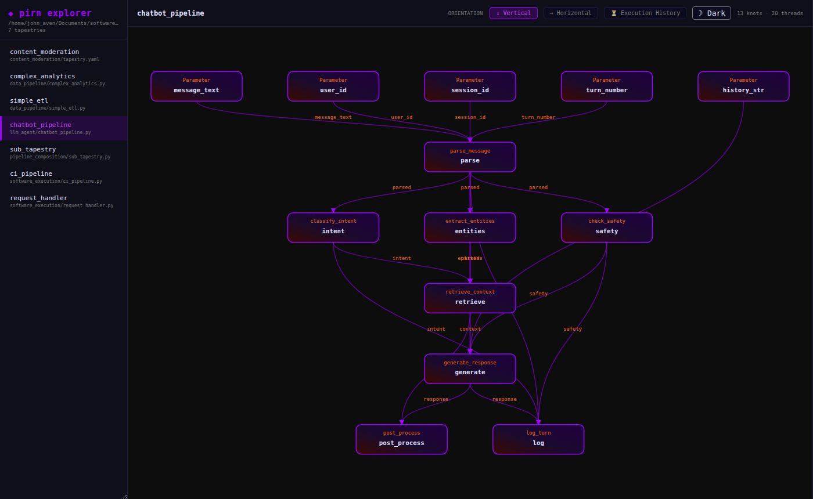
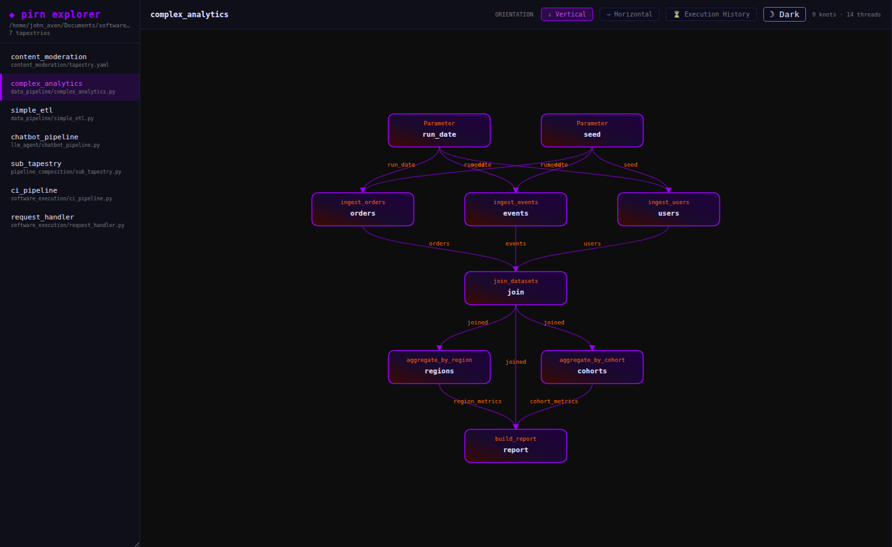
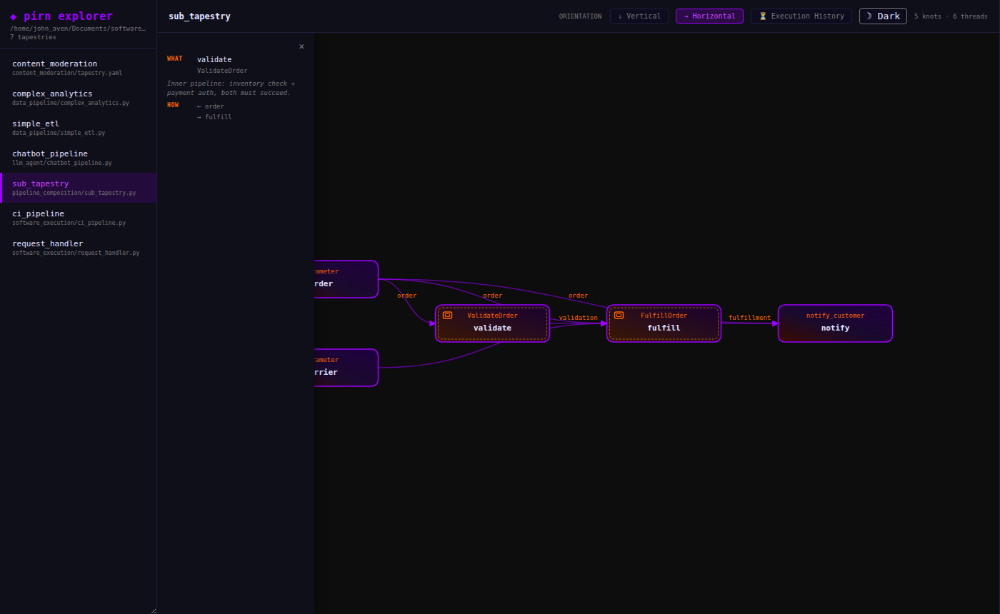
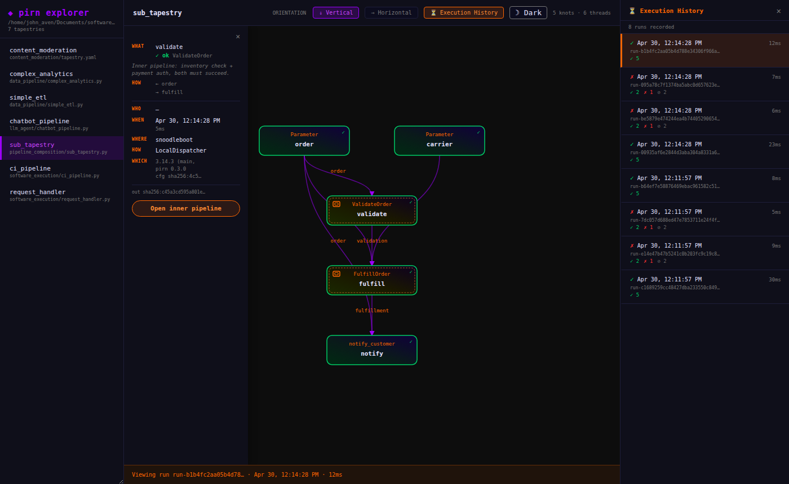
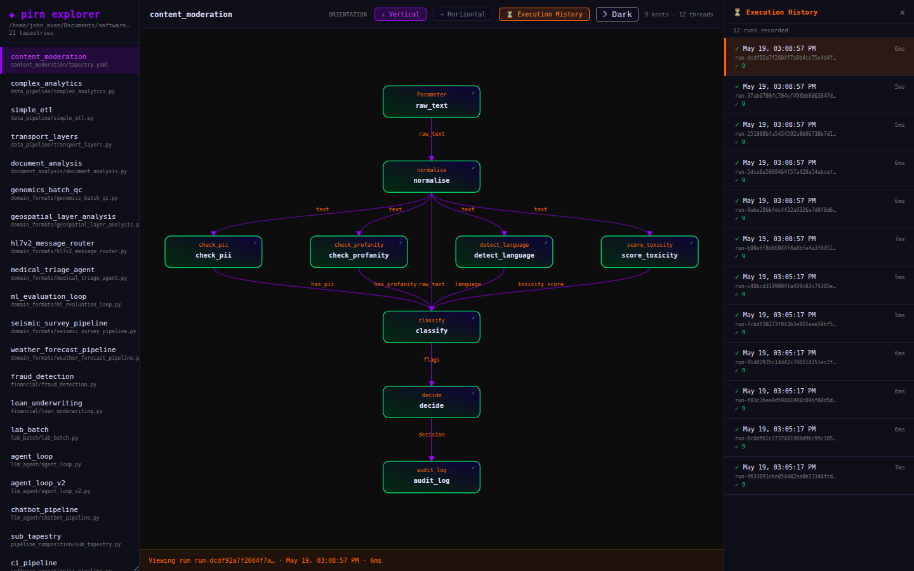
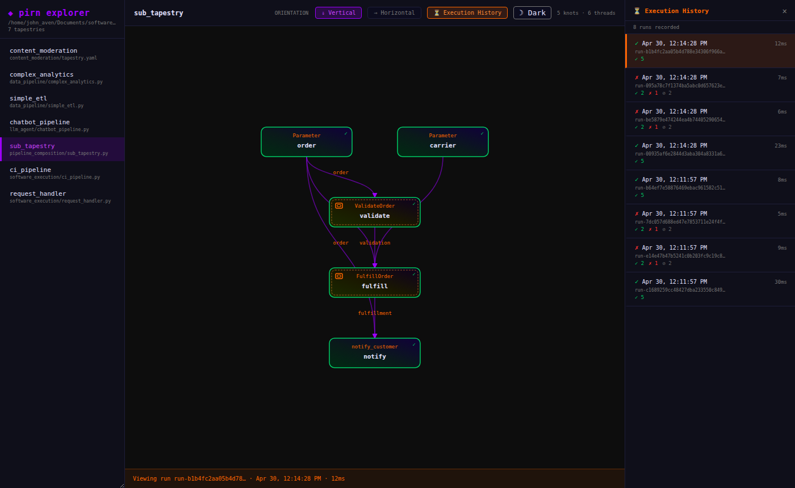
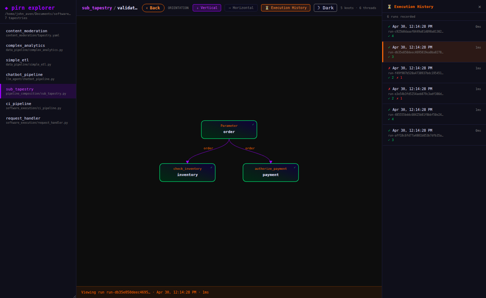
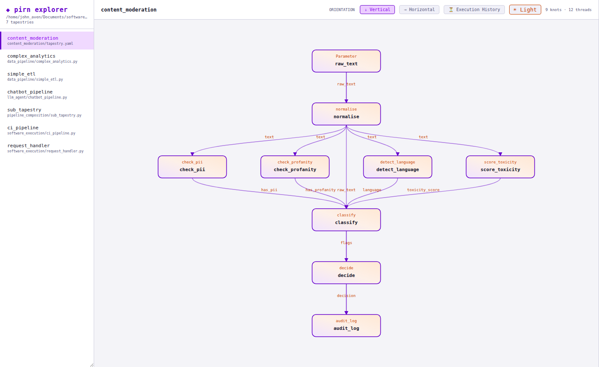
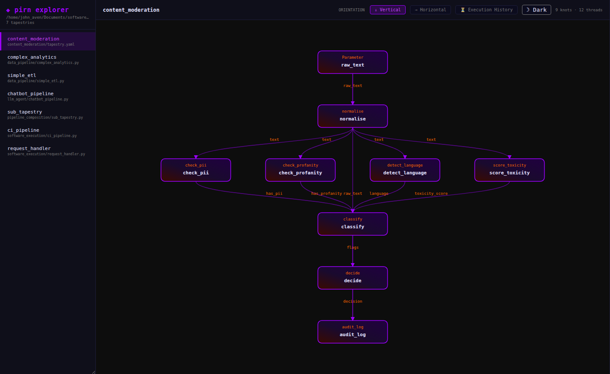

# Visualization

pirn ships a full visualization layer — from embedded Mermaid diagrams to a standalone interactive explorer with run history and per-knot provenance details.

---

## `pirn-explore` CLI

The `pirn-explore` command scans a directory for pipeline definitions, generates an interactive D3-based HTML explorer, and opens it in your browser:

```bash
pirn-explore .                          # scan current directory
pirn-explore ./pipelines                # scan a specific folder
pirn-explore . --output report.html     # custom output file
pirn-explore . --no-open               # write file without opening browser
```

The generated `pirn_explorer.html` is a self-contained file with no server dependency — share it, commit it, email it.

---

## The explorer UI


The explorer opens with a pipeline list on the left, an interactive DAG canvas in the center, and controls along the top.

### Pipeline list

The left sidebar lists all tapestries discovered in the scanned directory. Click any pipeline to load its graph. Each entry shows the pipeline name and the source file it came from.



*The `chatbot_pipeline` — a multi-step LLM agent with intent classification, entity extraction, safety checking, retrieval, and response generation.*

### Loom view

The main canvas displays the pipeline as an interactive directed acyclic graph. Nodes show the knot id and class. Orange edge labels show the parameter name flowing between knots.

**Interactions:**
- Scroll to zoom, drag to pan.
- Click any node to open the knot detail panel.
- Use the orientation toggle to switch between vertical and horizontal layouts.



*The `complex_analytics` pipeline — a data processing graph with fan-out and aggregation steps.*

### Orientation toggle

Switch between vertical (top-down) and horizontal (left-right) layout depending on the shape of your pipeline.



---

## Knot detail panel

Click any node in the graph to open the knot detail panel. This implements **7W provenance** — showing what the knot is, how it connects to the rest of the graph, and (when a run is selected) the full execution record.



| W | Field | Description |
|---|-------|-------------|
| **WHO** | `knot_class` | Fully-qualified Python class name that ran this knot |
| **WHEN** | `started_at` / `finished_at` | UTC timestamps + wall-clock duration |
| **WHERE** | `dispatcher` | Which dispatcher executed this knot (Local, Thread, Celery, etc.) |
| **HOW** | `knot_config_hash` | Content hash of the knot's config at run time |
| **WHY** | `parent_input_hashes` | Content hashes of all inputs — traceability to upstream values |
| **WHAT** | `output_hash` | Content hash of the output value |
| **WHICH** | `run_id` | Which run this record belongs to |

### Error details

When a knot has `outcome == "err"`, the detail panel shows the exception type, message, and full formatted traceback. If a traceback filter was applied (e.g. `redact_common_secrets`), the stored traceback is already redacted.

---

## Execution history panel

Click **Execution History** in the top bar to open the history panel. It shows all recorded runs for the selected pipeline — each with its `run_id`, timestamp, duration, and overall status.



Click a run to overlay its outcomes on the graph. Failed knots turn red, skipped knots grey, successful knots glow purple.

---

## SubTapestry drill-down

SubTapestry nodes are visually distinct in the explorer: they carry a dashed inner border and a nested-box icon in the top-left corner, and use a warm amber gradient instead of the standard purple.



*The `sub_tapestry` pipeline — `ValidateOrder` and `FulfillOrder` are SubTapestry nodes (amber gradient, dashed inner border, nested-box icon). `notify_customer` is a regular knot.*

When a run is selected and a SubTapestry node has a recorded inner run, the knot detail panel shows an **Open inner pipeline** button. Click it — or double-click the node directly — to drill into the inner tapestry graph.


*Clicking a SubTapestry node opens its detail panel. When an inner run is available the "Open inner pipeline" button appears at the bottom.*

The inner pipeline opens with its own node graph and execution history. The breadcrumb trail at the top shows where you are; click any ancestor or use the **‹ Back** button to navigate back up. On mobile, swipe right from the left edge of the screen to go back.



*The inner pipeline of `ValidateOrder` — `check_inventory` and `authorize_payment` — with its own node outcomes and breadcrumb navigation showing the path back to the outer tapestry.*

The history panel updates as you navigate — it always shows runs that match the currently visible pipeline level.

---

## Light mode

The explorer defaults to dark mode. Click the **Dark** button in the top right to switch to light mode.



---

## Content moderation example



*The `content_moderation` pipeline — normalises input text then fans out to PII detection, profanity checking, language detection, and toxicity scoring before making a routing decision.*

---

## Mermaid diagrams

### `mermaid_for_tapestry(tapestry)`

Generates Mermaid `graph LR` syntax for the tapestry structure. Use it in Markdown documentation that supports Mermaid (MkDocs, GitHub, GitLab):

```python
from pirn import mermaid_for_tapestry

with Tapestry() as t:
    x = Parameter("x", int)
    d = double(x=x, _config=KnotConfig(id="d"))
    answer = add(a=x, b=d, _config=KnotConfig(id="answer"))

print(mermaid_for_tapestry(t))
```

Output:

```
graph LR
    param_x["x\n(Parameter)"]
    d["d\n(double)"]
    answer["answer\n(add)"]

    param_x --> d
    param_x --> answer
    d --> answer
```

### `mermaid_for_run(result)`

Generates Mermaid syntax with knot outcomes overlaid. Nodes are coloured by outcome — `ok` green, `err` red, `skipped` grey. Useful for embedding execution traces in incident reports or CI artifacts.

```python
from pirn import mermaid_for_run

result = await tapestry.run(RunRequest(parameters={"x": 5}))
print(mermaid_for_run(result))
```

---

## HTML export

### `html_for_run(result)`

Generates a self-contained HTML file with the run graph and outcome overlays — status colours, hover tooltips with content hashes and duration, and outcome filter buttons.

```python
from pirn import html_for_run
from pathlib import Path

result = await tapestry.run(RunRequest(parameters={"x": 5}))
Path("run.html").write_text(html_for_run(result))
```

### `html_for_tapestry(tapestry)`

Generates a self-contained HTML file showing the tapestry structure without run outcomes. Use it for documentation, architecture reviews, or sharing pipeline designs before running.

```python
from pirn import html_for_tapestry

Path("tapestry.html").write_text(html_for_tapestry(tapestry))
```

---

**See also:** [API — Visualization](../api/visualization.md)
