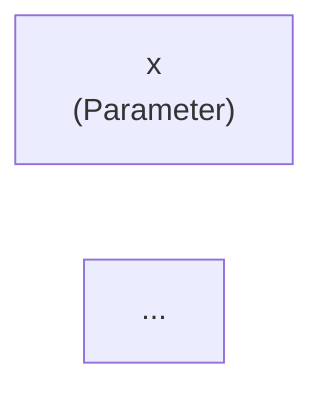

# Visualization

pirn ships a full visualization layer — from embedded Mermaid diagrams to a standalone interactive explorer with run history and per-knot provenance details.

---

## `pirn-explore` CLI

The `pirn-explore` command scans a directory for pipeline definitions, generates an interactive D3-based HTML explorer, and opens it in your browser:

```bash
pirn-explore .                          # scan current directory
pirn-explore ./pipelines                # scan a specific folder
pirn-explore . --output report.html     # custom output file
pirn-explore . --no-open               # write file without opening browser
```

The generated `pirn_explorer.html` is a self-contained file with no server dependency — share it, commit it, email it.

---

## The explorer UI

### Loom view

The main panel displays your pipeline graph as an interactive directed acyclic graph. Nodes (knots) are rendered with their ids and types. Edges (threads) show the dependency direction from parent to child. The layout uses a longest-path algorithm so the flow reads left to right.

**Interactions:**
- Click a node to open the knot detail panel.
- Hover to see the knot id, class, and outcome badge.
- Drag nodes to rearrange; the graph re-renders edges automatically.
- Use the outcome filter buttons to show only `ok`, `err`, or `skipped` knots.

### Tapestry list

The left sidebar lists all tapestries discovered in the scanned directory. Click a tapestry name to load its loom view and associated run history.

### Execution history panel

The right sidebar shows the run history for the selected tapestry — each run listed with its `run_id`, timestamp, duration, and overall status (`succeeded` / `failed`). Click a run to overlay its outcomes on the loom view. Failed knots turn red; skipped knots turn grey; successful knots glow purple.

### Theme toggle

The explorer matches the pirn design system — dark by default with a light mode toggle in the top right. The dark palette uses the same `--purple: #9d00ff` and `--orange: #ff6600` accent colours as these docs.

---

## Knot detail panel

Clicking a knot in the loom view opens the knot detail panel. This panel implements **7W provenance**:

| W | Field | Description |
|---|-------|-------------|
| **WHO** | `knot_class` | Fully-qualified Python class name that ran this knot |
| **WHEN** | `started_at` / `finished_at` | UTC timestamps + wall-clock duration |
| **WHERE** | `dispatcher` | Which dispatcher executed this knot (Local, Thread, Celery, etc.) |
| **HOW** | `knot_config_hash` | Content hash of the knot's config at run time |
| **WHY** | `parent_input_hashes` | Content hashes of all inputs — traceability to upstream values |
| **WHAT** | `output_hash` | Content hash of the output value |
| **WHICH** | `run_id` | Which run this record belongs to |

### Error details

When a knot has `outcome == "err"`, the detail panel shows:

- `exc_type` — the exception class name.
- `message` — the exception message.
- `traceback_text` — the full formatted traceback.
- `error_record_id` — the stable id of the `ExceptionRecord` for cross-referencing.

If a traceback filter was applied (e.g. `redact_common_secrets`), the stored traceback shown here is already redacted.

---

## Mermaid diagrams

### `mermaid_for_tapestry(tapestry)`

Generates Mermaid `graph LR` syntax for the tapestry structure. Use it in Markdown documentation that supports Mermaid (MkDocs, GitHub, GitLab):

```python
from pirn import mermaid_for_tapestry

with Tapestry() as t:
    x = Parameter("x", int)
    d = double(x=x, _config=KnotConfig(id="d"))
    answer = add(a=x, b=d, _config=KnotConfig(id="answer"))

print(mermaid_for_tapestry(t))
```

Output:

```
graph LR
    param_x["x\n(Parameter)"]
    d["d\n(double)"]
    answer["answer\n(add)"]

    param_x --> d
    param_x --> answer
    d --> answer
```

Embed directly in a Markdown file:

````markdown

````

### `mermaid_for_run(result)`

Generates Mermaid syntax with knot outcomes overlaid via class assignments. Nodes are coloured by outcome:

- `ok` → green fill
- `err` → red fill
- `skipped` → grey fill

```python
from pirn import mermaid_for_run

result = await tapestry.run(RunRequest(parameters={"x": 5}))
print(mermaid_for_run(result))
```

Useful for documenting past runs or embedding execution traces in incident reports.

---

## HTML export

### `html_for_run(result)`

Generates a self-contained HTML file with an SVG rendering of the run graph. Features:

- Status colours (green/red/grey) per knot outcome.
- Hover tooltips showing `knot_id`, `knot_class`, `outcome`, content hashes, and duration.
- Filter buttons to show/hide knots by outcome.
- Longest-path layout — no server, no external assets.

```python
from pirn import html_for_run
from pathlib import Path

result = await tapestry.run(RunRequest(parameters={"x": 5}))
Path("run.html").write_text(html_for_run(result))
```

### `html_for_tapestry(tapestry)`

Generates a self-contained HTML file showing the tapestry structure without run outcomes. Use it for documentation, architecture reviews, or sharing pipeline designs.

```python
from pirn import html_for_tapestry

Path("tapestry.html").write_text(html_for_tapestry(tapestry))
```

---

## Example workflow

Generate visualizations as part of a CI pipeline:

```python
import asyncio
from pathlib import Path
from pirn import mermaid_for_tapestry, html_for_run


async def ci_run():
    # Build tapestry
    with Tapestry() as t:
        ...

    # Export structure diagram for docs
    Path("docs/diagrams/pipeline.md").write_text(
        "```mermaid\n" + mermaid_for_tapestry(t) + "\n```"
    )

    # Run and export HTML trace
    result = await t.run(RunRequest(parameters={...}))
    Path("artifacts/run-trace.html").write_text(html_for_run(result))

    return result


asyncio.run(ci_run())
```

---

**See also:** [API — Visualization](../api/visualization.md)
