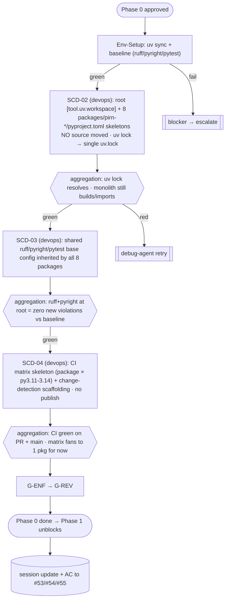

# Phase 0 Plan — Workspace Scaffold (SCD-02, 03, 04)

**Fidelity:** FULL (stable — no code moves; independent of SCD-01's ADR-4 outcome).
**Inherits:** [PIPELINE.md](./PIPELINE.md) Sections A–D (conventions, roster, shape, enforcement/retry).
**Depends on:** SCD-01 merged (gate clear).
**Issues:** [#53](https://github.com/snoodleboot-io/pirn/issues/53) (SCD-02), [#54](https://github.com/snoodleboot-io/pirn/issues/54) (SCD-03), [#55](https://github.com/snoodleboot-io/pirn/issues/55) (SCD-04).

> **Why this is safe to fully specify now:** Phase 0 stands up the uv workspace, eight `pyproject.toml` skeletons, shared tool-config, and a CI skeleton **while all code still lives at `pirn/`**. It moves no source and does not exercise `fill_registry` multi-package behavior, so the gate's outcome cannot invalidate it.

---

## Items & dependencies

```
SCD-02 (workspace root + 8 skeletons) → SCD-03 (shared ruff/pyright/pytest config) → SCD-04 (CI matrix skeleton)
                                          SCD-04 also depends on SCD-02
```

SCD-03 and SCD-04 both follow SCD-02; SCD-04 additionally needs SCD-03's shared config. **One mostly-sequential lane** — limited parallelism (SCD-03 config work can start its draft while SCD-02's `uv lock` settles), so this phase is a 3-step pipeline more than a fan-out.

## Delta §3 — Environment manifest

| Service/process | Purpose | Health check |
|---|---|---|
| uv workspace sync | `uv lock` must resolve the new workspace + produce a single `uv.lock` | `uv lock` exits 0; one lockfile |
| ruff + pyright | shared-config parity vs monolith baseline | zero new violations vs captured baseline |
| pytest (existing suite) | regression guard — monolith at `pirn/` still green | `uv run pytest -q` green |
| GitHub Actions runner (CI skeleton) | SCD-04 workflow resolves workspace + runs lint/type/test | workflow green on PR + `main` |

**No docker backends required for Phase 0** (no `needs_*` integration work — code hasn't moved). Lighter env than the gate.

## Delta §4 — Execution map



## Delta §5 — Subagent specification

| Subagent | Parent | Scope | Outputs | Constraints |
|---|---|---|---|---|
| Env-Setup | devops-agent | uv sync + baseline capture | green env + baseline counts | owns infra |
| SCD-02 scaffold | devops-agent | root `pyproject.toml` (`members=["packages/*"]`, `[tool.uv.sources]` path deps, `[dependency-groups] all`); 8 `packages/pirn-*/pyproject.toml` (name, version, `requires-python`, hatchling, `[tool.hatch.build.targets.wheel] packages=["src/<import>"]`) | workspace skeleton; `uv.lock` | **no source moved**; `__init__.py` rule N/A (no src yet); `pirn-core`→imports `pirn`, domains→`pirn_<x>` |
| SCD-03 tool-config | devops-agent | shared ruff `select`/`per-file-ignores` (incl. `pirn/__init__.py` RUF022, viz E501, tests F841), pyright include/relaxations per-package without duplicating rule bodies, pytest markers (perf/slow/mutation/heavy) + `addopts` | one inherited base config | parity with monolith ruleset |
| SCD-04 CI skeleton | devops-agent | workflow: `uv sync` → lint/type/test on still-monolithic code; matrix axes (package × py) as skeleton; change-detection scaffolding; no publish logic | `.github/workflows/*` | must not alter current publish behavior |

## Delta §7 — Test strategy

- **ATDD:** "monolith at `pirn/` still builds and imports unchanged" (SCD-02 AC#5) — a regression acceptance test asserting `import pirn` + `tapestry-check --help` after scaffold.
- **TDD:** assert root `pyproject.toml` declares all 8 members + path deps; each skeleton declares the 4 required keys; `uv lock` produces exactly one lockfile.
- **Validation:** ruff + pyright at workspace root must report **zero new violations vs. the monolith baseline** (SCD-03 AC#4) — measured against the baseline captured at Env-Setup.

## Delta §8 — Integration verification

| Boundary | Verification |
|---|---|
| uv workspace resolution | real `uv lock` resolves 8 members → single `uv.lock` (not asserted via mock) |
| hatchling wheel packages key | build each skeleton; assert `pirn-core`→`pirn`, `pirn_<x>` per domain |
| CI runner | SCD-04 workflow actually runs green on a PR (live Actions), not just YAML lint |

## Delta §9 — Gap report

| Ref | Gap | Fallback |
|---|---|---|
| P0-A | `[tool.uv.sources]` path-dep wiring across 8 empty packages is fiddly | SCD-02 validates with `uv lock` before SCD-03 builds on it |
| P0-B | CI matrix "fans to one package" looks like full coverage but isn't | SCD-04 `log`s the skeleton status; real fan-out is SCD-24 (Phase 5) — documented, not silently capped |
| P0-C | shared config drift risk (PRD Risk #5) | SCD-03 centralizes; G-ENF verifies all 8 inherit identically |

## Definition of done (maps to #53/#54/#55 AC)

- ☐ Root declares `[tool.uv.workspace]` members + `[tool.uv.sources]` for all 8; `uv lock` → single lockfile; monolith still builds. *(SCD-02)*
- ☐ Shared ruff/pyright/pytest config inherited by all 8; zero new violations vs baseline. *(SCD-03)*
- ☐ CI installs via `uv sync`, runs lint/type/test green; matrix + change-detection scaffolding present; publish behavior unchanged. *(SCD-04)*
