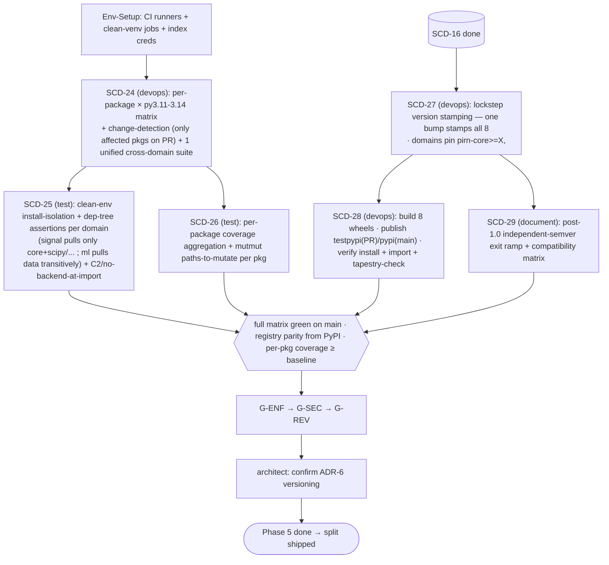

# Phase 5 Plan — CI/Coverage Rework, Versioning & Publish (SCD-24–29)

**Fidelity:** SKELETON ⚠ (item/deps/AC stable from `FEATURES.md`).
**Inherits:** [PIPELINE.md](./PIPELINE.md) A–D.
**Depends on:** SCD-04 (CI skeleton) + SCD-16 (all domains extracted).
**Issues:** [#75](https://github.com/snoodleboot-io/pirn/issues/75)–[#80](https://github.com/snoodleboot-io/pirn/issues/80).

## Items & dependencies
```
SCD-24 per-package CI matrix (deps: SCD-04, SCD-16)
   ├─ SCD-25 install-isolation + dep-tree assertions (deps: SCD-24)
   └─ SCD-26 coverage + mutation rework (deps: SCD-24)
SCD-27 lockstep version stamping (deps: SCD-16) → SCD-28 build & publish N wheels (deps: SCD-27)
SCD-29 post-1.0 independent-semver exit ramp (deps: SCD-27)
```
Two parallel spines: **CI/coverage** (24→25‖26) and **version/publish** (27→28, 27→29). They join at the green-matrix-on-main milestone.

## Delta §3 — Environment
GitHub Actions matrix (package × Python 3.11–3.14), clean-venv runners for install-isolation, **testpypi** (PR) / **pypi** (main) publish targets, codecov. Heavier CI infra than code — devops/test owned.

## Delta §4 — Execution map


## Delta §5 — Subagents
- **SCD-24** (devops): expand SCD-04 skeleton to real matrix + change-detection (mitigates ~192-job explosion, PRD Risk #4) + one unified cross-domain integration suite running the registry-parity check.
- **SCD-25** (test): clean-env install per `pirn-<x>` → assert resolved tree; per-domain extras-isolation; C2 + no-backend-at-import jobs.
- **SCD-26** (test): per-package coverage aggregation; mutmut `paths-to-mutate` per package (PR-scoped changed-files + nightly full).
- **SCD-27** (devops): extend `calculate_version.py` to stamp all 8 `pyproject.toml`; pin floors; C4 check.
- **SCD-28** (devops): N-wheel build + publish/verify per package.
- **SCD-29** (document): versioning-policy doc + compatibility-matrix template.

## Delta §7 — Test strategy
ATDD: `pip install pirn-signal` in clean env pulls core+scipy/pywavelets/librosa and nothing from data/ml/health/oilgas (asserted); `pip install pirn-ml` pulls `pirn-data` transitively (SCD-25). Single version bump stamps all 8 identically (SCD-27). Verify jobs: install each wheel from index → `import pirn`/`import pirn_<x>` + `tapestry-check --help` (SCD-28). TDD: C4 floor check; coverage ≥ baseline per package.

## Delta §8 — Integration verification
Real publish to **testpypi** on PR; real install **from the index** in verify jobs (not local wheels); a cross-domain tapestry resolves knots by name after installing the **published** packages (registry parity from PyPI — the end-to-end proof of the whole split). Codecov upload reflects per-package coverage.

## Delta §9 — Gaps `⚠`
- P5-A: matrix job explosion — change-detection is the mitigation; if change-detection is unreliable, fall back to nightly-full + PR-affected-only and `log` the scope.
- P5-B: pypi publish is irreversible and outward-facing → SCD-28 gates on testpypi success first; the human is asked before the first real pypi push (escalation per PIPELINE.md D).

## DoD (→ #75–#80 AC)
- ☐ Each package lint/type/test on py3.11–3.14; change-detection; unified cross-domain suite; matrix green on main. *(SCD-24)*
- ☐ Clean-env install-isolation + dep-tree assertions per domain; C2/no-backend-at-import. *(SCD-25)*
- ☐ Per-package coverage ≥ baseline; mutmut per package; codecov per package. *(SCD-26)*
- ☐ One bump stamps all 8; pins + C4 floor; 1.0 lockstep documented. *(SCD-27)*
- ☐ 8 wheels build + publish (testpypi/pypi) + verify install/import/tapestry-check; registry parity from PyPI. *(SCD-28)*
- ☐ Independent-semver exit ramp + compatibility matrix documented. *(SCD-29)*
