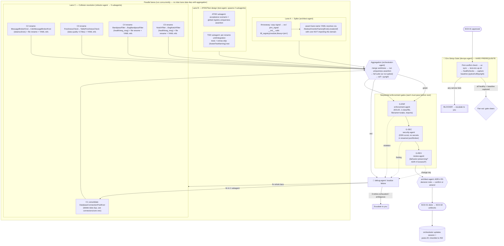

# Multiagent Execution Plan — SCD-01 (the registry gate, issue #52)

**Status:** PLAN FOR REVIEW — no agent begins work until you approve this document.
**Branch:** `feat/51-split-core-and-domains` (feature branch confirmed — not `main`)
**Scope of this phase (N):** Execute **SCD-01 / [#52](https://github.com/snoodleboot-io/pirn/issues/52)** — the architectural gate that must clear before *any* extraction. The pipeline below is designed once and is **reusable** for SCD-02…SCD-29; this document instantiates it concretely against SCD-01.

> **Why SCD-01 and only SCD-01 now:** SCD-01 is the single hard gate. It both (a) proves `fill_registry(module=, library="pirn")` multi-package self-registration and (b) *resolves* the 5 knot-key collisions. Two of those (`databaseconnectionpoolknot`, `messagebrokerknot`) become **core↔pirn-data cross-package** collisions the moment connectors folds into core (SCD-05/06), so they must be unique *before* SCD-02 unblocks. Per `FEATURES.md` SCD-02 depends on SCD-01; nothing parallelizes ahead of the gate except the gate's own internal lanes.

---

## 1. Conventions loaded

| Convention | Location | Loaded | Notes / gaps |
|---|---|---|---|
| Core system + startup checklist | [.claude/conventions/core/general.md](../../../.claude/conventions/core/general.md) | ✅ | Branch check passes (on `feat/51-…`). Session management is **mandatory**. |
| Session protocol | same file (`Core Session`) | ✅ | Existing session `session_20260609_df95mk.md` (orchestrator mode, this branch) — will be **updated**, not duplicated. |
| Core conventions (SOLID, one-class-per-file, snake_case filename = class) | same file | ✅ | One class per file, filename = snake_case(ClassName). **Directly governs the collision renames.** |
| Python conventions | [.claude/conventions/languages/python.md](../../../.claude/conventions/languages/python.md) | ✅ | Absolute imports only; **no import-forwarding / re-export**; `T \| None`; no module/class constants (YAML or pydantic-settings); `__init__.py` in every package; pyright strict; type hints on public fns. |
| Shared workflow | [.claude/workflows/feature.md](../../../.claude/workflows/feature.md) | ✅ | Every agent runs this: restate goal → read first → propose → **wait for confirmation** → implement → test → self-review. |
| Agent registry (24 agents) | [CLAUDE.md](../../../CLAUDE.md) | ✅ | One-agent-per-request routing; each agent self-contained. |
| SCD planning package | [README.md](./README.md), [FEATURES.md](./FEATURES.md), [ADR.md](./ADR.md), [REVIEW.md](./REVIEW.md) | ✅ | SCD-01 spec, B1 collision list, ADR-4 resolution table, critical path. |

**Gaps / conflicts identified (must be acknowledged before execution):**

- **G1 — Convention placeholders.** `core/general.md` core-conventions section still carries `TODO` for *Error Handling pattern*, *Repository Structure*, *Commit style*, *PR size*. The Python file fills error-handling (typed exception hierarchies, no silent swallow). **Resolution:** defer to the Python conventions + observed repo style (Conventional Commits per git history; typed `pirn/exceptions`). No new pattern is introduced by SCD-01, so this gap does not block.
- **G2 — Constants rule vs. renames.** "No constants" is strict, but SCD-01 only *renames classes* and updates YAML refs — it introduces no new constants. Watch only that renamed knots keep config in YAML, not as new class/module constants.
- **G3 — One-class-per-file ↔ filename.** Renaming `class FreshnessCheck → TableFreshnessCheck` etc. **requires the file to be renamed too** (`freshness_check.py` → `table_freshness_check.py`) to satisfy the snake_case-filename rule. The plan accounts for `git mv` + import-rewrite, not just an in-file edit.

---

## 2. Discovered agent roster → pipeline roles

All 24 agents enumerated from `.claude/agents/`. Each is a persona + the shared `feature.md` workflow + on-demand skills. Mapping to the pipeline roles requested (code, ATDD, TDD, verify, enforce, security, debug, PM/architect):

| Pipeline role | Assigned agent(s) | File | Used in SCD-01? |
|---|---|---|---|
| PM / architect (gate decision, ADR-4 confirm/amend) | **architect-agent**, plan-agent, product-agent | [architect-agent.md](../../../.claude/agents/architect-agent.md) | ✅ Lane A owner |
| Refactor (collision resolution = SCD-01 core) | **refactor-agent** | [refactor-agent.md](../../../.claude/agents/refactor-agent.md) | ✅ Lanes C1–C5 owner |
| Code (implementation) | code-agent | code-agent.md | ➖ not needed (no new feature in SCD-01) |
| ATDD (acceptance) + TDD (unit/integration) | **test-agent** | test-agent.md | ✅ Lane B + verify |
| Verify / integration | **test-agent** + **debug-agent** | debug-agent.md | ✅ aggregation + retry |
| Enforce (standards audit) | **enforcement-agent** | [enforcement-agent.md](../../../.claude/agents/enforcement-agent.md) | ✅ gate G-ENF |
| Security | **security-agent** | security-agent.md | ✅ gate G-SEC (DSN/secret-scrub surface) |
| Debug / retry | **debug-agent** | debug-agent.md | ✅ retry loop owner |
| Environment / CI / infra | **devops-agent** | devops-agent.md | ✅ **Env-setup gate owner** |
| Migration (codemod for YAML/import refs) | **migration-agent** | migration-agent.md | ✅ assists renames (ref rewrite) |
| Review (final code review) | **review-agent** | review-agent.md | ✅ gate G-REV |
| Orchestration / aggregation / session | **orchestrator-agent** | orchestrator-agent.md | ✅ top-level coordinator |
| Not exercised by SCD-01 | backend, frontend, data, mlai, performance, observability, incident, compliance, document, ask, explain, migration(docs) | — | ➖ |

**Role-coverage flags (Step 2):**

- **No dedicated "environment-setup" agent exists.** Closest fit = **devops-agent**; it owns the Env-Setup gate. Flagged as a substitution, not a true match (Gap Report R-A).
- **ATDD and TDD are not separate agents.** Both map to **test-agent**; the pipeline splits them into two *concurrent subagent invocations* (acceptance vs unit/integration) so they still run in parallel (Gap Report R-B).
- Every requested role has an owner. No role is unstaffed.

---

## 3. Environment manifest (Env-Setup gate — hard prerequisite)

Owned by **devops-agent**. **No other lane unblocks until every check below passes.** The pipeline owns all of this — you are never asked to start a service.

| Service / process | Purpose for SCD-01 | Start command (pipeline-run) | Health check | Depends on |
|---|---|---|---|---|
| **uv workspace sync** | `sweet_tea` + `Registry.fill_registry` live only in the uv venv (base `python3` cannot import them — verified) | `uv sync --extra dev --extra data --extra health --extra signal` | `uv run python -c "from sweet_tea.registry import Registry; Registry.fill_registry"` exits 0 | — |
| **Postgres 16** (`:5433`) | `DatabaseConnectionPoolKnot` consolidation → `needs_postgres` integration tests must stay green | `scripts/test-env-up.sh` (compose `postgres`) | `pg_isready -U pirn` healthy | docker |
| **Valkey 8** (`:6380`) | connector-pool / cache integration tests | `test-env-up.sh` (`valkey`) | `valkey-cli ping` = PONG | docker |
| **Redpanda/Kafka** (`:9092`) | `MessageBrokerKnot`→`CdcMessageBrokerKnot` rename → `needs_kafka` tests green | `test-env-up.sh` (`redpanda`) | broker reachable on 9092 | docker |
| **MinIO/S3** (`:9000`) | `needs_s3` object-store tests | `test-env-up.sh` (`minio`) + `mc mb local/pirn-test` | `/minio/health/live` 200 | docker |
| **pytest runner** | run full suite green (SCD-01 AC) | `uv run pytest -q` | suite collects, 0 errors | uv sync |
| **ruff + pyright** | enforcement / type gate | `uv run ruff check`, `uv run pyright` | 0 new violations vs baseline | uv sync |

**Pre-flight the env-setup subagent MUST perform (no laziness):**

1. **Port-conflict check first.** Unrelated containers `discovery-pg-vault` / `discovery-pg-app` are already running. The test compose binds non-default host ports (5433/6380/9092/9000); the subagent must `docker ps` + check each host port is free **before** `up`, and surface a conflict as a **blocker**, not silently proceed.
2. Run `scripts/test-env-up.sh`; poll each healthcheck (compose has 30×1s retries built in).
3. Export `PIRN_TEST_*` env vars (the script prints them) into the test lane's environment.
4. Capture a **baseline**: `uv run pytest -q` + `uv run ruff check` + `uv run pyright` on the *current* tree, recording green/violation counts so "zero new violations" and "full suite green" are measured against a real baseline, not an assumption.
5. **Teardown documented:** `scripts/test-env-down.sh` (`docker compose ... down -v`). The subagent documents start/verify/stop and leaves services *up* for the duration, tearing down only on explicit completion.

**If any service cannot start → it is a blocker, surfaced immediately. No lane proceeds on a partial environment.**

---

## 4. Execution map

---

## 5. Subagent specification

Spawned subagents run via the Agent/Workflow tooling. Each receives: **(i)** its agent persona file, **(ii)** the loaded conventions (general + python + feature workflow), **(iii)** its task scope, **(iv)** its shared interfaces (inputs/outputs). File-mutating subagents in Lane C run in **git-worktree isolation** to avoid parallel-write conflicts; the aggregator merges.

| Subagent | Parent | Task scope | Inputs | Outputs | Convention constraints |
|---|---|---|---|---|---|
| **Env-Setup** | devops-agent | §3 manifest: port check, uv sync, services up, baseline capture | compose file, scripts, pyproject markers | green services + baseline counts + exported `PIRN_TEST_*` | owns infra; never asks human; blocker on any failure |
| **Spike** | architect-agent | throwaway `src/` `pirn_signal`, `fill_registry`, prove bare-name resolve w/o core importing domain | `pirn/domains/signal`, `Registry`, `AbstractInverterFactory` | spike result + ADR-4 R1 evidence | throwaway branch only; no changes to mainline tree |
| **ATDD** | test-agent | acceptance test = every `library="pirn"` key → exactly 1 entry, across full knot set | knot registry, `register()` keying (`class_name.lower()`) | `test_registry_uniqueness` (fails pre-fix) | AAA structure; no mocks for the registry itself |
| **TDD** | test-agent | per-rename unit + integration tests; extras-missing skip = `SweetTeaWarning` (no hard raise) | rename list, marker set | unit tests per renamed knot + skip-behavior test | AAA; real backends for `needs_*` markers, not mocks |
| **C1 consolidate** | refactor-agent | delete `data/.../database_connection_pool_knot.py` dup; route to core/connectors class; update YAML/tests | both `database_connection_pool_knot.py` files | single core class; data refs repointed | behavior-preserving; absolute imports; no re-export |
| **C2 rename** | refactor-agent | `MessageBrokerKnot`→`CdcMessageBrokerKnot` in `data/scd/cdc`; **do not touch** `connectors/.../message_broker_knot.py`; `git mv` file; rewrite YAML refs | `data/specializations/scd/cdc/message_broker_knot.py` | renamed class+file+refs | filename=snake(class); 1 class/file |
| **C3 rename** | refactor-agent | `FreshnessCheck`→`TableFreshnessCheck`; **both** `data/.../quality/freshness_check.py` files reconciled; `git mv`; YAML refs | 2 freshness files | renamed class+file(s)+refs | same |
| **C4 rename** | refactor-agent | `BandpassFilter`→`EegBandpassFilter` in `health/eeg_meg`; **do not touch** `signal/.../bandpass_filter_bank.py`; `git mv`; YAML refs | `health/eeg_meg/bandpass_filter.py` | renamed class+file+refs | same |
| **C5 rename** | refactor-agent | `NotchFilter`→`EegNotchFilter` in `health/eeg_meg`; **do not touch** `signal/.../notch_filter.py`; `git mv`; YAML refs | `health/eeg_meg/notch_filter.py` | renamed class+file+refs | same |
| **Ref-rewrite** | migration-agent | sweep YAML / docstrings / error-strings for old class names missed by C1–C5; idempotent | C1–C5 outputs | clean ref tree | deterministic, idempotent codemod |

**Shared-interface contract (prevents collisions between concurrent subagents):** C2/C4/C5 each carry an explicit **"do not touch" sibling** because the colliding name also exists in another domain (connectors message-broker; signal bandpass/notch). These siblings are *not* renamed — only the data/health variants are, per the ADR-4 table. The aggregator's global uniqueness assertion is the cross-check that this was done correctly.

---

## 6. Convention enforcement (per agent + checkpoints)

| Convention | Applied by | Verified at checkpoint |
|---|---|---|
| One class per file; filename = snake_case(ClassName) | refactor-agent (C1–C5) | **G-ENF** (enforcement-agent) — fails the renamed file if name ≠ class |
| Absolute imports, **no import-forwarding / re-export** | refactor + migration | G-ENF + `uv run ruff` in aggregation |
| `T \| None`, type hints on public fns, pyright strict | refactor-agent | aggregation `uv run pyright` (zero new errors vs baseline) |
| No new constants (YAML / pydantic-settings only) | all | G-ENF spot-check on renamed knots |
| Typed exception hierarchy, no silent swallow | refactor-agent | G-REV (review-agent) |
| Behavior preservation (pure rename/consolidation) | refactor-agent | G-REV + full suite green at aggregation |
| Secret/DSN handling on pool/broker classes | security-agent | **G-SEC** (DsnScrubber surface unchanged) |
| Session updated; AC checklist tracked | orchestrator-agent | final step → session + #52 comment |
| Branch + session protocol | orchestrator-agent | pre-flight (already on feature branch ✓) |

Gate order is **sequential and blocking**: aggregation(green) → G-ENF → G-SEC → G-REV → architect decision note. A failure at any gate routes to the debug loop (§10), not forward.

---

## 7. Test strategy (ATDD before code; TDD concurrent with refactor)

- **ATDD (acceptance) — written first, fails before fixes.** Single acceptance scenario from SCD-01 AC#2: *"every `(library="pirn")` registry key maps to exactly one entry across the whole knot set."* Authored by the ATDD subagent against `Registry`'s real keying (`class_name.lower()` → bare-name lookup raises on >1). This test is **RED at start** (5 collisions) and **GREEN only when all 5 are resolved** — it is the executable definition of the gate.
- **TDD (unit/integration) — concurrent with Lane C.** The TDD subagent writes, in parallel with the refactors: (a) per-renamed-knot resolve-by-new-name tests; (b) the consolidated `DatabaseConnectionPoolKnot` still serves both former call sites; (c) **extras-missing → `SweetTeaWarning` skip, no hard raise** (AC#4); (d) the spike's bare-name resolution (AC#1).
- **Validation against test patterns:** all tests use AAA structure (`test-aaa-structure` skill); `needs_postgres/valkey/kafka/s3` tests run against the **real** docker backends from §3 — **not mocks** (mocking rules: don't mock what you own/the boundary under test). Coverage must meet-or-exceed the captured baseline (AC: full suite green).
- **Aggregation validation:** orchestrator runs the uniqueness assertion + full `uv run pytest -q` + ruff + pyright. All four must pass before G-ENF.

---

## 8. Integration verification plan (real boundaries touched by SCD-01)

| Boundary | How it's verified end-to-end (not via mock) |
|---|---|
| **sweet_tea Registry self-registration** | Spike imports `pirn_signal` (src layout) → asserts knots register under `library="pirn"` and resolve by bare name with `pirn` (core) **not** importing the domain. Real `Registry.fill_registry`, real `AbstractInverterFactory`. |
| **DatabaseConnectionPoolKnot ↔ Postgres** | `needs_postgres` integration tests run against the live `:5433` Postgres after consolidation — proves the single core class serves the former data call site. |
| **CdcMessageBrokerKnot ↔ Kafka/Redpanda** | `needs_kafka` tests run against live `:9092` broker after rename — proves CDC path intact. |
| **Object-store / S3 path** | `needs_s3` tests against live MinIO `:9000`. |
| **YAML bare-name resolution** | A cross-knot YAML loads and resolves every renamed knot by its new bare name through the real loader. |

**Rule:** if any of these cannot be verified against a live backend in this environment, it is a **blocker** — the affected rename does not merge on a mock pass alone.

---

## 9. Gap report (with fallbacks)

| Ref | Gap | Impact | Proposed fallback |
|---|---|---|---|
| **R-A** | No dedicated environment-setup agent in roster | Env gate has no native owner | **devops-agent** owns it (closest fit). Accept substitution. |
| **R-B** | ATDD and TDD share one agent (test-agent) | Risk of serializing test design | Split into **two concurrent subagent invocations** of test-agent (acceptance vs unit). Preserves parallelism. |
| **G1** | `core/general.md` has `TODO` for error-handling pattern, commit style, PR size, repo-structure | Ambiguous base conventions | Defer to **python.md** (typed exception hierarchy) + observed repo style (Conventional Commits, `pirn/exceptions`). SCD-01 introduces no new pattern, so non-blocking. |
| **G3** | Class rename forces **file** rename (snake-filename rule) | More than an in-file edit | Each C-subagent does `git mv` + ref-rewrite, not just class-name edit. Built into scope. |
| **R-C** | Two `freshness_check.py` files in `data/` (`specializations/quality/` and `quality/`) | Ambiguous which is the SCD-01 target | C3 reconciles **both**; aggregation uniqueness assertion confirms no residual `freshnesscheck` key. |
| **R-D** | Unrelated docker containers running (`discovery-pg-*`) | Possible host-port contention | Env-setup does a **port-conflict pre-check** before `up`; conflict = blocker surfaced to you. |
| **R-E** | `connectors` also holds `message_broker_knot.py` / `database_connection_pool_knot.py` | Wrong-file rename risk | Explicit **"do not touch sibling"** contract in §5; ADR-4 table is authoritative on which variant moves. |

**No integration is being stubbed.** No `pass` / `TODO` / `NotImplementedError` is permitted in any delivered output (Step 5). If a backend can't be stood up, that rename is blocked, not faked.

---

## 10. Debug & retry logic

- **Owner:** **debug-agent**, coordinated by orchestrator-agent.
- **How failures surface:** the aggregation step (uniqueness assertion + full suite + ruff + pyright) and each sequential gate (G-ENF/G-SEC/G-REV) emit pass/fail with the failing artifact. Any red routes to debug, never forward.
- **Retry scope (smallest blast radius first):**
  1. **Subagent-local** — failure localized to one collision (e.g. only C2's Kafka test red) → re-run **just that C-subagent** with the debug findings.
  2. **Lane-level** — if the failure is cross-cutting (e.g. uniqueness still red because two subagents disagreed on which variant to rename) → re-run the **whole Lane C** with a corrected contract.
  3. **Env-level** — if a `needs_*` test fails due to a service, bounce the Env-Setup gate (it may be infra, not code).
- **Retry budget:** **3** attempts per scope. Each retry must carry the debug-agent's root-cause note (no blind re-runs — matches the "do not silently retry" convention).
- **Escalation to you when:** retries exhausted; OR the failure implies an **ADR-4 amendment** (e.g. the spike shows `fill_registry` self-registration doesn't actually work as ADR-4 R1 assumes); OR a security finding (G-SEC) on the pool/broker classes; OR an environment blocker (R-D port conflict, service won't start). Escalation pauses all lanes and re-presents — per the constraint that material changes to roster/conventions/env/plan trigger a re-present.

---

## Definition of done for SCD-01 (maps 1:1 to #52 acceptance criteria)

1. ☐ `pirn_signal` src-layout package registers under `library="pirn"`; bare-name YAML resolves via `AbstractInverterFactory[Knot].create(ref)` with core **not** importing the domain. *(Lane A + AC#1)*
2. ☐ Registry-uniqueness assertion passes across the whole knot set — all 5 collisions resolved. *(ATDD + aggregation, AC#2)*
3. ☐ `DatabaseConnectionPoolKnot` consolidated to one core class; `CdcMessageBrokerKnot` / `TableFreshnessCheck` / `EegBandpassFilter` / `EegNotchFilter` renamed with all YAML/test refs updated; full suite green. *(Lanes C1–C5, AC#3)*
4. ☐ Missing optional deps → `SweetTeaWarning` skip, no hard raise. *(TDD, AC#4)*
5. ☐ Decision note confirms or amends ADR-4 R1. *(architect-agent, AC#5)*

On all five green: orchestrator updates `session_20260609_df95mk.md`, posts the checked AC list to [#52](https://github.com/snoodleboot-io/pirn/issues/52), and **SCD-02 (#53) unblocks**.

---

## What I need from you (Step 6 gate)

**No agent starts until you approve.** Specifically, please confirm:

1. **Scope** = SCD-01 (#52) only this phase, with SCD-02+ to follow as separate approved phases — or do you want me to chain Phase 0 (SCD-02→03→04) into the same run?
2. **Worktree isolation** for the 5 concurrent refactor subagents is acceptable (it adds disk/setup cost but prevents parallel-write conflicts).
3. **Env ownership** — the pipeline will run `scripts/test-env-up.sh` (starts docker Postgres/Valkey/Redpanda/MinIO) and `uv sync`. Confirm it's fine to bring those services up on this machine (port pre-check will guard the existing `discovery-pg-*` containers).
